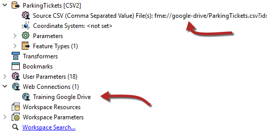
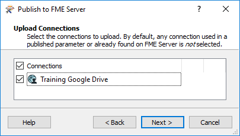

# 网络连接

与数据库一样，当数据集的源数据是Web服务时，FME能够将连接参数存储在安全容器中。该容器可以发布到FME Server或在其上重新创建。

## 什么是Web连接？

Web连接是一组Web服务连接参数的容器。这些参数包括服务，用户名，密码（或经过身份验证的连接）以及根据服务类型而有所不同的其他参数。

Web连接的两个主要优点是：

* 连接参数不再嵌入工作空间，这意味着更少的安全风险
  * 例如，您的参数不会向下载工作空间的任何人公开
* 连接参数可以在多个工作空间之间重用
  * 例如，使用相同Web服务的两个工作空间可以使用相同的连接

Web连接可以使用FME Desktop中的工作空间发布，也可以直接在FME Server中添加。

## 创建Web连接

创建Web连接通常在FME Desktop中启动。可以使用FME Workbench菜单栏中的工具&gt; FME选项&gt; Web连接创建它们。然后，可以在读模块，写模块或转换器中使用已定义的连接。

例如，此工作空间使用与Google Drive Web服务的连接读取CSV数据集，如写模块参数和Web连接列表中所示：

当工作空间发布到FME Server时，新对话框会询问作者是否还要发布Web连接：

然后将连接添加到FME Server上的连接容器中。

|  警察局长Webb-Mapp说...... |
| :--- |
|  **警告：**从Desktop上传Web服务足以运行连接时，Safe Software会提供此服务定义，以用于**演示**和易用性。客户端ID和客户端密钥可能随时被停用。对于生产用途，我们建议用户从Web服务提供商处获取自己的客户端ID和客户端密钥。为OAuth身份验证设置服务定义是最好留给系统管理员的任务。有关如何执行此操作的详细信息，请参阅“ [FME Server管理员指南”](https://docs.safe.com/fme/html/FME_Server_Documentation/Content/AdminGuide/Planning-Access-to-Web-Services.htm?Highlight=oauth)。 |

## 使用Web连接

运行工作空间时，如果它具有引用Web服务的转换器或读模块，则它将正确运行，就像在FME Desktop安装上一样。

在FME Server上发布的参数中，Web连接在源数据集URL中定义：

|  Intuitive修女说...... |
| :--- |
|  与数据库连接一样，此功能允许使用作者的连接参数在FME Desktop中测试工作空间，但是一旦发布到Server，就切换到一般帐户; 一切既简单又安全。 |

