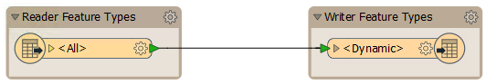
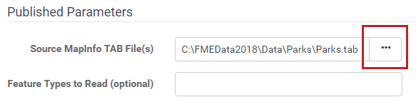
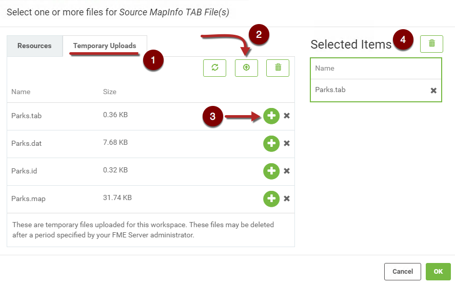
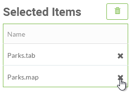

# 在运行时上传数据集

虽然作者很容易将数据与工作空间一起发布到FME Server存储库，但它不是最终用户可以访问的方法。

因此，对于文件（而不是订阅源或数据库），存在允许最终用户在运行时上传数据的功能。

## 上传源数据

此工作空间是使用动态读模块和写模块创建的。这意味着可以处理任何源数据集（格式正确）并将其转换：

当然，在这种情况下，使用工作空间发布数据没有多大意义。如果用户在运行时上传数据，则会更好。

如果源数据集是已发布的参数，则可以通过单击“浏览”按钮在FME Server界面的“运行工作空间”页面中轻松完成此操作：

这将打开一个对话框，为数据类型选择一个或多个文件。要仅临时上传文件，请切换到“临时上传”选项卡（1），然后单击“上传”按钮（2）上传数据。上传包含多个文件的数据（如MapInfo Tab）时，请确保选择所有文件。将数据上传到临时上传后，需要将其添加到工作空间，这可以通过单击每个文件旁边的绿色加号来完成（3）。最后，在选择OK之前，确保选择了所有必需的文件（4）。请注意，需要上传所有文件，但只需要选择主文件以使工作空间正确运行，在本例中为Parks.tab：

现在，当工作空间运行时，所选用户上传的数据将被转换。

---

|  警察局长Webb-Mapp说...... |
| :--- |
|  在上面的示例中，源数据集采用由多个文件组成的格式（MapInfo TAB）。   虽然需要上传所有文件，但只需要**选择** TAB文件本身。 使用的方法是取消选择Selected Items部分下的文件; 这里是.dat，.id和.map文件。 这些文件仍然可用，但是FME不会将它们作为单独的数据集处理，如果它们都保持选中状态，就会发生这种情况。      |

---

## 注意事项和限制

关于何时上传数据以供最终用户转换，需要注意一些注意事项和限制：

* 赋予用户上传能力是有风险的，因为他们的数据集的模式必须与工作空间的模式定义相匹配; 否则，转换将因意外输入而失败。或者 - 如上所述 - 可以使用动态（也可能是通用的）转换来避免这些问题。
* 用户上传的数据仅暂时可用。“系统清理”页面向我们显示这些文件（默认情况下）在超过24小时后被删除。用户上传不是长期解决方案。
* 从理论上讲，用户上传的数据也可以通过“资源”页面访问（后面会详细介绍）。但是，实际上，它位于一个不起眼的位置，不会期望最终用户找到它。因此，临时数据应被视为无法通过任何其他方式访问，并且不可供任何其他工作空间使用。

