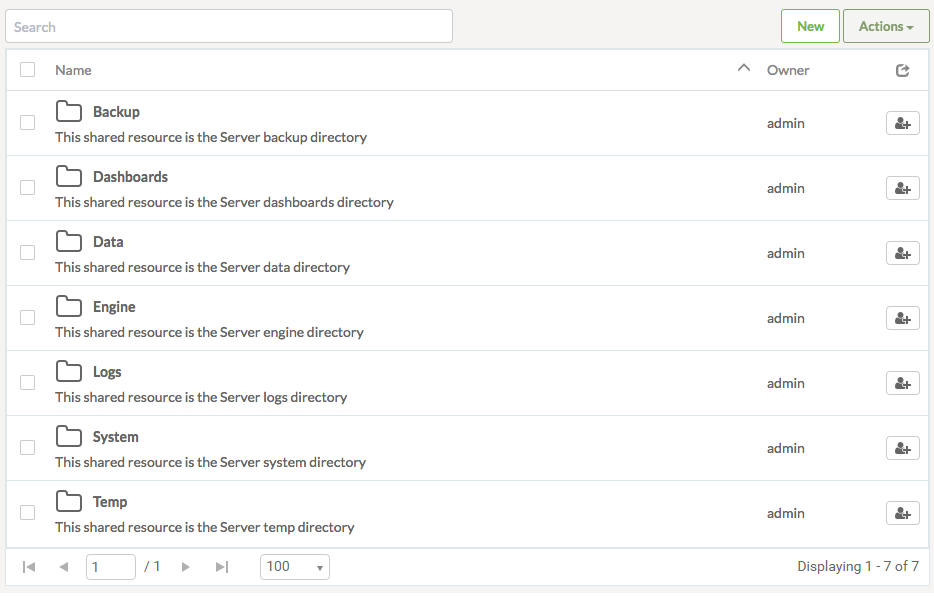
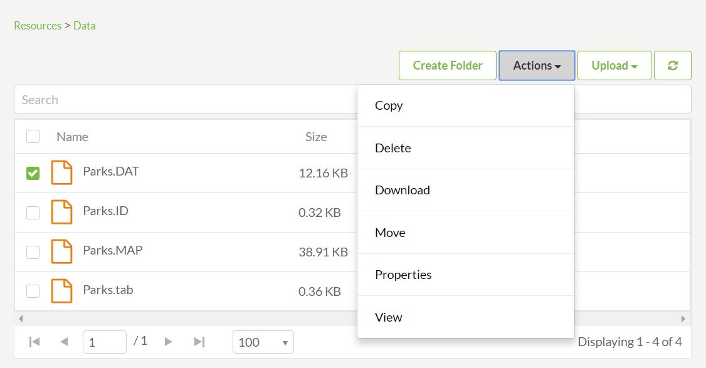
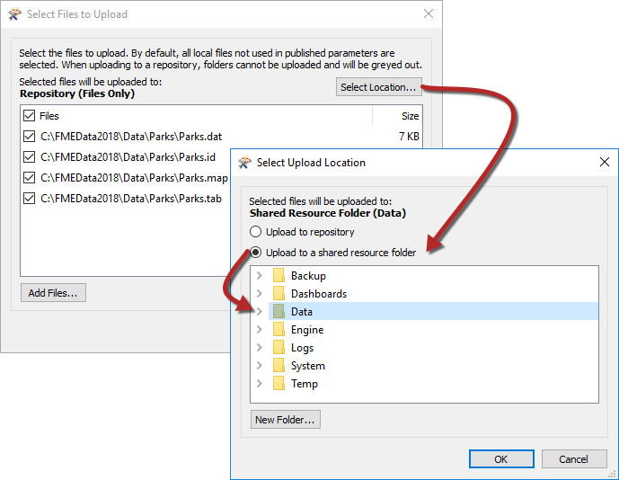
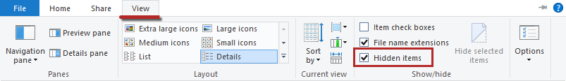
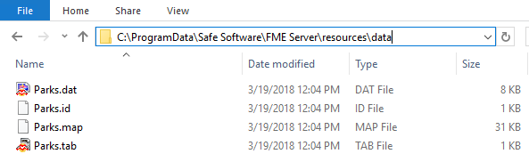
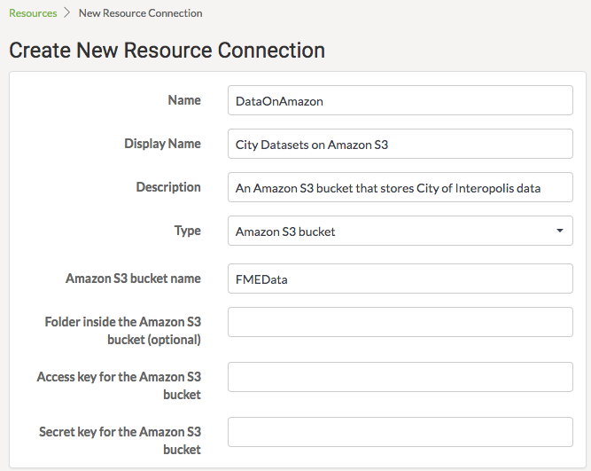
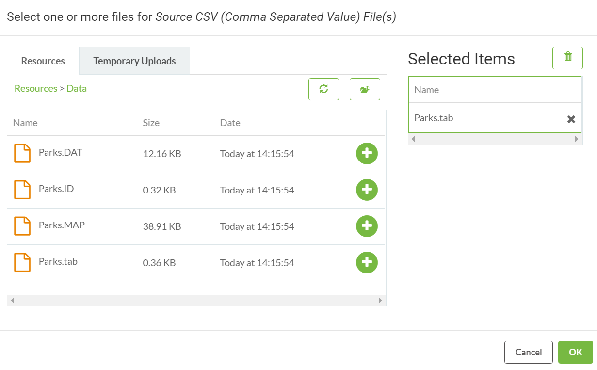
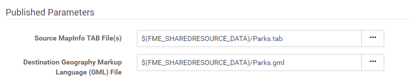

# 资源文件系统

在FME Server中管理源数据的最后一种方法是使用名为资源（Resources）的工具系统。

---

## 什么是资源？

“资源”是一个内置的文件管理系统，允许将数据（和其他文件）发布到FME Server实例并在所有服务器操作中使用。可以通过可在侧面菜单上访问的“资源”页面来管理资源。

在“资源”页面中，您可以找到上载到FME Server的所有文件以及FME Server创建的文件：

[](https://github.com/xuhengxx/FMETraining-1/tree/f1cdae5373cf9425ee2d148732792713c9043d44/ServerAuthoring2DataHandling/Images/Img2.017.ResourcesHome.png)

如您所见，资源文件系统设置了许多默认文件夹，可以在其中存储文件。虽然有许多不同的文件夹可以存储数据，但对于数据集，最常用的文件夹是数据（Data）文件夹：

[](https://github.com/xuhengxx/FMETraining-1/tree/f1cdae5373cf9425ee2d148732792713c9043d44/ServerAuthoring2DataHandling/Images/Img2.018.ResourcesDataFolder.png)

以上是包含多个文件的数据文件夹。注意一旦检查了数据集， **“操作”**按钮将列出可用的操作，例如上载，复制，删除或移动文件（或文件夹）。

---

## 其他上传方法

除了Web界面之外，还有其他方法可以将数据导入资源文件系统。

首先，FME Workbench中的FME Server发布向导允许这样做。如果默认方法是选择文件并将它们上传到与工作空间相同的仓库，则允许将位置更改为资源文件系统：

[](https://github.com/xuhengxx/FMETraining-1/tree/f1cdae5373cf9425ee2d148732792713c9043d44/ServerAuthoring2DataHandling/Images/Img2.019.ResourcesDataPubWiz.png)

或者，FME Server资源实际存在于操作系统的文件系统中，这意味着可以直接在那里复制数据。默认位置（在Windows操作系统上）是：

```text
C：\ ProgramData \ Safe Software \ FME Server \ resources
```

---

|  技巧 |
| :--- |
|  ProgramData是一个隐藏文件夹，要在Windows机器上查看它，请单击Windows资源管理器中功能区上的“视图”选项卡，然后在“显示/隐藏”类别中启用“隐藏项目”：  [](https://github.com/xuhengxx/FMETraining-1/tree/f1cdae5373cf9425ee2d148732792713c9043d44/ServerAuthoring2DataHandling/Images/Img2.020.HiddenItems.png) |

[](https://github.com/xuhengxx/FMETraining-1/tree/f1cdae5373cf9425ee2d148732792713c9043d44/ServerAuthoring2DataHandling/Images/Img2.021.ResourcesDataWindowsFilesys.png)

最后，单击FME Server主资源页面中的New按钮可以直接连接到Amazon S3文件系统：

[](https://github.com/xuhengxx/FMETraining-1/tree/f1cdae5373cf9425ee2d148732792713c9043d44/ServerAuthoring2DataHandling/Images/Img2.022.ResourcesDataAmazonS3.png)

这允许存储在S3 bucket中的数据用作FME Server上的转换源。

---

## 使用上传的数据

在转换中使用资源数据只是从提示的文件夹中选择它。所有数据提示都允许从资源文件夹中选择文件。

例如，用户已将MapInfo TAB Parks数据集上传到资源数据文件夹。如果源数据集是已发布的参数，则在运行工作空间时，用户可以从资源文件夹中选择数据，如下所示：

[](https://github.com/xuhengxx/FMETraining-1/tree/f1cdae5373cf9425ee2d148732792713c9043d44/ServerAuthoring2DataHandling/Images/Img2.023.ResourcesDataSelection.png)

事实上，甚至可以将输出数据文件夹设置为资源文件夹：

[](https://github.com/xuhengxx/FMETraining-1/tree/f1cdae5373cf9425ee2d148732792713c9043d44/ServerAuthoring2DataHandling/Images/Img2.024.ResourcesDataOutputFolder.png)

---

## 数据管理的好处

使用资源文件系统作为数据存储工具有几个好处：

* 任何工作空间都可以使用数据，而无需每次都上传
* 即使FME Server 管理员限制对操作系统文件系统的访问，也可以将数据存储在本地（到FME服务器引擎）
* 可以在许多用户之间映射和共享资源文件夹作为物理驱动器
* 资源文件夹是一种更永久的解决方案。自动系统清理工具不会删除数据

---

|  Vector小姐说...... |
| :--- |
|  这次不仅仅是一个，而是两个问题！ 首先：我使用上传工具将工作空间复制到资源文件夹中。然后怎样呢？   <br><br>[1.我可以通过浏览资源，选择工作空间，然后单击运行来运行它](http://52.73.3.37/fmedatastreaming/Manual/QAResponse2017.fmw?chapter=21&question=7&answer=1&DestDataset_TEXTLINE=C%3A%5CFMEOutput%5CQAResponse.html) <br>[2.我可以通过Manage&gt; Workspaces菜单工具运行它](http://52.73.3.37/fmedatastreaming/Manual/QAResponse2017.fmw?chapter=21&question=7&answer=2&DestDataset_TEXTLINE=C%3A%5CFMEOutput%5CQAResponse.html)<br> [3.我可以通过FME Desktop中的FMEServerJobSubmitter转换器调用它来运行它](http://52.73.3.37/fmedatastreaming/Manual/QAResponse2017.fmw?chapter=21&question=7&answer=3&DestDataset_TEXTLINE=C%3A%5CFMEOutput%5CQAResponse.html) <br>[4.无法运行它，因为它没有正确发布到仓库](http://52.73.3.37/fmedatastreaming/Manual/QAResponse2017.fmw?chapter=21&question=7&answer=4&DestDataset_TEXTLINE=C%3A%5CFMEOutput%5CQAResponse.html)  <br><br>其次：上传整个文件夹有什么限制？  <br><br>[1.文件夹上传仅适用于某些网络浏览器](http://52.73.3.37/fmedatastreaming/Manual/QAResponse2017.fmw?chapter=21&question=8&answer=1&DestDataset_TEXTLINE=C%3A%5CFMEOutput%5CQAResponse.html) <br>[2.文件夹上传要求将文件夹压缩到单个文件中](http://52.73.3.37/fmedatastreaming/Manual/QAResponse2017.fmw?chapter=21&question=8&answer=2&DestDataset_TEXTLINE=C%3A%5CFMEOutput%5CQAResponse.html)<br> [3.文件夹上传仅适用于Windows C：驱动器（不是D：，E：等）](http://52.73.3.37/fmedatastreaming/Manual/QAResponse2017.fmw?chapter=21&question=8&answer=3&DestDataset_TEXTLINE=C%3A%5CFMEOutput%5CQAResponse.html)<br> [4.文件夹上传要求在上传的计算机上安装FME Desktop](http://52.73.3.37/fmedatastreaming/Manual/QAResponse2017.fmw?chapter=21&question=8&answer=4&DestDataset_TEXTLINE=C%3A%5CFMEOutput%5CQAResponse.html) |

