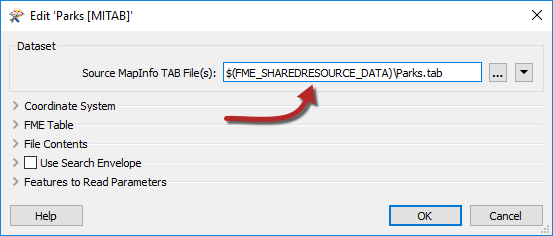

# 资源创作

使用FME Server Web界面，可以在运行时从资源文件夹中选择数据。但是，在某些情况下，作者需要从资源文件夹中读取数据，而最终用户不必选择它。

要执行此操作，需要使用FME参数将数据定义为来自资源文件夹。

## 服务器的FME参数

在FME Workbench中，“导航”窗口有一个名为“用户参数”的部分。您可能已经注意到，其中一部分是FME Server特定参数的列表。有关所有服务器参数的详细说明，请参阅[FME Server参数文档](https://docs.safe.com/fme/2018.0/html/FME_Desktop_Documentation/FME_ReadersWriters/!Transformer_Parameters/FME_Server_Parameters.htm)：

它们的用途多种多样; 例如，FME\_SECURITY\_USER返回运行工作空间的用户的名称，可用于写入自定义日志，也可以根据特定用户以不同方式过滤工作空间中的数据。FME\_TOPIC将返回调用工作空间的通知主题（如果有）的名称。

但是，在编写资源数据时，最有用的参数是FME\_SHAREDRESOURCE\_DATA

|  警告 |
| :--- |
|  所有这些参数的一个共同因素是它们仅在FME Server上运行工作空间时才有效。如果工作空间在FME Desktop上运行，则不会返回值。因此，要在桌面上测试包含此类参数的工作空间，您需要提供虚拟值。 |

## FME\_SHAREDRESOURCE\_DATA

FME\_SHAREDRESOURCE\_DATA参数返回共享资源数据的路径。在创建工作空间以直接从资源文件夹中读取数据时，通常会使用数据的本地副本创建工作空间，然后更新源数据集字段以包含FME Server参数：

可以通过在对话框中键入来直接更新字段，但通过单击下拉箭头并选择使用文本编辑器可以更轻松地实现。

导航器窗口中的条目现在如下所示：

虽然参数在Desktop中以红色显示，但在服务器上运行工作空间时，参数将替换为实际路径，并按预期读取数据。

|  警告 |
| :--- |
|  重要的是要记住（例如，在上面的屏幕截图中注意到）服务器参数FME\_SHAREDRESOURCE\_DATA在其路径中包含“Data”文件夹。  例如，我使用FME\_SHAREDRESOURCE\_DATA \ Zoning \ Zones.tab而不是FME\_SHAREDRESOURCE\_DATA \ Data \ Zoning \ Zones.tab |

## 资源路径的快捷方式

您可以复制上传数据集的路径，然后将其直接粘贴到Workbench中，而不是在上传数据之前在Workbench中设置路径。

通过在FME Server资源页面中检查其属性来获取共享资源的路径。要执行此操作，请找到资源，单击文件旁边的复选框，然后单击“操作”下拉菜单并选择“属性”：

然后可以将此路径复制并粘贴到工作空间中，以便直接引用该数据集而无需手动输入。当然，这确实要求数据已经上传到FME Server，并且在发布时不会随工作空间一起上传！

|  Vector小姐说...... |
| :--- |
|  所以我可以让我的工作空间从资源文件夹中读取特定数据 - 但是如何阻止最终用户更改它？  [1.删​​除Job Submitter服务的安全权限](http://52.73.3.37/fmedatastreaming/Manual/QAResponse2017.fmw?chapter=21&question=9&answer=1&DestDataset_TEXTLINE=C%3A%5CFMEOutput%5CQAResponse.html) [2.删除其资源文件夹的安全权限](http://52.73.3.37/fmedatastreaming/Manual/QAResponse2017.fmw?chapter=21&question=9&answer=2&DestDataset_TEXTLINE=C%3A%5CFMEOutput%5CQAResponse.html) [3.使源数据集参数对该读模块是可选的](http://52.73.3.37/fmedatastreaming/Manual/QAResponse2017.fmw?chapter=21&question=9&answer=3&DestDataset_TEXTLINE=C%3A%5CFMEOutput%5CQAResponse.html) [4.从工作空间中删除该源数据集的已发布参数](http://52.73.3.37/fmedatastreaming/Manual/QAResponse2017.fmw?chapter=21&question=9&answer=4&DestDataset_TEXTLINE=C%3A%5CFMEOutput%5CQAResponse.html) |

