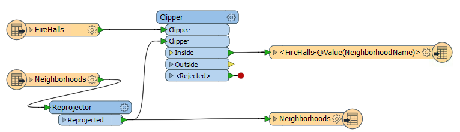

# 练习2.1：每日数据库更新：发布数据

|  练习2.1 |  每日数据库更新：发布数据 |
| :--- | :--- |
| 数据 | 街区Neighborhoods（KML） 选举投票Election Voting（GML） |
| 总体目标 | 创建工作空间以读取和处理部门数据并将其发布到FME Server |
| 演示 | 发布源数据并上传临时数据集 |
| 启动工作空间 | C:\FMEData2018\Workspaces\ServerAuthoring\DataHandling-Ex1-Begin.fmw |
| 结束工作空间 | C:\FMEData2018\Workspaces\ServerAuthoring\DataHandling-Ex1-Complete.fmw |

---

对于本章的练习，您是当地城市GIS部门的技术分析师。

您已经（练习1.1,1.2和1.3）创建了一个工作空间来执行转换，将其发布到FME Server，运行它以确认它的工作，共享存储库，并将工作空间设置为按计划运行。

现在您有一个创建新工作空间的任务。它使用的其中一个数据集与上一个练习相同，因此我们将尝试让第二个工作空间使用属于第一个工作空间的数据。

---

|  Intuitive修女说...... |
| :--- |
|  如果您有丰富的FME Workbench经验 - **如果您的指导老师同意** - 只需打开上面标题中列出的结束工作空间并跳到第7步 |

  
**1）检查源数据**  
创建任何新工作空间的第一项任务是检查源数据，所以让我们这样做。使用FME Data Inspector打开这两个数据集：

| 读模块格式 | GML（地理标记语言） |
| :--- | :--- |
| 读模块数据集 | C:\FMEData2018\Data\Elections\ElectionVoting.gml |

您可以关闭VotingDivisions图层。我们对此练习感兴趣的是指定为VotingPlaces的点要素：

[](https://github.com/xuhengxx/FMETraining-1/tree/f1cdae5373cf9425ee2d148732792713c9043d44/ServerAuthoring2DataHandling/Images/Img2.200.Ex1.SourceElectionData.png)  
地图瓦片[Stamen Design](http://stamen.com/)，许可[CC-BY-3.0](http://creativecommons.org/licenses/by/3.0)。数据提供[OpenStreetMap](http://openstreetmap.org/)，许可[CC-BY-SA](http://creativecommons.org/licenses/by-sa/3.0)。

  
**2）创建工作空间**  
打开上面列出的起始工作空间。

您可能会注意到它是我们之前工作空间的副本，因为此工作空间的要求非常相似。如果您确实选择继续在该工作空间中工作，请确保以不同的名称保存它 - 否则我们将发布的数据将不适用于此练习。

工作空间看起来像这样：

[](https://github.com/xuhengxx/FMETraining-1/tree/f1cdae5373cf9425ee2d148732792713c9043d44/ServerAuthoring2DataHandling/Images/Img2.201.Ex1.StartingWorkspace.png)

  
**3）删除Firehalls**  
对于此工作空间，我们需要处理选举数据而不是消防站（FireHalls），因此首先删除FireHalls的写模块要素类型，然后删除读模块要素类型。

删除读模块要素类型时，系统将询问您是否要删除整个读模块。我们可以重用它，但为了简单起见，请单击是。

工作空间现在看起来像这样：

[](https://github.com/xuhengxx/FMETraining-1/tree/f1cdae5373cf9425ee2d148732792713c9043d44/ServerAuthoring2DataHandling/Images/Img2.202.Ex1.WorkspaceSansFirehalls.png)

  
**4）添加VotingPlaces**  
现在选择Readers&gt; Add Reader以开始将读模块添加到工作空间。出现提示时，为VotingPlaces数据输入以下详细信息:

| 读模块格式 | GML（地理标记语言） |
| :--- | :--- |
| 读模块数据集 | C:\FMEData2018\Data\Elections\ElectionVoting.gml |

单击“确定”将读模块添加到工作空间。提示时，仅选择VotingPlaces要素类型，而不是VotingDivisions：

[](https://github.com/xuhengxx/FMETraining-1/tree/f1cdae5373cf9425ee2d148732792713c9043d44/ServerAuthoring2DataHandling/Images/Img2.203.Ex1.AddReaderFTTR.png)

  
**5）将VotingPlaces添加到写模块**  
要将VotingPlaces添加到写模块，请右键单击新放置的读模块函数类型，然后选择“NULL”复制：

[](https://github.com/xuhengxx/FMETraining-1/tree/f1cdae5373cf9425ee2d148732792713c9043d44/ServerAuthoring2DataHandling/Images/Img2.204.Ex1.RightClickAddToWriter.png)

现在将有一个VotingPlaces数据集的读写模块要素类型：

[](https://github.com/xuhengxx/FMETraining-1/tree/f1cdae5373cf9425ee2d148732792713c9043d44/ServerAuthoring2DataHandling/Images/Img2.205.Ex1.WorkspaceWithWriter.png)

更改连接以通过Clipper转换器传递VotingPlaces（投票地点）数据，就像FireHalls（消防站）曾经的那样：

[](https://github.com/xuhengxx/FMETraining-1/tree/f1cdae5373cf9425ee2d148732792713c9043d44/ServerAuthoring2DataHandling/Images/Img2.206.Ex1.WorkspaceWithConnectedWriter.png)

  
**6）设置VotingPlaces要素类名称**  
最后，与FireHalls一样，让我们​​为VotingPlaces写模块要素类设置要素类名称。

检查其参数并在要素类名称下输入：

```text
VotingPlaces- @值（NeighborhoodName）
```

...或单击下拉列表并使用文本编辑器对话框输入该值。这将导致每个不同街区中的投票位置被写入单独的表/层。

保存工作空间。如前所述，请确保其名称与第一个项目不同。

  
**7）发布到服务器**  
将工作空间发布到FME Server。这次您只需选择以前创建的FME Server连接，而不必再次输入参数。

对于仓库，选择先前创建的Training仓库，并输入工作空间的名称（如果它还没有）。

这次，不要只是选中上传所有数据文件的框，而是单击Select Files按钮：

[](https://github.com/xuhengxx/FMETraining-1/tree/f1cdae5373cf9425ee2d148732792713c9043d44/ServerAuthoring2DataHandling/Images/Img2.207.Ex1.PublishToServer.png)

此对话框列出了我们要使用工作空间发布到存储库的文件。从技术上讲，VancouverNeighborhoods数据集已经使用之前的工作空间发布到仓库，但尝试以这种方式重复使用数据并不是很好的做法（即使我们可以），因此对所有文件进行复选标记并单击“确定”：

[](https://github.com/xuhengxx/FMETraining-1/tree/f1cdae5373cf9425ee2d148732792713c9043d44/ServerAuthoring2DataHandling/Images/Img2.208.Ex1.SelectAllFiles.png)

在发布向导的最后一个对话框中，再次选择Job Submitter 作为Web服务来注册工作空间。

  
**8）检查文件**  
如果您可以访问FME Server计算机本身，请打开文件浏览器并浏览到仓库数据的存储位置。这里是C：\ ProgramData \ Safe Software \ FME Server \ repositories \ Training：

[](https://github.com/xuhengxx/FMETraining-1/tree/f1cdae5373cf9425ee2d148732792713c9043d44/ServerAuthoring2DataHandling/Images/Img2.209.Ex1.RepositoryFilesInFilesystem.png)

您将看到每个工作空间都保存到单独的文件夹中。如果您检查文件夹的内容，您将在其中看到上传的数据集。

这是工作空间访问随其发布的文件的方式。通过一些人工操作，它还可以访问与同一存储库中的另一个工作空间一起存储的文件。

  
**9）运行工作空间**  
登录FME Server，找到并运行工作空间。在“运行”对话框中，请注意表示源数据的已发布参数包含FME环境变量FME\_MF\_DIR：

[](https://github.com/xuhengxx/FMETraining-1/tree/f1cdae5373cf9425ee2d148732792713c9043d44/ServerAuthoring2DataHandling/Images/Img2.210.Ex1.RepositoryFileSelection.png)

此变量告诉FME查找与源数据文件的工作空间相同的文件夹。正如您所看到的，即使工作空间运行良好，以这种方式处理数据也不是特别“用户友好”。

  
**9）上传临时数据**  
现在让我们假装VotingPlaces数据层以某种方式发生了变化。您可以通过简单地打开文件浏览器并制作GML文件的副本来模拟它。

例如，将C：\ FMEData2018 \ Data \ Elections \ ElectionVoting.gml重命名为NewElectionVoting.gml

_**注意：**_您不必复制ElectionVoting.xsd - 可以将该模式文件用于新的GML数据集。\*

现在，在FME Server Web界面中，注销admin帐户并以用户（user/user）身份登录。

因此，作为用户，我们希望使用新数据运行工作空间。我们无法发布数据，因为用户帐户没有写入该仓库的权限; 而且无论如何，由于工作空间没有以任何方式改变，我们不应该一定要经历发布过程。

因此，单击“运行工作空间”并在“Training”库中选择新发布的工作空间。但是，要使用新数据集，请单击Source GML提示右侧的浏览按钮：

[](https://github.com/xuhengxx/FMETraining-1/tree/f1cdae5373cf9425ee2d148732792713c9043d44/ServerAuthoring2DataHandling/Images/Img2.211.Ex1.SelectSourceData.png)

在打开的对话框中，单击“临时上传”选项卡，然后单击“上传文件”按钮：

[](https://github.com/xuhengxx/FMETraining-1/tree/f1cdae5373cf9425ee2d148732792713c9043d44/ServerAuthoring2DataHandling/Images/Img2.212.Ex1.TempUploadButton.png)

选择文件NewElectionVoting.gml和ElectionVoting.xsd，然后单击“打开”以上传它们。现在 - 返回先前的对话框 - 单击X按钮取消选择XSD文件：

[](https://github.com/xuhengxx/FMETraining-1/tree/f1cdae5373cf9425ee2d148732792713c9043d44/ServerAuthoring2DataHandling/Images/Img2.213.Ex1.TempUnselectFile.png)

该文件需要存在，但不需要选择。现在单击“确定”，然后单击“运行”按钮。

现在，工作空间将使用上传的数据集运行完成。

但是 - 这是重要的部分 - 这只是一个临时上传。工作空间可以立即重新运行，数据仍将显示在临时上传部分，但它不是永久性解决方案。数据可能会在24小时内自动清理。

---

<table>
  <thead>
    <tr>
      <th style="text-align:left">恭喜</th>
    </tr>
  </thead>
  <tbody>
    <tr>
      <td style="text-align:left">
        <p>通过完成本练习，您已学会如何：
          <br />
        </p>
        <ul>
          <li>使用新读模块和新写模块要素类型更新工作空间</li>
          <li>将工作空间发布到FME Server并包含源数据</li>
          <li>在FME Server文件系统上找到源数据</li>
          <li>选择要在运行时临时上传的源数据集</li>
        </ul>
      </td>
    </tr>
  </tbody>
</table>
