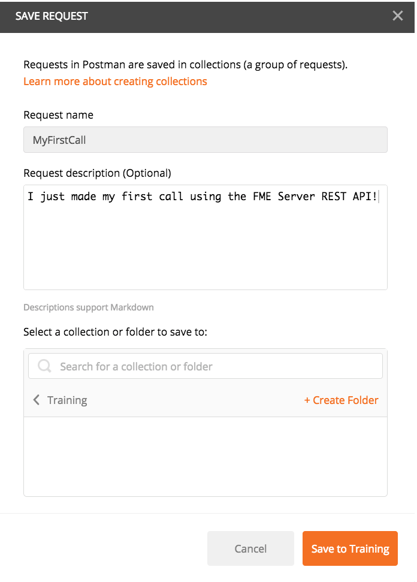
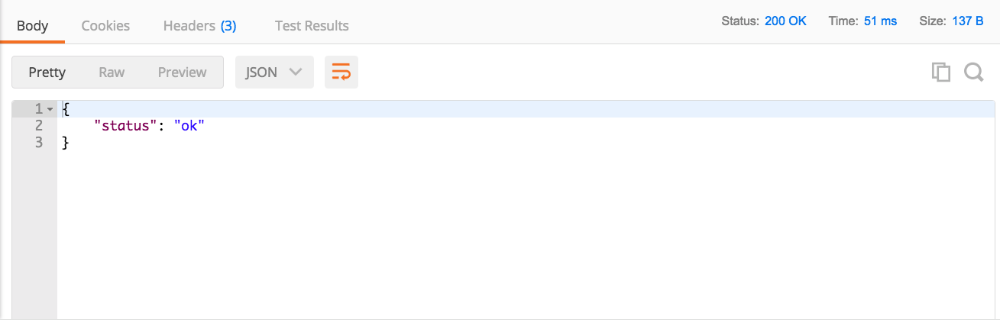

# 3.1练习2-使用REST客户端工具创建一个调用

|  练习2 |  使用Postman发出HTTP请求 |
| :--- | :--- |
| 数据 | 无 |
| 总体目标 | 使用REST API从服务器检索信息 |
| 演示 | 来自REST API的运行状况检查 |

本练习演示了如何使用REST API调用FME Server。Postman是一个REST客户端工具。REST客户端工具允许用户输入请求URL并直接从服务器接收消息。此练习演示了healthcheck调用，该调用将检查FME Server是否已正常运行。

我们即将在Postman中进行以下调用。 &lt;style type="text/css"&gt; .tg {border-collapse:collapse;border-spacing:0;} .tg td{font-family:Arial, sans-serif;font-size:14px;padding:10px 5px;border-style:solid;border-width:1px;overflow:hidden;word-break:normal;border-color:black;} .tg th{font-family:Arial, sans-serif;font-size:14px;font-weight:normal;padding:10px 5px;border-style:solid;border-width:1px;overflow:hidden;word-break:normal;border-color:black;} .tg .tg-ej3l{background-color:\#66ccff;vertical-align:top} .tg .tg-ufe5{background-color:\#66ccff;vertical-align:top} &lt;/style&gt;

| GET | http:///fmerest/v3/healthcheck?textResponse=false |
| :--- | :--- |

此调用不需要授权并且应该立即运行。请注意，此调用中有一个字符串查询参数。此调用将自动返回JSON响应; 但是，您可以通过将文本响应设置为true来覆盖它。这将返回文本响应而不是JSON。

  
**1）下载Postman - 如果您尚未使用虚拟机**

第一步是下载Postman。只需单击此链接 [https://www.getpostman.com/apps](https://www.getpostman.com/apps) 并下载该应用程序。它适用于Windows，Linux和Mac。

  
**2）打开Postman**

欢迎来到Postman！我们现在准备使用上面的URL首次调用您的FME Server。打开Postman后，您应该会看到此页面。

  
**3）单击“请求”。**

 或者，单击“新建”&gt;“请求”

  
**4）填写请求并单击“保存”。**

从这里，我们收到一个页面来保存我们的请求。如果您希望保存调用以便将来使用它，则使用此选项。通常，调用的名称将更具描述性。但是，出于本演示的目的，请创建一些有创意的内容，例如“MyFirstCall”。对于此调用，您可以为培训目的创建新集合。

要创建新的培训集合，请单击+创建文件夹。然后命名并保存您的集合。

  
**5）将URL复制到工具栏中。**

将URL复制到工具栏中，然后点击发送！请注意，我们正在使用GET HTTP方法进行此调用。要了解此方法的含义，请查看第1.2节中的表格。 &lt;style type="text/css"&gt; .tg {border-collapse:collapse;border-spacing:0;} .tg td{font-family:Arial, sans-serif;font-size:14px;padding:10px 5px;border-style:solid;border-width:1px;overflow:hidden;word-break:normal;border-color:black;} .tg th{font-family:Arial, sans-serif;font-size:14px;font-weight:normal;padding:10px 5px;border-style:solid;border-width:1px;overflow:hidden;word-break:normal;border-color:black;} .tg .tg-ej3l{background-color:\#66ccff;vertical-align:top} .tg .tg-ufe5{background-color:\#66ccff;vertical-align:top} &lt;/style&gt;

| GET | http://&lt;yourServerHost&gt;/fmerest/v3/healthcheck?textResponse=false |
| :--- | :--- |

_请注意，如果您正在使用培训机器，则需要将localServer替换为localhost_

  
**6）查看Postman的响应。**

查看您的调用。这是您收到的响应。

单击“标头”部分以查看更详细的调用视图。

|  技巧 |
| :--- |
|  如果您使用的是培训计算机，您的FME Server在打开时可能无法正常工作。如果FME Server不可用，请进入Windows任务管理器，退出所有Postgres任务。然后，进入Windows服务并重新启动FME Server数据库和FME Server核心。如果这不能解决问题，请访问 [FME Server故障排除指南](https://knowledge.safe.com/articles/540/fme-server-troubleshooting-guide.html) |

**重要说明：**

* 响应是JSON格式的。这可以在报头“响应报头内容类型”中找到。
* 在右上角，您应该看到Status：200 OK。这表明它已成功与服务器进行交互。此通话不需要授权。但是，对服务器的大多数调用都需要授权。下一步是进行需要服务器授权的调用。

<table>
  <thead>
    <tr>
      <th style="text-align:left">恭喜</th>
    </tr>
  </thead>
  <tbody>
    <tr>
      <td style="text-align:left">
        
通过完成本练习，您已学会如何：
           
        

        <ul>
          <li>设置并使用Postman</li>
          <li>在Postman中创建一个调用</li>
        </ul>
      </td>
    </tr>
  </tbody>
</table>