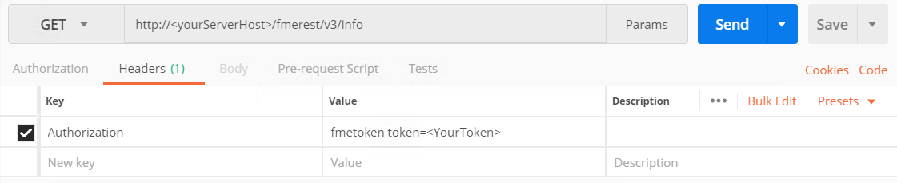
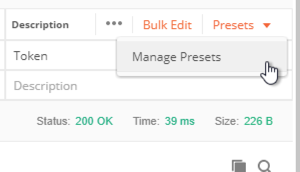

|  练习3 |  授权和REST API |
| :--- | :--- |
| 数据 | 无 |
| 总体目标 | 显示如何在REST API中正确授权调用 |
| 演示 | 信息调用 |

这显示了如何在FME Server REST API中创建授权调用。授权是REST API中的重要组件。大多数呼叫都需要授权，以验证用户是否可以从服务器访问信息。FME Server REST API中的授权由令牌处理。这将在下面进行说明和进一步说明。

  
**1）创建下面的调用** 

&lt;style type="text/css"&gt; .tg {border-collapse:collapse;border-spacing:0;} .tg td{font-family:Arial, sans-serif;font-size:14px;padding:10px 5px;border-style:solid;border-width:1px;overflow:hidden;word-break:normal;border-color:black;} .tg th{font-family:Arial, sans-serif;font-size:14px;font-weight:normal;padding:10px 5px;border-style:solid;border-width:1px;overflow:hidden;word-break:normal;border-color:black;} .tg .tg-ej3l{background-color:\#66ccff;vertical-align:top} .tg .tg-ufe5{background-color:\#66ccff;vertical-align:top} &lt;/style&gt;

| GET | http://&lt;yourServerHost&gt;/fmerest/v3/info |
| :--- | :--- |


将此URL复制并粘贴到Postman的工具栏中，然后单击“发送”！

_此调用需要令牌。演示的下一部分将向您展示当您对服务器进行未经授权的调用时会发生什么。_

[](https://github.com/xuhengxx/FMETraining-1/tree/b47e2c2ddcf98cce07f6af233242f0087d2d374d/FMESERVER_RESTAPI3HTTPCaller/Images/image3.2.1.png)

您应该收到一条消息，说401未经授权。这是因为我们没有使用令牌来授权调用。本指南的下一部分将介绍如何使用令牌在服务器上发出请求。

  
**2）获取令牌**

有许多方法可以在FME Server中获取令牌。第一种方法是转到FME Server Web界面。右侧角有一个用户符号。这是用户设置，然后去管理令牌。

[](https://github.com/xuhengxx/FMETraining-1/tree/b47e2c2ddcf98cce07f6af233242f0087d2d374d/FMESERVER_RESTAPI3HTTPCaller/Images/image3.2.2.GetTokens.png)

获得令牌的另一种方法是访问，

```text
  http://<yourServerHost>/fmetoken.
```

  
**3）在调用中使用令牌**

现在我们有了一个令牌，我们可以在请求中使用它。在“GET”旁边将以下URL粘贴到Postman中。将“yourTOKEN”替换为您从服务器收到的令牌。 

&lt;style type="text/css"&gt; .tg {border-collapse:collapse;border-spacing:0;} .tg td{font-family:Arial, sans-serif;font-size:14px;padding:10px 5px;border-style:solid;border-width:1px;overflow:hidden;word-break:normal;border-color:black;} .tg th{font-family:Arial, sans-serif;font-size:14px;font-weight:normal;padding:10px 5px;border-style:solid;border-width:1px;overflow:hidden;word-break:normal;border-color:black;} .tg .tg-ej3l{background-color:\#66ccff;vertical-align:top} .tg .tg-ufe5{background-color:\#66ccff;vertical-align:top} &lt;/style&gt;

| GET | http://&lt;yourServerHost&gt;/fmerest/v3/info?fmetoken=&lt;yourTOKEN&gt; |
| :--- | :--- |


您应该从FME服务器收到200响应代码。请注意，这不是首选的授权方法。通过将令牌放入URL中，它是可见的并且不太安全。

  
**4）使用首选方法在调用中使用令牌**

首选方法是使用授权标头。要查找授权标头的放置位置，请在URL下方查找“标头”部分。在这里，在key\(密钥\)下写着Authorization（授权）。然后将值设置为fmetoken token =your token。网址应该是 

&lt;style type="text/css"&gt; .tg {border-collapse:collapse;border-spacing:0;} .tg td{font-family:Arial, sans-serif;font-size:14px;padding:10px 5px;border-style:solid;border-width:1px;overflow:hidden;word-break:normal;border-color:black;} .tg th{font-family:Arial, sans-serif;font-size:14px;font-weight:normal;padding:10px 5px;border-style:solid;border-width:1px;overflow:hidden;word-break:normal;border-color:black;} .tg .tg-ej3l{background-color:\#66ccff;vertical-align:top} .tg .tg-ufe5{background-color:\#66ccff;vertical-align:top} &lt;/style&gt;

| GET | http://&lt;yourServerHost&gt;/fmerest/v3/info |
| :--- | :--- |


现在尝试通过单击“发送”按钮来运行调用。

[](https://github.com/xuhengxx/FMETraining-1/tree/b47e2c2ddcf98cce07f6af233242f0087d2d374d/FMESERVER_RESTAPI3HTTPCaller/Images/image3.2.3a.tokenPostman.png)

  
**5）查看响应**

单击“发送”后，您将在Postman中看到此响应。此调用返回build构建号和版本号。

[](https://github.com/xuhengxx/FMETraining-1/tree/b47e2c2ddcf98cce07f6af233242f0087d2d374d/FMESERVER_RESTAPI3HTTPCaller/Images/image3.2.4.Response.png)

在本节中，我们介绍了对FME Server进行授权调用的基础知识。

  
**6）访问“预设”部分以添加预设**

在屏幕的右侧，有一个部分用于创建预设。预设允许用户保存此授权信息以供将来使用。

[](https://github.com/xuhengxx/FMETraining-1/tree/b47e2c2ddcf98cce07f6af233242f0087d2d374d/FMESERVER_RESTAPI3HTTPCaller/Images/image3.2.5.Preset.png)

  
**7）创建一个新预设**

单击“添加”以添加预设。

[](https://github.com/xuhengxx/FMETraining-1/tree/b47e2c2ddcf98cce07f6af233242f0087d2d374d/FMESERVER_RESTAPI3HTTPCaller/Images/image3.2.6.AddPreset.png)

填写值以创建新预设：

* **Header Preset Name（标头预设名称）：**令牌
* **键：**授权
* **值：** fmetoken token = YourToken
* **描述：**令牌过期

[](https://github.com/xuhengxx/FMETraining-1/tree/b47e2c2ddcf98cce07f6af233242f0087d2d374d/FMESERVER_RESTAPI3HTTPCaller/Images/image3.2.7.AuthorizationPreset.png)

要在将来的调用中使用此标头预设，只需在键部分键入标记并选择预设。然后您的标头将自动填充预设。

---

**其他授权选项**

您也可以在 Postman中使用标准授权。但是，本课程将在标头中使用令牌。 

---

<table>
  <thead>
    <tr>
      <th style="text-align:left">恭喜</th>
    </tr>
  </thead>
  <tbody>
    <tr>
      <td style="text-align:left">
        <p>通过完成本练习，您已学会如何：
          <br />
        </p>
        <ul>
          <li>在Postman中使用授权调用</li>
          <li>创建Postman预设以保存令牌以供以后调用</li>
        </ul>
      </td>
    </tr>
  </tbody>
</table>
