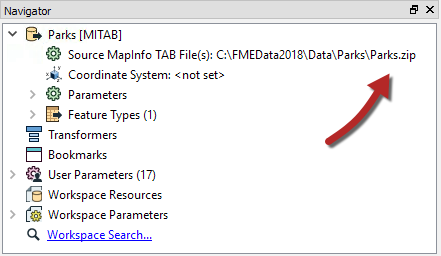
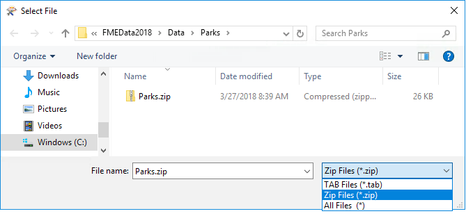
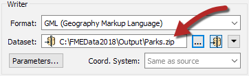
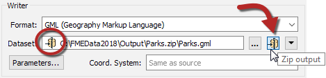
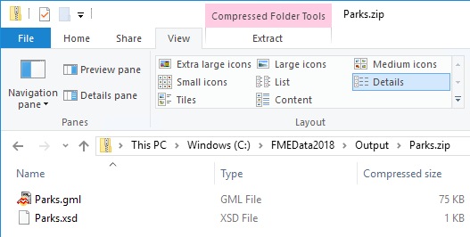

# 编写Zip文件

FME读模块和写模块都能够使用压缩（zip）文件。Zip文件是存储需要作为单个单元处理的数据集的便捷方式; 例如，一个包含在单个zip文件中的多个数据集文件。

## Zip文件阅读

读模块读取的数据集由“导航器”窗口中的“源数据集/文件”参数定义：

[](https://github.com/safesoftware/FMETraining/blob/Desktop-Advanced-2018/DesktopAdvanced3AdvancedR%2BW/Images/Img3.000.ZipFileReader.png)

如上面的屏幕截图所示，此数据集参数可以是指向zip文件的指针。您只需在source参数中选择zip文件，FME将在读取数据时提取数据。

数据集是基于文件（如单个AutoCAD文件）还是基于文件夹（如组成Shapefile数据集的文件集）无关紧要。

设置它的唯一困难是要记住默认情况下文件浏览器不显示zip文件，并且必须更改正在查看的文件扩展名：

[](https://github.com/safesoftware/FMETraining/blob/Desktop-Advanced-2018/DesktopAdvanced3AdvancedR%2BW/Images/Img3.001.ZipFileBrowseDataset.png)

## Zip文件写入

将数据写为zip文件对于需要对输出数据进行后处理的位置特别有用。例如，如果使用关闭脚本将输出数据移动或复制到新位置，则处理单个zip文件比处理多个数据文件更方便。

创建压缩输出的最简单方法是在输出数据集字段中将文件扩展名更改为.zip：

[](https://github.com/safesoftware/FMETraining/blob/Desktop-Advanced-2018/DesktopAdvanced3AdvancedR%2BW/Images/Img3.002.ZipFileExtension.png)

您还可以指定要在zip文件中写入的文件名。实际上，设置zip扩展名的快捷按钮可以为您完成此操作：

[](https://github.com/safesoftware/FMETraining/blob/Desktop-Advanced-2018/DesktopAdvanced3AdvancedR%2BW/Images/Img3.003.ZipDatasetButton.png)

请注意数据集字段中指示压缩状态的小图标。

运行工作空间时，日志文件会报告zip创建：

```text
完成更新输出zip文件：`C：\ FMEData2018 \ Output \ Parks.zip'
```

...而且输出确实是一个压缩数据集：

[](https://github.com/safesoftware/FMETraining/blob/Desktop-Advanced-2018/DesktopAdvanced3AdvancedR%2BW/Images/Img3.004.ZippedOutputDataset.png)

|  直觉姐姐说...... |
| :--- |
|  我是永久转换顺序的直觉姐姐。我将在本章中为您提供空间指导。  某些用户可能希望压缩数据，以便将其作为单个实体移动或复制到其他位置。可以在TCL或Python关闭脚本中使用用户参数来查找刚写入的文件的名称，而FeatureWriter转换器还将数据集的名称作为属性提供。 |

|  技巧 |
| :--- |
|  如果您想知道，支持读取其他文件压缩格式将在FME 2019中出现（它已经在测试版中）。这包括.gz，.bz2，.zipx，.7z，.tar，.rar和其他几个！ |


