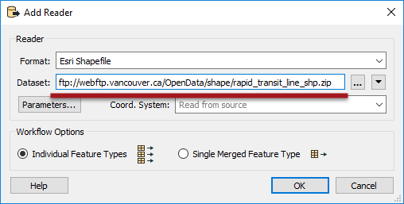
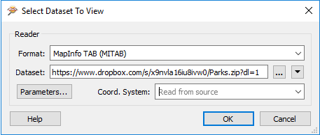
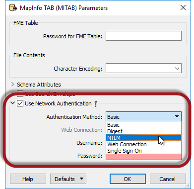
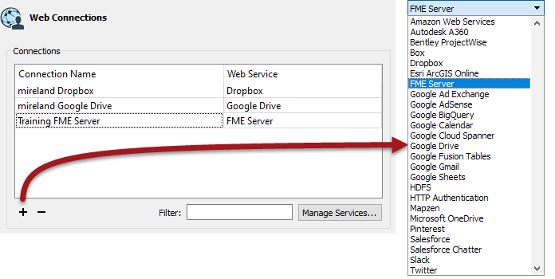
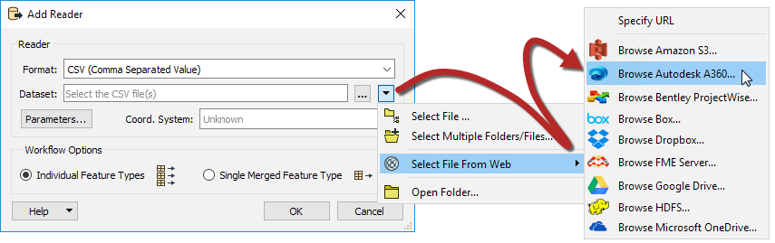
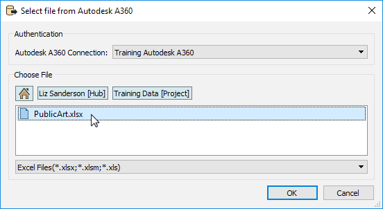

# 基于Web的数据集

毫无疑问，有一个趋势是数据被存储在云中，包括空间数据。因此，FME拥有全面的工具来读取基于网络的数据集。

## 简单的URL选择

读取基于Web的数据集的最简单方法是将URL粘贴到源数据集参数中。

这里的工作空间作者正在添加一个读模块，直接从开放数据FTP站点读取Shapefile。

|  Intuitive修女说...... |
| :--- |
|  必须将基于文件夹的数据集压缩为单个zip文件，以便FME从Web中读取它; 以上是该要求的完美例证。可以从非压缩数据集中读取数据集，但仅当数据集包含单个文件（例如AutoCAD DWG文件）时才能读取。 |

输入到源数据集字段中的URL也可以是对基于Web的文件存储系统上的共享资源的引用。例如，这里的用户正在直接从Dropbox链接读取MapInfo TAB数据集到FME Data Inspector中：

关键是强制Web服务提供到文件的直接链接，而不是他们自己的Web界面。例如，要使Dropbox呈现数据，您应该在URL [中将dl查询参数设置](https://www.dropbox.com/en/help/201)为1，如上面的屏幕截图所示，而不是默认值0（零）。

但是，有更好的方法从Web服务读取数据...

|  技巧 |
| :--- |
|  如果从需要身份验证的网站数据中读取数据，则大多数读模块都有参数来输入此类信息：   |

## Web服务

除了能够从URL读取外，FME还可以直接访问某些Web服务来读取数据。通过名为**Web Connections** 的FME内部功能实现对Web服务的直接访问。

通过在FME Workbench菜单栏上选择工具&gt; FME选项&gt; Web连接并单击Web连接对话框中的加号按钮来创建Web连接：

有大量可以建立连接的Web服务 - 管理服务按钮允许您集成所需的任何其他Web服务 - 但主要的是：

<table>
<tbody><tr>
    <td>•Amazon S3</td>
    <td>•FME Server</td>
</tr>
<tr>
    <td>•Autodesk A360</td>
    <td>•Google Drive</td>
</tr>
<tr>
    <td>•Box</td>
    <td>•HDSF</td>
</tr>
<tr>
    <td>•Dropbox</td>
    <td>•Microsoft OneDrive</td>
</tr>
</tbody></table>

这些是主要类型，因为它们能够以可以直接从“添加读模块”对话框访问的方式存储数据：

在上面的屏幕截图中，作者正在从AutoCAD A360添加Excel数据集。此操作将打开一个对话框，您可以在其中浏览AutoCAD A360以获取所需文件：

然后将读模块添加到工作空间并像其他任何一样运行。

请注意，如果您希望使用FeatureReader转换器而不是读模块，则可以使用相同的“从Web选择文件”选项。

|  警告 |
| :--- |
|  显然，在向FME添加新的Web服务连接时需要执行身份验证步骤，如果工作空间已发布到FME Server或只是复制到另一个FME Desktop安装中，则需要在新的位置执行相同的身份验证。 |

## 连接器转换器

除了能够将读模块引导到Web服务之外，还存在可以读取文件的各种转换器。这些与读模块支持的相同列表有关，因此我们有：

<table>
<tbody><tr>
    <td>•AutodeskA360Connector</td>
    <td>•OneDriveConnector</td>
</tr>
<tr>
    <td>•BoxConnector</td>
    <td>•PintrestConnector</td>
</tr>
<tr>
    <td>•DropboxConnector</td>
    <td>•ProjectWiseConnector</td>
</tr>
<tr>
    <td>•FMEServerResourceConnector</td>
    <td>•SalesForceConnector</td>
</tr>
<tr>
    <td>•GoogleDriveConnector</td>
    <td>•SlackConnector</td>
</tr>
<tr>
    <td>•HDFSConnector </td>
    <td></td>
</tr>
</tbody></table>

这些转换器不会_读取_传统FME意义上的数据。相反，他们读取所选文件，并将内容添加到属性或将文件下载到本地文件系统。

例如，作者在此处使用Creator转换器触发从Google Drive读取文件：

该文件的内容已添加到属性中，然后可以根据需要进行处理。例如，它可能是一个XML片段，可以使用XML转换器进行解码。

---

| 技巧 |
|:---|
| Connector转换器还可以上载文件，列出Web服务的内容，以及从该服务中删除文件。 |

---

鉴于读模块上的“从Web选择文件”工具，Connector转换器通常不用于读取源数据; 虽然它们可用于下载随后使用FeatureReader读取的文件。

另一种用途是检索文件列表，然后使用FeatureReader直接读取这些文件。

但是，更可能的用途是将写入数据传输到Web上。写模块没有等效的“从Web选择文件”选项，因此最好的替代方法是使用FeatureWriter转换器写入数据，然后使用Connector转换器将该数据传输到所选的Web服务。

