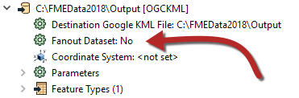
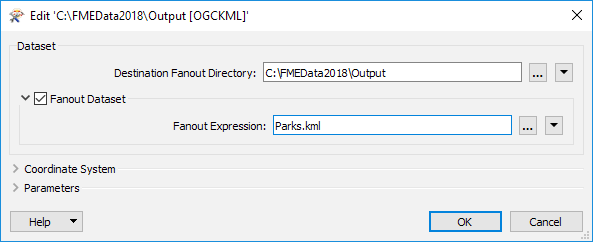

# 数据集扇出

数据集扇出将数据传递到相同的要素类型，但在多个数据集中。再次使用高程示例，此处输出是每个高程值的不同数据集：

此扇出的结果是一系列DXF数据集，每个数据集在一个层上具有一个高程值的轮廓。

## 设置数据集扇出

数据集扇出在Workbench的“导航”窗口中定义，位于写模块的数据集参数下方：

双击“扇出数据集”参数将打开一个对话框，在该对话框中定义要写入的文件夹以及要使用的扇出表达式。它默认为原始文件名：

要实现扇出（每个属性值不同的文件），请编辑扇出表达式以包含属性名称，例如：

在这种情况下，每个不同的街区都会生成一个单独的公园要素文件。

|  Vector小姐说...... |
| :--- |
|  扇出是使用FME编写数据的重要部分，请告诉我，哪些陈述是正确的？  [1.您可以在同一工作空间中同时具有要素类型扇出和数据集扇出](http://52.73.3.37/fmedatastreaming/Manual/QAResponse2017.fmw?chapter=14&question=1&answer=1&DestDataset_TEXTLINE=C%3A%5CFMEOutput%5CQAResponse.html)  [2.您可以使用具有数据库格式但不是数据集扇出的要素类型扇出](http://52.73.3.37/fmedatastreaming/Manual/QAResponse2017.fmw?chapter=14&question=1&answer=2&DestDataset_TEXTLINE=C%3A%5CFMEOutput%5CQAResponse.html)  [3.扇出表达式可以是属性，也可以是构造字符串，但不是用户参数](http://52.73.3.37/fmedatastreaming/Manual/QAResponse2017.fmw?chapter=14&question=1&answer=3&DestDataset_TEXTLINE=C%3A%5CFMEOutput%5CQAResponse.html)  [4.扇出不能基于格式属性，如fme\_color](http://52.73.3.37/fmedatastreaming/Manual/QAResponse2017.fmw?chapter=14&question=1&answer=4&DestDataset_TEXTLINE=C%3A%5CFMEOutput%5CQAResponse.html) |

