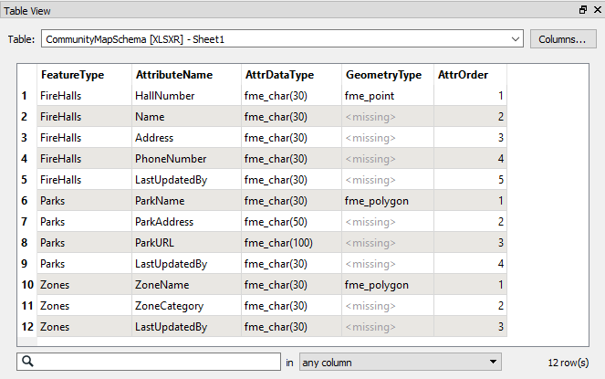
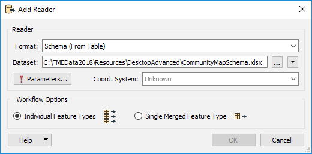
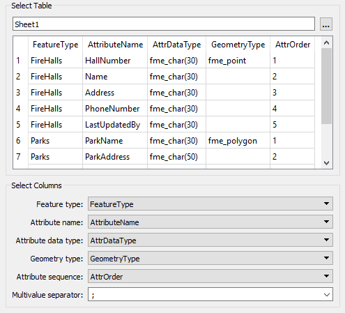
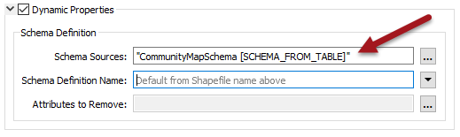
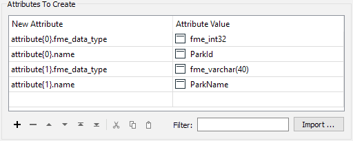
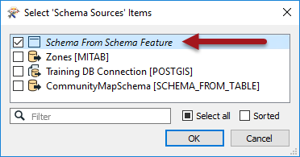

# 备用动态架构源

通常，动态转换的模式来自源数据集本身或来自不同的数据集（例如正在写入数据的数据库表）。

但是，还有另外两种方案可用于提供输出模式：

* 模式可以来自存储定义的查找表（文本文件或电子表格）
* 模式可以动态定义为工作空间中的属性列表

## 基于表的模式

在这种情况下，输出模式作为某种形式的表存储在文本文件或电子表格中; 例如：

这里作者列出了一系列定义输出模式的要素类型，属性和几何类型。在FME中，他们将通过添加资源读模块来使用此模式。资源读模块的格式为Schema（From Table）：

在此读模块的参数对话框中，有一些参数用于指定表中的哪些字段表示模式的哪些部分：

几何类型是可选的，但在此示例中使用。

属性序列是另一个可选参数。它在表中定义了一个字段，用于记录属性应出现的顺序。

然后，当然，必须将此读模块用作输出模式的源：

与往常一样，传入的属性必须映射到传出模式。这里最好的方法是SchemaMapper转换器，因为它也可以使用查找表来创建其映射。

|  直觉姐姐说… |
| :--- |
|  此方法的一个显着优点是您无需编辑工作空间或编辑数据集即可进行模式更改。一旦更改了表中的输出模式，那么它将自动应用于FME转换中。 那真是太好了! |

## 构造的属性模式

此方案是使用FME中的列表构造属性模式的方法。通过使用列表中的属性来定义模式，例如：

写模块被告知通过选择它作为源模式来优先使用此模式：

### FME数据类型

前面两个工具都允许用户在输出模式中定义属性类型。FME中有一组有效的数据类型，如下所示：

| 一般字段类型 | 特定字段类型 |
| :--- | :--- |
| 字符字段 | fme\_varchar\(宽度\), fme\_char\(宽度\), fme\_char |
| 整数字段 | fme\_uint8, fme\_int16, fme\_uint16, fme\_int32, fme\_uint32, fme\_int64,fme\_uint64 |
| 数字字段 | fme\_decimal\(宽度,小数\), fme\_real32, fme\_real64 |
| 日期时间字段 | fme\_datetime, fme\_time, fme\_date |
| 其他字段 | fme\_buffer, fme\_boolean |

|  Vector小姐说...... |
| :--- |
|  从工作空间中的属性构造动态模式的能力具有很多可能性。实际上，其中一个FME转换器会自动创建动态模式属性，以便您可以创建新模式。这是什么？  [1. SchemaMapper](http://52.73.3.37/fmedatastreaming/Manual/QAResponse2017.fmw?chapter=14&question=4&answer=1&DestDataset_TEXTLINE=C%3A%5CFMEOutput%5CQAResponse.html) [2. AttributePivoter](http://52.73.3.37/fmedatastreaming/Manual/QAResponse2017.fmw?chapter=14&question=4&answer=2&DestDataset_TEXTLINE=C%3A%5CFMEOutput%5CQAResponse.html) [3. PythonCaller](http://52.73.3.37/fmedatastreaming/Manual/QAResponse2017.fmw?chapter=14&question=4&answer=3&DestDataset_TEXTLINE=C%3A%5CFMEOutput%5CQAResponse.html) [4. Clipper](http://52.73.3.37/fmedatastreaming/Manual/QAResponse2017.fmw?chapter=14&question=4&answer=4&DestDataset_TEXTLINE=C%3A%5CFMEOutput%5CQAResponse.html) |

