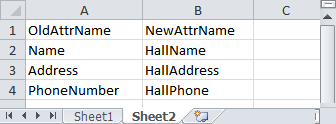
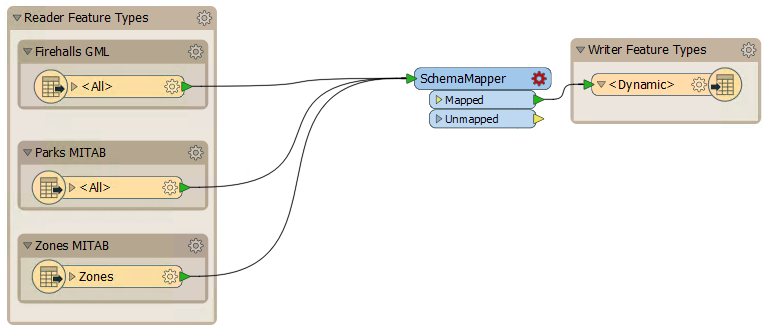
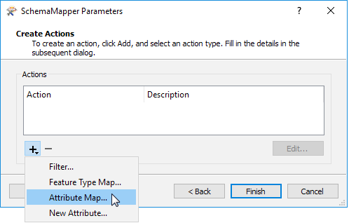
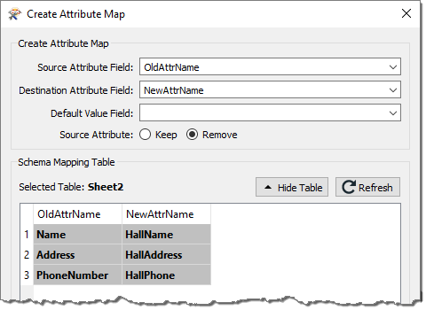

# 练习：动态社区地图转换（基于表格）

 练习5

 动态社区地图转换（基于表格）

数据

社区地图（Esri文件地理数据库）

总体的目标

使用基于表的模式生成新的社区地图数据集

演示

用于动态转换的基于表的模式

启动工作空间

C:\FMEData2018\Workspaces\DesktopAdvanced\ReadWrite-Ex5-Begin.fmw

结束工作空间

C：\ FMEData2018 \ Workspaces \ DesktopAdvanced \ ReadWrite-Ex5-Complete.fmw  
C：\ FMEData2018 \ Workspaces \ DesktopAdvanced \ ReadWrite-Ex5-Complete-Advanced.fmw

在上一个练习中，您使用动态模式为计划部门创建了一个新的社区地图数据集。当时只定义了两个表，但现在需要另一个表，计划部门希望您更新工作空间。

不必在每次添加更多数据集时都进行更改，您发现您可以简单地创建一个包含模式定义的Excel电子表格这样，规划团队可以自己编辑它，并为将来的所有更新执行相同的操作。

  
**1）检查电子表格**  
打开并检查C：\ FMEData2018 \ Resources \ DesktopAdvanced \ CommunityMapSchema.xlsx上的电子表格。

如果您没有Excel，请在FME Data Inspector中打开它并切换到Table View。

该表具有Firehalls，Parks和Zones要素类型的模式定义。

  
**2）启动Workbench**  
启动FME Workbench。从上一个练习或上面列出的开始工作空间打开工作空间。

  
**3）删除CommunityMap资源读模块**  
因为我们使用电子表格来定义输出模式，所以不再需要CommunityMap资源读模块。在“导航”窗口中找到它，右键单击它，然后选择“删除”。

出现提示时，单击“确定”以确认也将删除与此数据集相关的所有引用。

  
**4）将Excel文件添加为读模块资源**  
现在选择Readers&gt; Add Reader as Resource。在打开的对话框中选择：

读模块格式

模式（从表格）

读模块数据集

C:\FMEData2018\Resources\DesktopAdvanced\CommunityMapSchema.xlsx

_**注意：**请务必使用Schema（From Table）格式而不是Excel格式！_

在单击“确定”之前，单击“参数”按钮（如果不这样，则无论如何都会提示您）。我们可以在此对话框中定义表如何地图到所需的模式。

检查顶部的读模块参数。他们应该显示数据集是Excel格式文件。选择Sheet1作为要使用的表：

第一行应该用作字段名称。如果不是这种情况，请单击上面的参数按钮并正确设置值：

接下来，选择适当的字段以匹配所需的参数（例如Feature Type = FeatureType）：

单击“确定”关闭对话框，然后再次添加资源读模块。

 技巧

这样的查找表中的字段可以提供任何您想要的名称。&lt;/font&gt;在这个例子中，它们的名称与它们所应用的参数相同，但只是为了使关系尽可能明显。

&lt;/font&gt;&lt;/font&gt;&lt;/td&gt; &lt;/tr&gt; &lt;/tbody&gt;&lt;/table&gt;

  
**5）设置动态参数**  
现在检查写模块要素类型的要素类型参数。

在“用户属性”选项卡下，删除LastUpdatedBy属性，因为我们已将其添加到每种类型的电子表格定义中，并且此处不再需要它。

在“参数”选项卡中，单击“模式源”编辑按钮。取消选中FireHalls并检查CommunityMapSchema \[SCHEMA\_FROM\_TABLE\]：

接受对这些参数的更改。

  
**6）添加读模块**  
如果您注意到，模式电子表格包含Zones数据集的条目，因此添加读模块（不是资源 - 我们这次真的想要数据），如下所示：

读模块格式

MapInfo TAB（MITAB）

读模块数据集

C:\FMEData2018\Data\Zoning\Zones.tab

添加后，将其读模块要素类型连接到动态写入器要素类型。

  
**7）保存并运行工作空间**  
保存工作空间然后运行它。

检查输出。请注意，已编写了所有三种要素类型，并且它们的属性模式与Excel电子表格中定义的相匹配; 包括每个的LastUpdatedBy字段。

 高级练习

如果你有时间，让我们做一些更高级的步骤。 &lt;/font&gt;&lt;/font&gt;  
  
如果您无法对Excel文件进​​行编辑（如下两步），只需检查并替换该文件的高级副本：C:\FMEData2018\Resources\DesktopAdvanced\CommunityMapAdvancedSchema.xlsx

&lt;/font&gt;&lt;/font&gt;&lt;/td&gt; &lt;/tr&gt; &lt;/tbody&gt;&lt;/table&gt;

  
**8）更新电子表格 - 1**  
规划团队已决定重命名某些属性，因此请打开电子表格并重命名FireHalls要素类型的以下属性：

* 姓名为HallName
* 地址为HallAddress
* 电话号码为HallPhone

_**注意：**_ _如果您没有Excel，与此步骤不同，只需更改资源阅读器以使用此文件的高级模式版本，C:\FMEData2018\Resources\DesktopAdvanced\CommunityMapAdvancedSchema.xlsx_

  
**9）更新电子表格 - 2**  
如果您现在运行工作空间，它将运行完成，但重命名的字段中没有值。那是因为FME无法判断如何将源数据映射到新的模式。

我们可以添加一个AttributeRenamer转换器来处理这种变化，但更好的方法是使用SchemaMapper。这样它可以变得更有活力。

因此，在电子表格的表2中，输入：

| OldAttrName | NewAttrName |
| :--- | :--- |
| 名称 | HallName |
| 地址 | HallAddress |
| 电话号码 | HallPhone |

然后保存电子表格。

_**注意：**_ _同样，如果您没有Excel，只需更改资源读模块以使用该文件的高级模式版本，C:\FMEData2018\Resources\DesktopAdvanced\CommunityMapAdvancedSchema.xlsx_

  
**10）添加SchemaMapper**  
将SchemaMapper转换器添加到工作空间，连接到输出要素类型：

检查SchemaMapper的参数。它是一个向导，而不是一个对话框。在格式面板中，选择已编辑的Excel文件。在下一个面板中，选择Sheet 2作为要使用的表。

在最后一个面板中，选择Add&gt; Attribute Map：

出现提示时，选择OldAttrName作为源字段，选择NewAttrName作为目标字段。选中复选框以删除原始属性（即这是重命名，而不是复制）：

单击“确定”关闭此对话框，然后单击“完成”。现在保存并重新运行工作空间。

这次输出将正确映射其属性。所以现在规划部门可以转换他们的数据，决定输出模式，并动态地将源映射到目标属性; 全部通过编辑这一个Excel电子表格。

<table>
  <thead>
    <tr>
      <th style="text-align:left">恭喜</th>
    </tr>
  </thead>
  <tbody>
    <tr>
      <td style="text-align:left">
        
通过完成本练习，您已学会如何：

        <ul>
          <li>设置电子表格以用作动态转换模式</li>
          <li>使用Schema（来自表格）读模块从电子表格中读取模式</li>
          <li>使用SchemaMapper转换器在动态工作空间中映射属性</li>
        </ul>
      </td>
    </tr>
  </tbody>
</table>&lt;/td&gt; &lt;/tr&gt; &lt;/tbody&gt;&lt;/table&gt;  
&lt;/article&gt; &lt;/div&gt; &lt;/body&gt;&lt;/html&gt;

