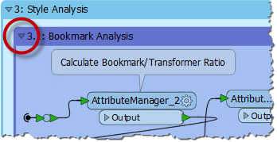

# 折叠书签

正如我们所知，书签就像它的真实世界同名一样，是一种放下标记以便于访问的方法。

通过FME，书签覆盖了通常执行特定任务的工作区域，因此用户可以从更大的转换器组中选择它并相对容易地移动到它。

正如一位用户所说，书签就像工作空间的段落！

上面的工作区很好地说明了如何使用书签标记工作空间的不同部分。如您所见，允许通过将一个书签_嵌套_在另一个书签中来进一步细分书签。

但是在FME 2018中，还有一个功能可以更进一步...

## 折叠书签

在FME 2018中，每个书签的左上角都有一个小图标，允许它折叠：

折叠书签意味着它被压缩到单个转换器的大小，除了数据进入或退出书签的位置之外，不显示任何内容：

再次单击该图标会将书签重新打开为其先前的大小。

此功能允许在较小的区域中渲染大部分工作空间，并且仅在需要编辑时才打开。

例如，上面显示的工作空间部分可能会缩减为：

这显然是在大画布上节省了大量空间。

## 折叠书签与自定义转换器

很容易看到折叠书签作为自定义转换器的替代品，特别是在自定义转换器仅用作节省画布空间的方法的情况下：

但是，如果要在多个位置重复使用内容，则可折叠书签不是一个很好的替代品。这是因为每个自定义转换器都从主自定义转换器定义继承其行为。编辑定义会更新所有自定义转换器。

折叠书签并不是如此。没有主定义并且编辑书签的内容不会自动更新任何其他书签中的内容，即使它是直接副本。

此外，折叠的书签无法与其他用户共享，也无法像自定义转换器那样设置已发布的参数。

因此，虽然折叠的书签可以替换自定义变换器的某些方面，但它无法完全替换它们。

