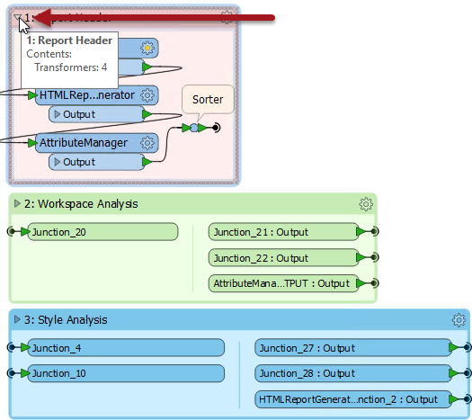

# 可折叠书签最佳实践

使用新的可折叠书签，需要考虑最佳实践和样式的各个方面。

## 重命名端口

可以重命名折叠书签上的输入和输出端口，以帮助明确进入和退出的数据：

这种能力存在并不明显，但实际上它可以通过“三种”不同的方式访问！

* 双击该对象
* 选择对象并按F2
* 使用上下文菜单上的“重命名”选项（如上图所示）

显而易见的好处是清晰明了。通过了解每个输入和输出端口的用途，可以对其进行额外的连接，而无需扩展书签内容。

## 重新排列书签

虽然您可以一次折叠一个书签，但导航器窗口中的一个选项允许您一次折叠所有书签：

这样做说明了在单个画布中可以节省多少空间：

当然，将书签更紧密地移动到一起来重用这个空间是有帮助的：

但除了重复使用空间外，还有另一个重新组织的原因。

当书签彼此靠近放置时，重新打开折叠的书签会调整工作空间的布局，将其他转换器或书签移开，将其他转换器或书签移开，使其内容显示不重叠。重新关闭书签会导致相反的情况发生。

例如，在上面的截图中：

...如果扩展了任何书签，则将其周围的书签移动到一侧以适应新的空间要求。当书签再次折叠时，反向发生，以提供与以前相同的紧凑布局。

