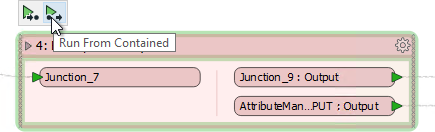
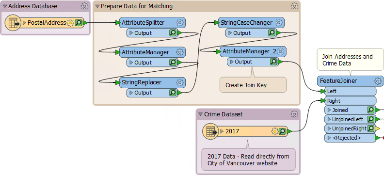
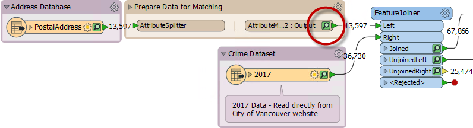
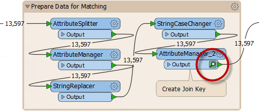

# 可折叠书签和缓存

可折叠书签的设计非常谨慎，因此它们可以与缓存和部分运行进行交互。

## 运行书签

部分运行的弹出选项以及出现在转换器上的选项也出现在书签上：

T这些选项称为 _运行到包含_ and _从包含运行_, a并显示书签是折叠还是展开。

这显然可以更轻松地运行工作区的一部分，尤其是折叠书签的地方。

## 提高性能

当作者创建一个非常大的工作空间时（通常是有很多书签的情况下），启用要素缓存的运行可能会创建大量不需要的缓存：

请注意，在上面的屏幕截图中，正在缓存“准备匹配数据”书签中的每个转换器。

为避免这种情况，要素缓存旨在避免为折叠书签中的每个转换器缓存数据。运行工作空间时，折叠书签中的所有转换器都会照常运行，但缓存的唯一数据是由书签上的输出端口表示的转换器：

我们可以看到，在工作空间运行完毕后扩展书签：

使用大型工作空间时，这可节省大量时间和资源。

|  |
| :--- |
|  显然，无论您的书签是否已折叠，您都不希望在启用缓存时将工作空间投入生产。仅建议将此技术用于工作空间创建的设计，创作和测试阶段。 |

