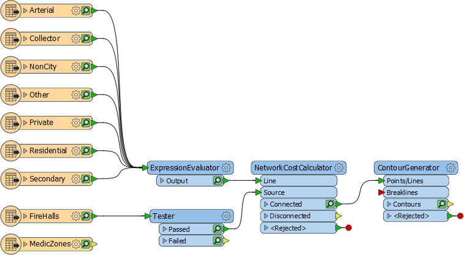
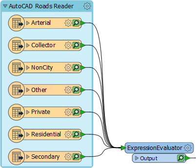
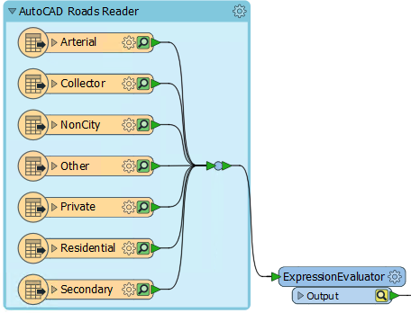
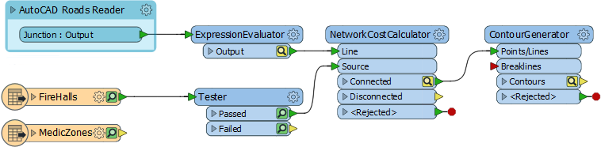
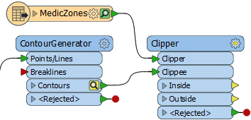
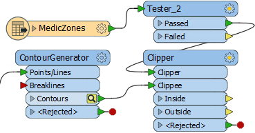
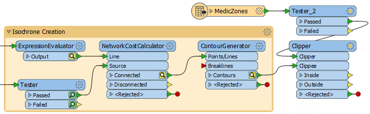
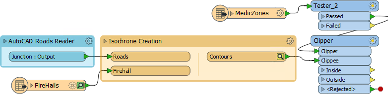
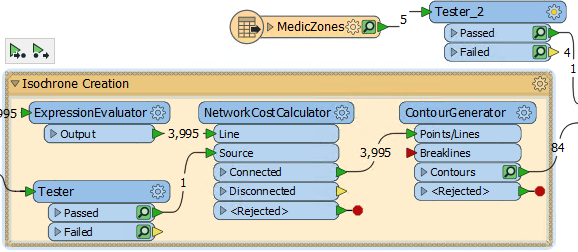

# 练习：紧急响应项目

|  练习 |  缓存和部分运行 |
| :--- | :--- |
| 数据 | 道路（AutoCAD DWG） 消防站和分区（GML） |
| 总体的目标 | 使用NetworkCostCalculator创建时间和距离等值线 |
| 演示 | 可折叠书签 |
| 启动工作空间 | C:\FMEData2018\Workspaces\UpgradingTo2018\Bookmarks-Ex1-Begin.fmwt |
| 结束工作空间 | C:\FMEData2018\Workspaces\UpgradingTo2018\Bookmarks-Ex1-Complete.fmwt |

在这里，我们将继续从缓存章节开始练习。我们的目标是协助规划紧急服务，通过创建等时线数据集 - 表示每个消防站的行程时间的轮廓线 - 用于医疗紧急情况。

  
**1）启动Workbench**  
启动FME Workbench，并在必要时打开上一个练习的模板文件。您可以在以下位置找到它的副本：C：\ FMEData2018 \ Workspaces \ UpgradingTo2018 \ Bookmarks-Ex1-Begin.fmwt

工作空间工作正常，但需要进行一些调整，而且需要最佳实践样式。

  
**2）添加书签**  
我们可以做的第一件事是通过为所有道路要素类型**添加书签**并将其折叠到更小的空间来使工作空间画布更加整洁。

因此，选择AutoCAD道路读模块的所有要素类型。按Ctrl + B（或从工具栏中选择“插入书签”）。将书签命名为AutoCAD Roads Reader：

如果我们现在折叠书签（尝试并查看），我们仍将获得多个输出和连接。我们真的不需要这个。因此，在所有连接和ExpressionEvaluator之间添加一个Junction转换器，并调整书签大小（必要时首先展开它）以适应Junction：

折叠书签，现在只有一个输出端口。双击端口以重命名它。将它命名为Roads：

这显然在画布中节省了相当多的空间。

  
**3）添加Clipper**  
要返回到手头的任务，当前的工作空间输出覆盖整个温哥华市，而我们只需要它来显示4号消防站的责任区域的轮廓线。

要剪切数据，请将Clipper转换器添加到工作空间。将轮廓连接到Clippee输入端口，将MedicZone要素类型连接到Clipper端口：

重新排列对象/端口以确保没有重叠连接。

  
**4）复制Tester**  
 MedicZones数据也涵盖了整个城市，我们只需要4号消防站。我们可以用Tester过滤这个; 实际上与现有Tester具有相同的测试。

因此，选择现有测试程序并按Ctrl + D（右键单击&gt;复制）以复制它。将重复的测试程序丢弃到MedicZones-Clipper连接中：

但是不要运行工作空间......

  
**5）添加书签**  
如果我们现在运行工作空间，则会有许多黄色缓存将被更新和保存。但是，我们并不真的需要这些。缓存对于测试工作空间的一部分很有用，但我们已经知道此工作空间的主要部分是正确的。

因此，在四个主要处理转换器（ExpressionEvaluator，Tester，NetworkCostCalculator，ContourGenerator）周围添加一个书签：

现在折叠书签，重命名其端口，并重新排列它周围的内容：

请注意，现在整个书签只有一个缓存。

  
**6）运行工作空间**  
通过选择Clipper转换器并选择Run To This（从此运行）重新运行工作空间。

我们现在正在保存缓存空间，因为只为书签部分创建了一个缓存。展开（并重新折叠）Isochrone书签以证明这一点。ContourGenerator具有缓存，因为它是最后一个转换器。Tester有缓存，但只是因为它已经有了它们：

注意，当您展开/折叠书签时，其他对象会相应移动以避免重叠。

现在检查Clipper:Inside缓存。您应该看到等时线被裁剪到消防站4的责任区域。

  
**7）保存工作空间将工作空间**  
重新保存为模板 - 包括缓存 - 因此可以根据需要进行进一步编辑。

|  技巧 |
| :--- |
|  要查看此项目的一些高级任务，请访问FME知识中心的[GIS教程](https://knowledge.safe.com/articles/30048/creating-time-and-distance-isolines-using-the-netw.html)。 |

<table>
  <thead>
    <tr>
      <th style="text-align:left">恭喜</th>
    </tr>
  </thead>
  <tbody>
    <tr>
      <td style="text-align:left">
        
通过完成本练习，您已学会如何：
           
        

        <ul>
          <li>添加和折叠书签</li>
          <li>添加Junction以减少书签输出端口的数量</li>
          <li>重命名书签输出端口</li>
          <li>重新排列书签周围的对象，以便在折叠/展开书签时移动它们</li>
          <li>折叠书签以保存缓存多余数据</li>
        </ul>
      </td>
    </tr>
  </tbody>
</table>