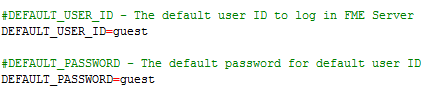

# 无需身份验证即可运行

称为**可信用户帐户**的特殊帐户可用于提供对FME Server的任何组件的未经身份验证的访问。默认情况下，此受信任帐户名为_guest_，并分配给_fmeguest_角色。默认情况下，_fmeguest_角色配置为允许对FME Server Web服务进行未经身份验证的访问。这意味着可以在不提供任何凭据的情况下调用服务URL。

|  警察局长Webb-Mapp说... |
| :--- |
|  如果希望所有FME Server Web服务都提示进行身份验证，请在为服务器配置自己的一组用户和访问控制后删除guest帐户。 |

可信用户帐户在_propertiesFile.properties_文件中为每个Web服务配置。如果您的FME Server安装使用内置的Apache Tomcat servlet，则这些文件位于：

```text

C:\Program Files\FMEServer\Utilities\tomcat\webapps\<service&qt;\WEB-INF\conf\propertiesFile.properties
```

_你将不得不改变 &lt;service&qt; 到位于webapps文件夹中的各种服务之一_

要更改服务的受信任帐户的用户名和密码，请配置_DEFAULT\_USER\_ID_和_DEFAULT\_PASSWORD_参数：



