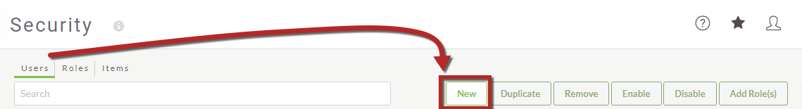
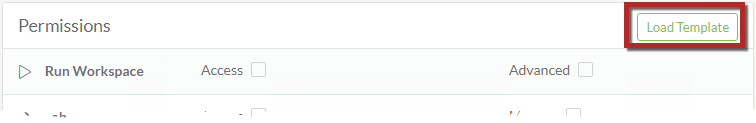
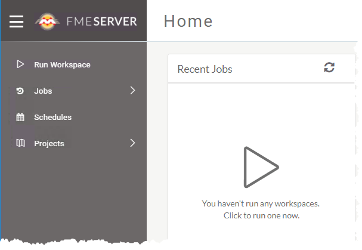

# 练习1：创建新用户

|  练习1 |  创建新用户并限制他们的操作 |
| :--- | :--- |
| 数据 | N / A |
| 总体目标 | 在FME Server Web界面中创建具有有限权限的新用户 |
| 演示 | 在FME Server中设置安全选项 |

贵公司最近聘请了一位将访问FME Server的新分析师。新员工不太适合您现有的当前FME Server角色，因此您需要为他们创建新角色。

  
**1）连接到FME Server**  
通过Windows“开始”菜单上的“Web Interface”选项或直接在Web浏览器（[http：// localhost / fmeserver](http://localhost/fmeserver)）中打开FME Server Web界面，然后使用用户名和密码_admin_登录。

单击左侧边栏上“管理”标题下的*“ 安全性”*以展开菜单，然后选择**"用户"** 以查看当前用户的列表。

  
**2）创建新用户**  
让我们为新分析师创建一个新的FME Server用户帐户。单击“ **新建”**以添加新用户：

出现提示时，使用以下参数创建新用户：

* **用户名：** NewUser
* **全名：** NewUser
* **密码：** NewUser1

  
**3）配置权限**  
现在我们已经指定了新用户帐户的凭据，让我们为他们有权访问的FME Server中的功能和项目设置权限。

通过选择**“加载模板”** 按钮，您可以选择从现有角色复制权限。

从“加载模板”选项中选择_fmeguest_。这有助于加快安全配置。请注意，Run Workspace和Jobs现已被授予Access。

配置权限以匹配以下内容：

* **运行工作空间：** 访问
* **作业：** 访问
* **计划表：** 创建
* **库：** 创建
* **项目：** 创建

请注意，通过选择Create，将自动授予Access权限。

在底部选择**确定**以创建用户。

  
**4）测试新用户帐户**  
验证我们设置的选项是否合格非常重要。

注销管理员帐户或打开新的私人浏览窗口，然后使用我们刚刚创建的新用户帐户的凭据登录。

请注意该用户如何只看到一组有限的菜单选项：运行工作空间，作业，计划，仓库和项目。

<table>
  <thead>
    <tr>
      <th style="text-align:left">恭喜</th>
    </tr>
  </thead>
  <tbody>
    <tr>
      <td style="text-align:left">
        
通过完成本练习，您已学会如何：
           
        

        <ul>
          <li>在FME Server安装上创建新用户</li>
          <li>从现有FME Server角色设置权限</li>
          <li>测试新创建的帐户以确保其正常运行</li>
        </ul>
      </td>
    </tr>
  </tbody>
</table>
