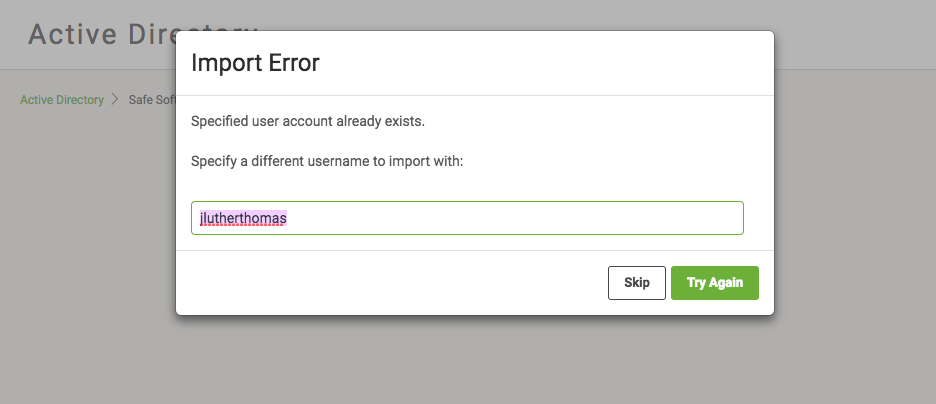

# 练习2：配置活动目录 / LDAP

|  练习2 |  为活动目录配置FME Server（LDAP） |
| :--- | :--- |
| 数据 | N / A |
| 总体目标 | 将FME Server连接到现有的活动目录服务 |
| 演示 | 在FME Server中配置活动目录，导入用户和组 |

|  此练习仅用于演示目的 |
| :--- |

此实验需要Windows域控制器，并且可以从FME Server系统连接。今天使用的培训环境无法访问域控制器。以下步骤和视频将作为配置典型活动目录以与FME Server配合使用的指南。它不包括特定活动目录可能需要的所有可能配置。

|  Intuitive修女说...... |
| :--- |
|  由于安全要求和限制，无法完成此练习。  相反，请观看[此视频演示练习](https://youtu.be/XzoCR-X5TKQ)。 |

  
**1）连接到FME服务器**  
通过Windows“开始”菜单上的Web界面选项或直接在Web浏览器http：// &lt;your fmeserver host&gt;/ fmeserver中打开FME Server Web界面，然后使用管理员帐户登录。

单击左侧边栏上“管理”标题下的“ _安全性”_，然后选择“ **活动目录”**。

  
**2）创建与活动目录的连接**  
通过创建新连接，您可以将组织的活动目录用户和组合并到FME Server安全配置中。

要开始使用，请选择“ **新建”**以打开“创建新服务器连接”页面。

输入以下信息：

* **名称：** FME 活动目录
* **主机：** dc.fme.com
* **端口：** 389
* **搜索帐户名称：** DC \ Administrator
* **搜索帐户密码：** dcAdmin2017

单击“ **确定”**以保存新的活动目录连接。您将返回到活动目录页面。等待状态从黄色变为绿色，表示连接成功。

  
**3）导入用户**  
现在已建立连接，选择“ **导入用户”**图标以从活动目录连接添加用户。

在“浏览用户”页面上，键入_mvector_，然后按Enter键。选择Miss Vector的用户，然后单击“ **导入”**。

Web浏览器窗口右上角会显示一条通知，表明用户已成功导入。

注意：如果Miss Vector属于任何活动目录组，我们可以将其作为FME服务器角色导入 - 并且将自动导入所有成员用户。

|  提示：导入错误 |
| :--- |
|  从活动目录导入用户时，您可能会遇到此消息。这是因为SYSTEM用户中已存在相同值的用户名。 建议您删除SYSTEM用户帐户，然后重新导入活动目录用户。 如果要从包含与第一个域相同的命名用户的第二个域导入用户，也会发生此错误 。在这种情况下，需要在此对话框上提供 不同的用户名，以表示来自第二个域的用户。 **注意**：FME Server为导入的用户名创建别名，并将其链接到活动目录中的 用户帐户。           |

  
**4）配置用户权限**  
将活动目录用户导入FME Server后，必须配置权限。

在FME Server Web界面左侧栏的Admin标题下选择Security&gt; **Users**。单击刚刚创建的**Miss Vector**用户以打开“编辑用户”页面。

单击**分配的安全角色**的文本框区域，然后选择**fmeauthor**。请注意现在已选中的fmeauthor Role的所有继承权限。

选择底部的“ **确定** ”以应用更改。

  
**5）**  
通过以Miss Vector身份登录FME Server，**测试新用户帐户**测试导入和分配权限是否成功。

注销管理员帐户或打开新的私人浏览窗口，然后使用以下凭据登录：

* **用户名：** mvector
* **密码：** dcFME2017

<table>
  <thead>
    <tr>
      <th style="text-align:left">恭喜！</th>
    </tr>
  </thead>
  <tbody>
    <tr>
      <td style="text-align:left">
        
通过完成本练习，您已学会如何：
           
        

        <ul>
          <li>将FME Server连接到现有的活动目录配置</li>
          <li>从活动目录导入用户和组</li>
        </ul>
      </td>
    </tr>
  </tbody>
</table>