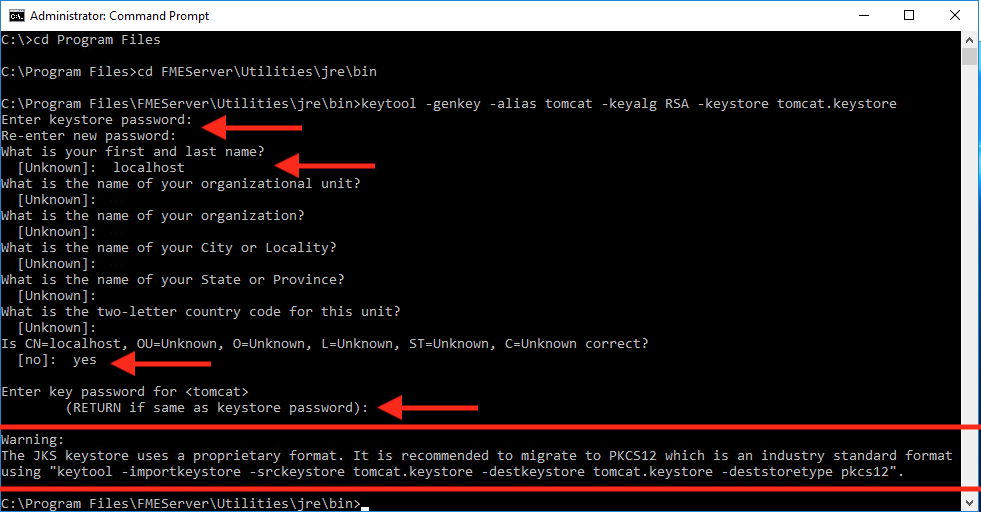
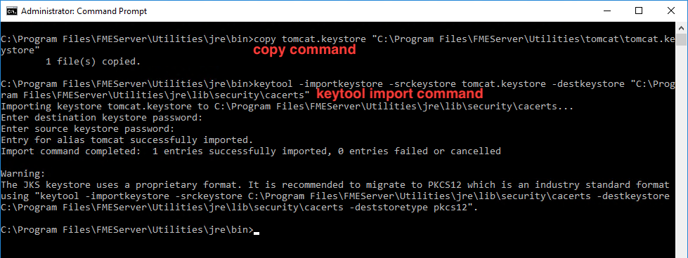
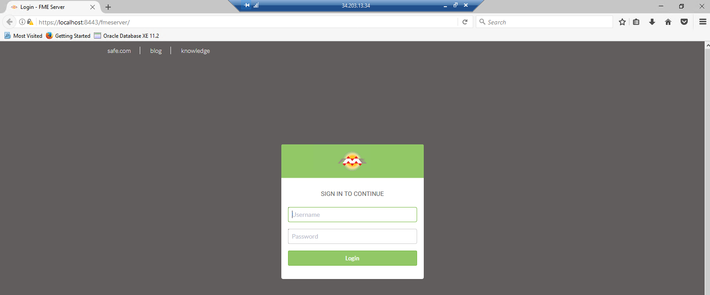
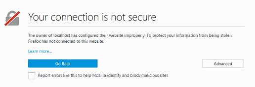
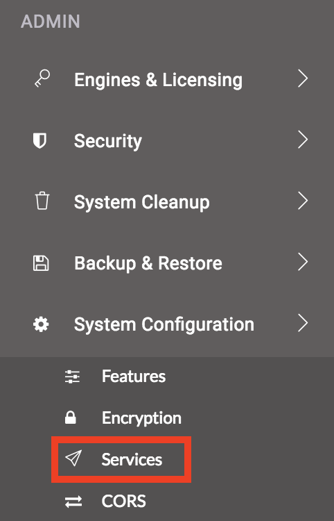
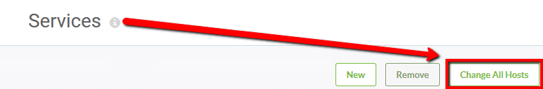
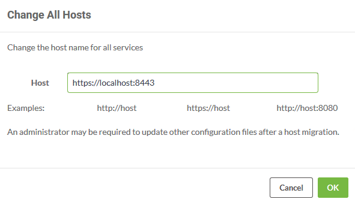

# 练习3：配置HTTPS

|  练习3 |  为HTTPS配置FME Server |
| :--- | :--- |
| 数据 | C：\ FMEData2018 \ Resources \ ServerAdmin \ server.xml C：\ FMEData2018 \ Resources \ ServerAdmin \ web.xml C：\ FMEData2018 \ Resources \ ServerAdmin \ context.xml |
| 总体目标 | 将对FME Server Web界面的访问权限更改为HTTPS |
| 演示 | 创建自签名证书并导入FME Server密钥库 |

贵公司正在迅速扩张并雇用许多新员工。现在，您没有让所有人都能访问FME Server，而是设置了登录，因此只有受信任的人员才能访问。您还需要设置额外的预防措施，以确保传输的信息安全。

HTTPS确保客户端和服务器之间的通信是加密的，因此如果被截获，第三方就无法轻松查看或使用该信息。对于FME Server，您可以使用HTTPS来确保不公开敏感登录信息。

对于任何HTTPS（SSL）页面，都需要证书。出于开发和测试目的，支持自签名证书。对于生产用途，我们建议您使用经过验证的SSL证书颁发机构（CA）的SSL证书。

  
**1）创建密钥库文件**  
首先，您必须使用Java Developer Kit（JDK）中的Java Keytool生成包含证书链的密钥库。

以管理员身份打开**命令提示符**。

导航到FME Server Java bin目录：

```text
cd C:\Program Files\FMEServer\Utilities\jre\bin\
```

运行以下命令以创建新的密钥库文件：

```text
keytool -genkey -alias tomcat -keyalg RSA -keystore tomcat.keystore
```

出现提示时设置以下值：

* **密钥库密码：** tomcat
* **名字和姓氏：** localhost
* _**&lt;剩余参数&gt;：**_ _&lt;leave\_blank&gt;_

如果输入正确，则在提示时输入_yes_。当提示输入&lt;tomcat&gt;的密钥密码时，请按RETURN。

[](https://github.com/xuhengxx/FMETraining-1/tree/c60c1e291fd9e762b26517c54e4fd7ea9f748055/ServerAdmin3Security/Images/3.204.Ex3.ConfigureForHTTPS_createKeytool.png)

在_C：\ Program Files \ FMEServer \ Utilities \ jre \ bin \中_创建一个新的密钥库

将新密钥库文件复制到FME Server安装中的tomcat目录：

```text
copy tomcat.keystore "C:\Program Files\FMEServer\Utilities\tomcat\tomcat.keystore"
```

|  技巧 |
| :--- |
|  确保密钥库文件**未被**移动。 在使用分布式FME Server核心和FME Server Web应用程序时，这一点非常重要。 |

  
**2）使用证书**  
必须将新密钥库导入FME Server密钥库以获取可信证书。在命令提示符中，输入以下命令：

```text
keytool -importkeystore -srckeystore tomcat.keystore -destkeystore "C:\Program Files\FMEServer\Utilities\jre\lib\security\cacerts"
```

系统将提示您输入两个密码。一个用于目标密钥库，另一个用于源密钥库。目标密钥库的密码是**changeit**。源密钥库的密码是**tomcat**。

[](https://github.com/xuhengxx/FMETraining-1/tree/c60c1e291fd9e762b26517c54e4fd7ea9f748055/ServerAdmin3Security/Images/3.205.Ex3.ConfigureForHTTPS_selfSignedCertificate.png)

**配置Tomcat**  
在接下来的步骤中，我们需要修改Apache Tomcat的三个配置文件。所有这三个文件都位于FME Server安装目录中：_C：\ Program Files \ FMEServer \ Utilities \ tomcat \ conf \_

最好制作要更改的任何文件的副本，并将它们放在单独的目录中，直到您确认编辑正在成功运行为止。

**3）配置server.xml** 在管理员模式下，在文本编辑器中  
打开_C：\ Program Files \ FMEServer \ Utilities \ tomcat \ conf \ server.xml_文件。

在_&lt;Listener&gt;_元素中找到_SSLEngine_设置，包括_className =“org.apache.catalina.core.AprLifecycleListener”_，并将_“on”_值更改为_“off”_。

```text
<Listener className="org.apache.catalina.core.AprLifecycleListener" SSLEngine="off" />
```

找到包含_protocol =“org.apache.coyote.http11.Http11NioProtocol”_的_&lt;Connector&gt;_元素，并将其替换为以下内容：

```text
<Connector protocol="org.apache.coyote.http11.Http11NioProtocol"
    port="8443" minSpareThreads="5"
    enableLookups="true" disableUploadTimeout="true"
    acceptCount="100" maxThreads="200"
    scheme="https" secure="true" SSLEnabled="true"
    keystoreFile="C:\Program Files\FMEServer\Utilities\tomcat\tomcat.keystore"
    keystorePass="tomcat"
    clientAuth="false" sslEnabledProtocols="TLSv1,TLSv1.1,TLSv1.2"
    sslImplementationName="org.apache.tomcat.util.net.jsse.JSSEImplementation"
    ciphers="TLS_ECDHE_RSA_WITH_AES_128_CBC_SHA256,TLS_ECDHE_RSA_WITH_AES_128_CBC_SHA,
    TLS_ECDHE_RSA_WITH_AES_256_CBC_SHA384,TLS_ECDHE_RSA_WITH_AES_256_CBC_SHA,
    TLS_RSA_WITH_AES_128_GCM_SHA256,TLS_RSA_WITH_AES_256_GCM_SHA384,
    TLS_RSA_WITH_AES_128_CBC_SHA256,TLS_RSA_WITH_AES_256_CBC_SHA256,
    TLS_RSA_WITH_AES_128_CBC_SHA,TLS_RSA_WITH_AES_256_CBC_SHA,
    SSL_RSA_WITH_3DES_EDE_CBC_SHA"
    URIEncoding="UTF8" />

<Connector port="80" protocol="HTTP/1.1"
    redirectPort="8443"/>
```

保存并关闭_server.xml_文件。

  
**4）配置web.xml**  
以管理员模式在文本编辑器中打开_web.xml_文件。

在结束_&lt;/ web-app&gt;_元素之前，将以下代码块添加到文件末尾：

```text
<security-constraint>
    <web-resource-collection>
        <web-resource-name>HTTPSOnly</web-resource-name>
        <url-pattern>/*</url-pattern>
    </web-resource-collection>
    <user-data-constraint>
        <transport-guarantee>CONFIDENTIAL</transport-guarantee>
    </user-data-constraint>
</security-constraint>
```

保存并关闭_web.xml_文件。

  
**5）配置context.xml**  
以管理员模式在文本编辑器中打开_context.xml_文件。

将以下内容添加到文件的末尾，就在结尾的_&lt;/ context&gt;_元素之前：

```text
<Valve className="org.apache.catalina.authenticator.SSLAuthenticator"
    disableProxyCaching="false" />
```

保存并关闭_context.xml_文件。

  
**6）验证配置**  
现在我们已经进行了更改，我们想验证是否为FME Server正确配置了HTTPS。

从**开始菜单&gt;FME Server 2018.0&gt;重新启动FME服务器**重新启动FME Server应用程序服务。

打开浏览器并导航到[_https：// localhost：8443 / fmeserver_](https://localhost:8443/fmeserver)。

您应该会看到安全格式的FME服务器登录页面。

[](https://github.com/xuhengxx/FMETraining-1/tree/c60c1e291fd9e762b26517c54e4fd7ea9f748055/ServerAdmin3Security/Images/3.206.Ex3.verifyConfiguration.png)

注意：如果使用自签名证书进行测试，您的浏览器可能会将该页面报告为不安全：

[](https://github.com/xuhengxx/FMETraining-1/tree/c60c1e291fd9e762b26517c54e4fd7ea9f748055/ServerAdmin3Security/Images/3.207.Ex3.ConnectionNotSecure_Warning.png)

对于自签名证书，某些浏览器允许您为[_https：// localhost：8443 /_](https://localhost:8443/)添加例外。

  
**7）修改服务URL以使用HTTPS**  
要为FME Server服务启用SSL，请登录FME Server Web界面（用户名和密码_admin_），然后选择左侧栏上的“ **服务** ”。

[](https://github.com/xuhengxx/FMETraining-1/tree/c60c1e291fd9e762b26517c54e4fd7ea9f748055/ServerAdmin3Security/Images/3.208.Ex3.ServicesButton.png)

在“ _服务”_页面上，您可以一次更新特定服务或所有服务。让我们更新所有服务。单击“ **更改所有主机”**

[](https://github.com/xuhengxx/FMETraining-1/tree/c60c1e291fd9e762b26517c54e4fd7ea9f748055/ServerAdmin3Security/Images/3.209.Ex3.ChangeAllHosts.png)

将打开“ _更改所有主机”_对话框。确保将**Host**设置为[_https：// localhost：8443_](https://localhost:8443/)，然后单击“ **确定”**。

[](https://github.com/xuhengxx/FMETraining-1/tree/c60c1e291fd9e762b26517c54e4fd7ea9f748055/ServerAdmin3Security/Images/3.210.Ex3.ChangeAllHosts2.png)

URL将在“服务”页面上更新为新的正确值。

[](https://github.com/xuhengxx/FMETraining-1/tree/c60c1e291fd9e762b26517c54e4fd7ea9f748055/ServerAdmin3Security/Images/3.211.Ex3.NewServiceURLs.png)

|  技巧 |
| :--- |
|  如果您正在使用带有FME Server的WebSockets，请查看“FME Server管理指南”和标题为“ [在WebSocket服务器上启用SSL（可选）](http://docs.safe.com/fme/2018.0/html/FME_Server_Documentation/Content/AdminGuide/configuring_for_https.htm) 的部分 |

<table>
  <thead>
    <tr>
      <th style="text-align:left">恭喜！</th>
    </tr>
  </thead>
  <tbody>
    <tr>
      <td style="text-align:left">
        <p>通过完成本练习，您已学会如何：
          <br />
        </p>
        <ul>
          <li>创建自签名证书</li>
          <li>在FME Server Java密钥库中导入证书</li>
          <li>将FME Server Web服务更改为使用HTTPS URL</li>
        </ul>
      </td>
    </tr>
  </tbody>
</table>