# 场景演练

在本节中，我们将几种不同格式的数据集成到一个数据库中：一个在GIS应用程序中常用的Esri地理数据库。

除了展示如何使用单个写模块写入多个要素类型之外，本演练还将重复前面练习中的过程。在将数据集成到单个数据库之后，我们将对数据进行一些基本分析。

  
**1）启动Workbench**  
使用“生成工作空间”对话框，使用以下参数创建工作空间：

| 读模块格式 | 谷歌KML |
| :--- | :--- |
| 读模块数据集 | C:\FMEData2018\Data\Boundaries\VancouverNeighborhoods.kml |
| 写模块格式 | Esri地理数据库（File Geodb Open API） |
| 写模块数据集 | C:\FMEData2018\Output\Training\CityDatabase.gdb |

**注意：** 确保为地理数据库格式选择File Geodb Open API，否则稍后可能会遇到问题。GDB的Open API实现允许您在没有Esri许可证的情况下在FME Data Inspector中创建和查看此地理数据库。但是，您需要ArcMap，ArcGIS Pro或ArcGIS Online的许可副本才能在其本机软件中查看GDB。或者，您的教师可能会要求您使用不同的格式，例如PostGIS数据库; FME可以轻松写入您想要的任何格式。

您的对话框应如下所示：

[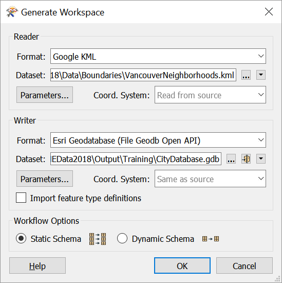](https://github.com/safesoftware/FMETraining/blob/FME-Desktop-Data-Integration-2018/Integration3LabExercises/GenerateWorkspace.png)

单击“生成工作空间”对话框中的“参数”按钮以检查读模块/写模块参数。我们将为此练习更改一个。在写模块参数下的Database Connections部分中，选中Overwrite Existing Geodatabase。通过检查，我们将在每次写出数据时完全重新创建数据库。您的对话框应如下所示：

[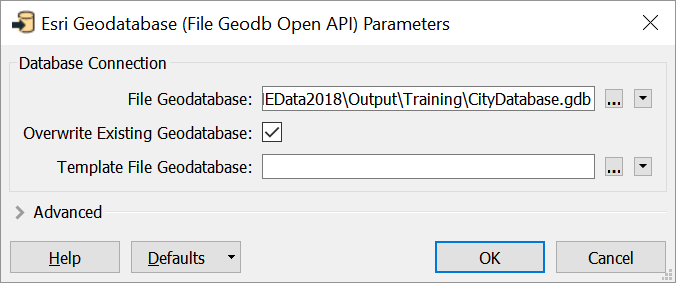](https://github.com/safesoftware/FMETraining/blob/FME-Desktop-Data-Integration-2018/Integration3LabExercises/OverwriteGeodatabase.png)

单击确定两次。您将看到“选择要素类型”对话框，因为我们的读模块数据集包含多个图层。我们只需要名为Neighborhoods的要素类型，它包含街区边界的多边形。确保“街区”是所选的唯一要素类型：

[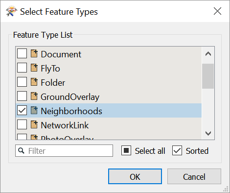](https://github.com/safesoftware/FMETraining/blob/FME-Desktop-Data-Integration-2018/Integration3LabExercises/SelectFeatureType.png)

单击确定。

**注意：**如果在设置写模块参数之前按下OK，则可以在生成工作空间后更改此值。在CityDatabase FILEGDB写模块&gt;参数&gt;覆盖现有数据库（设置为是）下的导航器窗口中。

  
**2）清理生成的工作空间**  
生成的工作空间自动添加了几何对象过滤器。发生这种情况是因为Esri地理数据库仅存储一种几何类型的图层。

[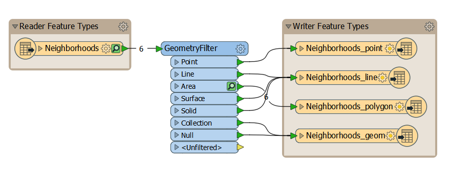](https://github.com/safesoftware/FMETraining/blob/FME-Desktop-Data-Integration-2018/Integration3LabExercises/BeginWorkspace.png)

但是，我们的读模块要素类型只包含多边形，因此我们可以通过以下方式清理起始工作空间：

* 删除GeometryFilter
* 删除Neighborhoods\_point，Neighborhoods\_line和Neighborhoods\_geom写模块要素类型
* 将Neighborhoods\_polygon 写模块要素类型重命名为“Neighborhoods”

您的工作空间现在应该如下所示：

[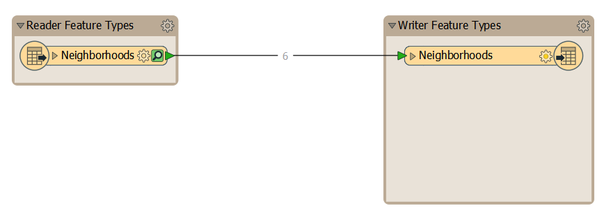](https://github.com/safesoftware/FMETraining/blob/FME-Desktop-Data-Integration-2018/Integration3LabExercises/BeginWorkspaceClean.png)

  
**3）添加Excel读模块**  
让我们再添加两个读模块。我们将查看上面列表中需要更改默认值的两个数据集，以便按照我们的意愿工作。其他可能需要类似更改的情况将在“ [附加程序”](https://github.com/safesoftware/FMETraining/blob/FME-Desktop-Data-Integration-2018/Integration3LabExercises/..%5CIntegration3LabExercises%5C3.14.AdditionalProcedures.md)部分中介绍。

您可以通过单击“读模块”&gt;“添加读模块”或单击画布上的空白区域并键入要添加的格式的名称或文件扩展名并从“快速添加”菜单中选择它来添加读模块。

首先，让我们添加一个公共艺术的Excel文件：

| 读模块格式 | Microsoft Excel |
| :--- | :--- |
| 读模块数据集 | C:\FMEData2018\Data\Culture\PublicArt.xlsx |

我们将对读模块默认值进行两处更改。

首先，将“工作流选项”从“单个要素类型”（默认）更改为“单个合并要素类型”。Excel读模块将行视为要素和工作表作为要素类型。这意味着默认情况下，FME会尝试将文件中的每个工作表作为单独的要素类型进行读取。如果您检查数据，您会发现每个邻域有一张纸。这适用于Excel，但我们希望我们的数据库将所有公共艺术视为一个点层。选择单合并要素类型为我们做到这一点。

其次，我们需要添加一个坐标系。读模块在Excel文件中有纬度和经度坐标，但由于Excel不存储坐标系信息，我们必须告诉FME使用哪一个。我们知道它是LL84，所以在对话框的Coordinate System框中键入它。

您的对话框应如下所示：

[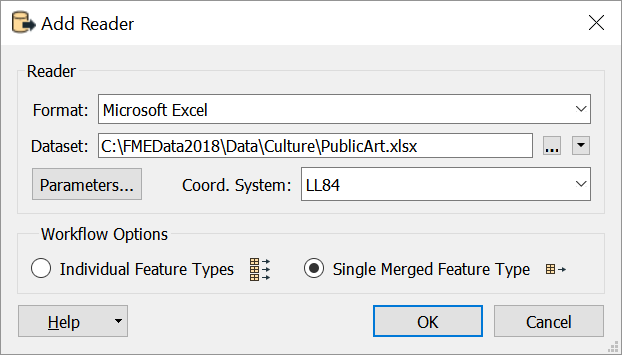](https://github.com/safesoftware/FMETraining/blob/FME-Desktop-Data-Integration-2018/Integration3LabExercises/PublicArt.png)

单击“确定”之前，单击“参数”。我们必须确保Reader识别Excel工作表中的正确列作为坐标。在Attributes表下，名为Longitude的C列应为x\_coordinate类型，名为Latitude的列D应为y\_coordinate类型。您的对话框应如下所示：

[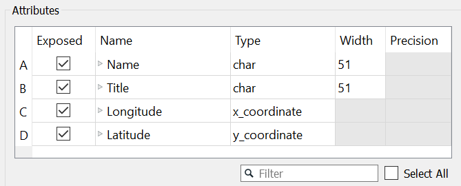](https://github.com/safesoftware/FMETraining/blob/FME-Desktop-Data-Integration-2018/Integration3LabExercises/PublicArtCoords.png)

单击确定两次。这会在我们的导航器窗口中添加一个新的Excel读模块，并在我们的画布上为其提供一个名为&lt;All&gt;的要素类型，这是合并要素类型的默认名称。然而，这不是很具描述性。让我们添加一个注释来表明这是合并的公共艺术数据。右键单击要素类型，然后选择“附加注记”。你可以写一些像“公共艺术安装地点（点）”的东西：

[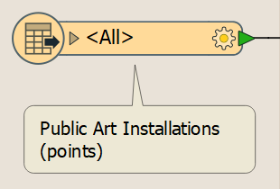](https://github.com/safesoftware/FMETraining/blob/FME-Desktop-Data-Integration-2018/Integration3LabExercises/PublicArtAnnotation.png)

即使我们添加了来自所有社区的公共艺术安装地点，我们仍然可以通过fme\_feature\_type属性区分街区。此属性仅提供要素所属的要素类型的名称。它存在于所有FME功能上，但并不总是暴露在外。每当您添加合并的要素类型时，它都会默认公开。如果单击新&lt;All&gt;读模块要素类型旁边的下拉箭头，则可以看到它。

如果右键单击此要素类型并选择“检查”，则可以看到数据仍按街区进行组织。如果选择要素，则“要素信息”窗口中显示的第一个属性是“FME要素类型”，它将显示街区名称。

让我们将fme\_feature\_type属性转换为对我们的地理数据库更有意义的属性。在&lt;All&gt; 读模块要素类型后添加AttributeManager。打开参数编辑器，然后单击“输出属性”列中的“属性操作”表。这将允许您重命名该属性。我们将其更改为NeighborhoodName而不是fme\_feature\_type。“操作”列将自动更改为“重命名”。您的属性操作表现在应如下所示：

[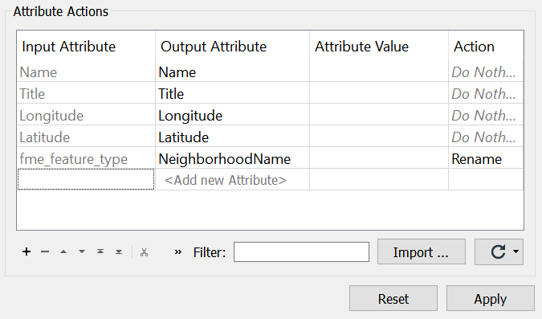](https://github.com/safesoftware/FMETraining/blob/FME-Desktop-Data-Integration-2018/Integration3LabExercises/AttributeActions.png)

单击确定/应用。

  
**4）为公共艺术添加写模块要素类型**  
现在我们需要一个写模块要素类型用于我们的公共艺术点。

|  技巧 |
| :--- |
|  请记住，我们已经设置了地理数据库写模块。我们不想添加另一个写模块，因为我们希望将所有数据写入同一个输出数据库。相反，我们需要使用要素类型，因为我们希望我们的数据按层组织。 |

我们可以在“写模块”&gt;“添加要素类型”下的菜单栏中为写模块添加要素类型。因为我们只有一个写模块，所以它会被自动选中。将新要素类型命名为PublicArt，并为其指定Geometry类型geodb\_point。“要素类型”对话框应如下所示：

[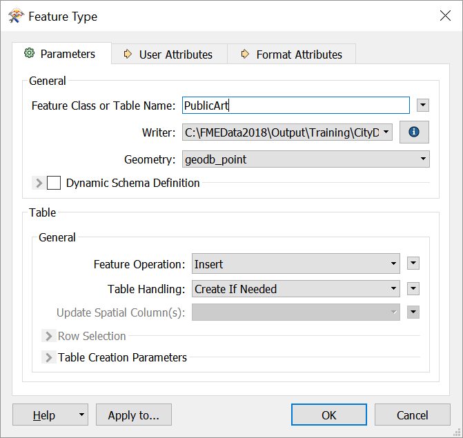](https://github.com/safesoftware/FMETraining/blob/FME-Desktop-Data-Integration-2018/Integration3LabExercises/PublicArtWriterFeatureType.png)

单击确定。将新要素类型连接到属性管理器的输出端口。你的画布应如下所示：

[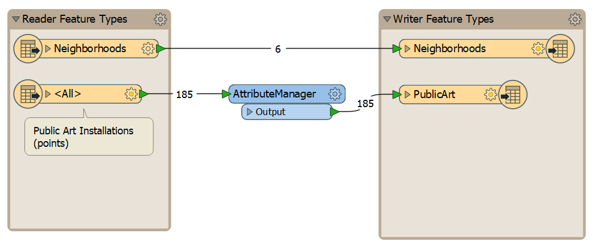](https://github.com/safesoftware/FMETraining/blob/FME-Desktop-Data-Integration-2018/Integration3LabExercises/PublicArtAdded.png)

  
**5）添加Shapefile读模块**  
通过单击“读模块”&gt;“添加读模块”或单击画布上的空白区域并键入要添加的格式的名称或文件扩展名并从“快速添加”菜单中选择它，添加另一个读模块。在这种情况下，这将是Esri Shapefile的shp。

| 读模块格式 | Esri Shapefile |
| :--- | :--- |
| 读模块数据集 | C：\ FMEData2018 \ Data \ Transportation \ Cycling \ BikePaths\_L.shp  C：\ FMEData2018 \ Data \ Transportation \ Cycling \ BikePaths\_M.shp  C：\ FMEData2018 \ Data \ Transportation \ Cycling \ BikePaths\_S.shp |

选择数据集时，使用Ctrl或Shift单击选择所有三个自行车路径shapefile。

根据自行车道的长度将自行车道路数据分成三个形状文件（L表示长，M表示中等，S表示简称）。就像公共艺术点一样，我们不需要在数据库中分离这些要素。因此，让我们将工作流选项从单个要素类型更改为单个合并要素类型。因为shapefile包含坐标系信息，所以我们不需要在此更改。您的对话框应如下所示：

[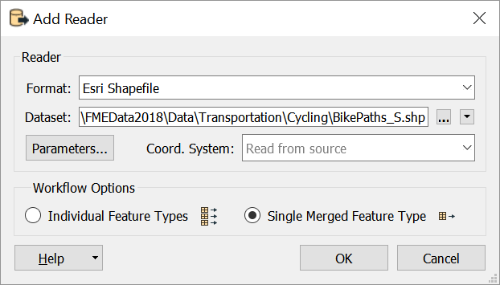](https://github.com/safesoftware/FMETraining/blob/FME-Desktop-Data-Integration-2018/Integration3LabExercises/BikePaths.png)

单击确定。这会为我们的画布添加另一个&lt;All&gt;要素类型。同样，我们应该添加一个注释，以便清楚哪个读模块是哪个：

[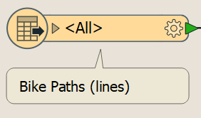](https://github.com/safesoftware/FMETraining/blob/FME-Desktop-Data-Integration-2018/Integration3LabExercises/BikePathsAnnotation.png)

如果检查读模块要素类型，您会发现数据已经具有值为S，M或L的PathType属性。因此，我们不需要使用AttributeManager重命名fme\_feature\_type，就像我们对公共艺术数据所做的那样。但是，我们也不希望将fme\_feature\_type写入我们的最终数据。

我们可以在我们的读模块要素类型上取消它。选择您的自行车路径读模块要素类型，然后转到参数编辑器中的“格式属性”选项卡。您将看到已检查fme\_feature\_type。只需取消选中它，然后单击确定/应用：

[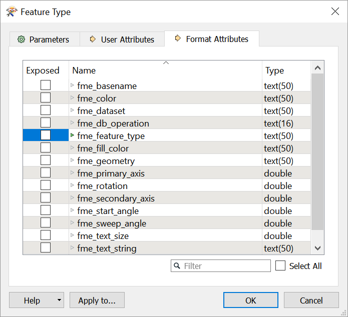](https://github.com/safesoftware/FMETraining/blob/FME-Desktop-Data-Integration-2018/Integration3LabExercises/BikePathsFormatAttributes.png)

现在，如果单击自行车路径读模块要素类型上的下拉箭头，您将看到已根据需要从架构中删除了fme\_feature\_type。

  
**6）为自行车路径添加写模块要素类型**  
现在我们需要一个用于自行车路径线的**写模块要素类型**。单击“写模块”&gt;“添加要素类型”，将新要素类型命名为BikePaths，并为其指定几何类型geodb\_polyline。“要素类型”对话框应如下所示：

[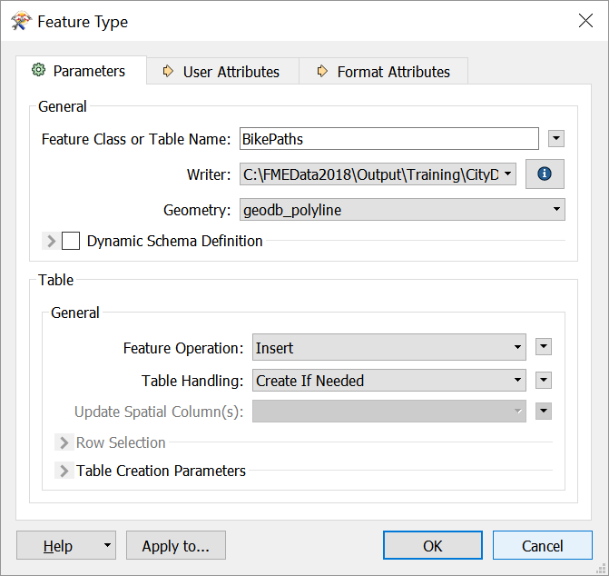](https://github.com/safesoftware/FMETraining/blob/FME-Desktop-Data-Integration-2018/Integration3LabExercises/BikePathsWriterFeatureType.png)

单击确定。将包含自行车路径要素的所有读模块要素类型连接到您的写模块要素类型BikePaths。你的画布应如下所示：

[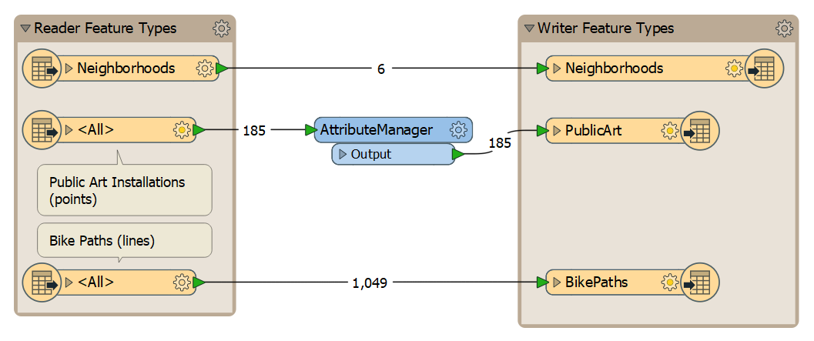](https://github.com/safesoftware/FMETraining/blob/FME-Desktop-Data-Integration-2018/Integration3LabExercises/BikePathsAdded.png)

  
**7）重投影数据**  
将Reprojector转换器添加到画布，然后将其连接到“街区”要素类型。选择UTM83-10作为目标坐标系。右键单击Reprojector转换器，然后选择“复制”以添加另一个。在AttributeManager输出端口和公共艺术 写模块要素类型之间进行连接。

这将确保我们的社区和公共艺术数据与我们的自行车道一致。你的画布应如下所示：

[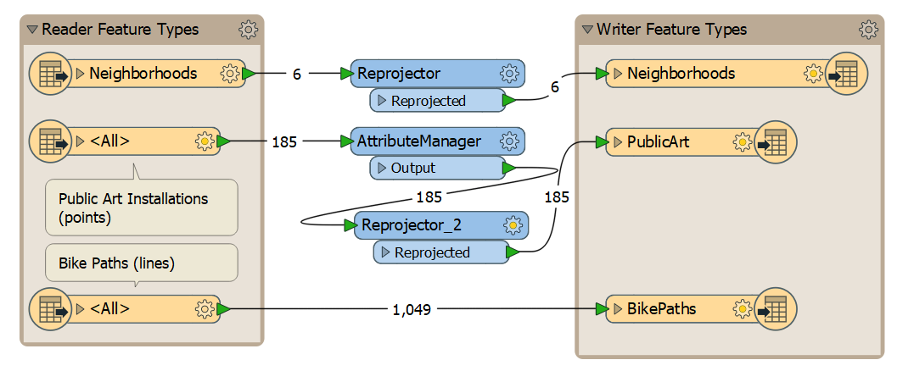](https://github.com/safesoftware/FMETraining/blob/FME-Desktop-Data-Integration-2018/Integration3LabExercises/FinalWorkspaceIntegration.png)

  
**8）检查输出**  
让我们看一下集成到一个地理数据库中的数据。您可以运行工作空间，然后在Data Inspector中打开生成的地理数据库，也可以单击“写模块”&gt;“重定向到数据检查器”。

当此要素打开时，实际上没有写入数据; 相反，您的转换结果将直接发送到Data Inspector。在工作空间仍处于开发阶段时，检查转换结果非常有用。

您应该看到Data Inspector中显示的所有三个图层，现在都以相同的格式存储在集中式数据库中：

[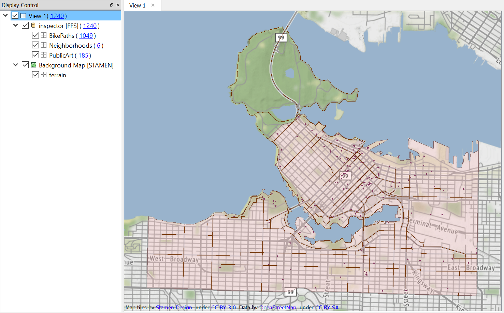](https://github.com/safesoftware/FMETraining/blob/FME-Desktop-Data-Integration-2018/Integration3LabExercises/FinalWorkspaceIntegrationInspector.png)  
地图瓷砖由[Stamen Design](https://stamen.com/)，许可[CC-BY-3.0](https://creativecommons.org/licenses/by/3.0)。数据[OpenStreetMap](https://openstreetmap.org/)，许可[CC-BY-SA](https://creativecommons.org/licenses/by-sa/3.0)。

  
**9）示例数据集成分析**  
让我们来看一个数据集成如何促进分析的例子。

如果城市规划部想知道街区的自行车道的总长度和公共艺术安装地点的数量怎么办？我们如何使用此工作空间执行此操作？

花一点时间，写下或绘制出如何使用迄今为止学到的知识来解决这个问题。如果您不记得转换器的确切名称，请不要担心。而是专注于概述您将执行此分析的过程。

让我们看看你是否正确！请注意，通常有多种方法可以解决FME中的问题，因此您的解决方案可能仍然有效。

以下是我们执行此分析所需采取的步骤：

1. 按街区计算自行车道路长度的总和。
2. 按街区统计公共艺术安装地点的数量。
3. 输出表格或图表以显示结果。

让我们来看看Workbench中如何做到这一点。

  
**10）计算公共艺术的统计数据**  
在公共艺术Reprojector之后添加StatisticsCalculator。我们将用这个来计算街区公共艺术安装地点的数量。你的画布应如下所示：

[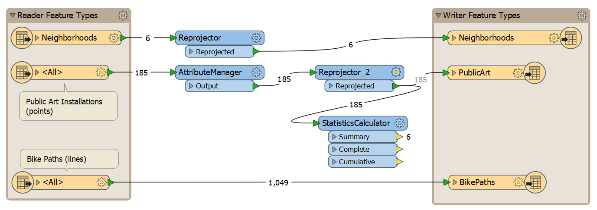](https://github.com/safesoftware/FMETraining/blob/FME-Desktop-Data-Integration-2018/Integration3LabExercises/PublicArtStatsCalc.png)

打开StatisticsCalculator的参数。选择要分析的属性的任何属性（只是计算是否有值，因此任何属性都可以）。除“总计数属性”外，清除“计算属性”中的所有框，以便不生成它们。最后，将Group By设置为NeighborhoodName。您的对话框应如下所示：

[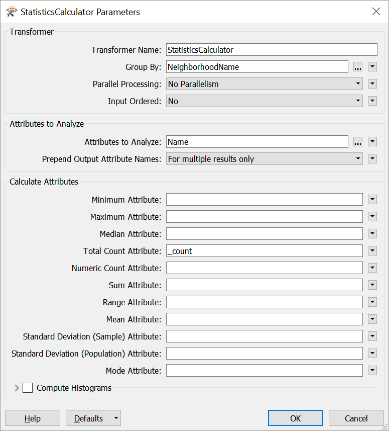](https://github.com/safesoftware/FMETraining/blob/FME-Desktop-Data-Integration-2018/Integration3LabExercises/PublicArtStats.png)

单击确定/应用。Summary输出端口现在将输出一个表格，其中包含街区公共艺术安装地点的数量。

让我们把它写成我们地理数据库中的一个表。单击“写模块”&gt;“添加要素类型”。将其称为PublicArtSummaryStats并为其指定几何类型geodb\_no\_geom。这将把它存储为一个没有几何图形的表。单击确定。添加新要素类型后，将其连接到StatisticsCalculator的Summary端口。你的画布应如下所示：

[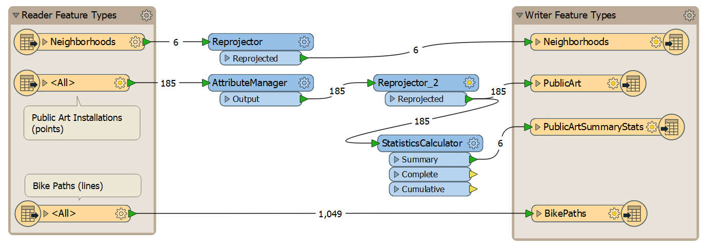](https://github.com/safesoftware/FMETraining/blob/FME-Desktop-Data-Integration-2018/Integration3LabExercises/PublicArtSummaryStats.png)

如果需要，您可以运行转换并检查表格。

  
**11）计算自行车路径的统计数据**  
在画布上添加LineOnAreaOverlayer。这个转换器将让我们将街区中的属性添加到与它们重叠的自行车路径中。这将让我们知道每个自行车路径段所在的街区。Reprojector应连接到Area端口（因为它是街区的多边形），并且自行车路径读模块要素类型应连接到Line端口。打开LineOnAreaOverlayer参数，然后选中“属性聚合”&gt;“合并属性”框。您的对话框应如下所示：

[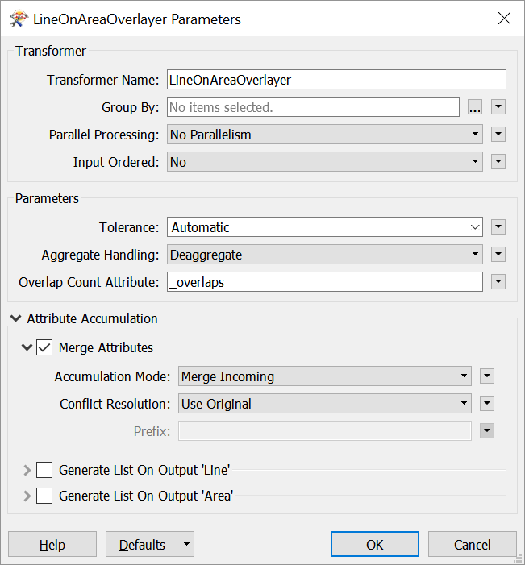](https://github.com/safesoftware/FMETraining/blob/FME-Desktop-Data-Integration-2018/Integration3LabExercises/LineOnArea.png)

单击确定/应用。

现在让我们将一个StatisticsCalculator添加到LineOnAreaOverlayer的Line输出端口。我们将使用它来总结每个要素的PathLength，并按街区报告自行车道的总长度。为此，请打开StatisticsCalculator的参数。将Group By设置为NeighborhoodName。将"要分析的属性"设置为PathLength。除了Sum属性之外，清除Calculate属性中的所有选择框，这样就不会生成它们您的对话框应如下所示：

[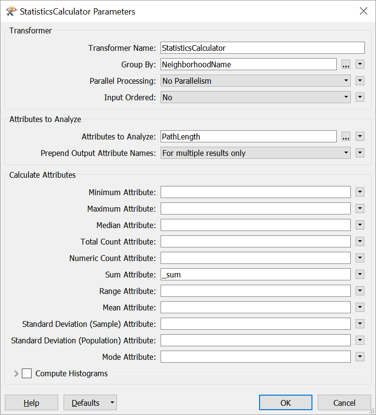](https://github.com/safesoftware/FMETraining/blob/FME-Desktop-Data-Integration-2018/Integration3LabExercises/BikePathsStats.png)

单击确定/应用。

如果您检查此转换器的结果（使用要素缓存），您会发现其中一个街区名称为空。这是因为斯坦利公园（温哥华市中心西北部的大型公园）的自行车道没有街区多边形。我们在输出表中解决这个问题。

添加AttributeManager并将其连接到StatisticsCalculator Summary输出端口。打开其参数，然后单击“输入属性NeighborhoodName”的“属性值”列中的下拉箭头。然后选择条件值：

[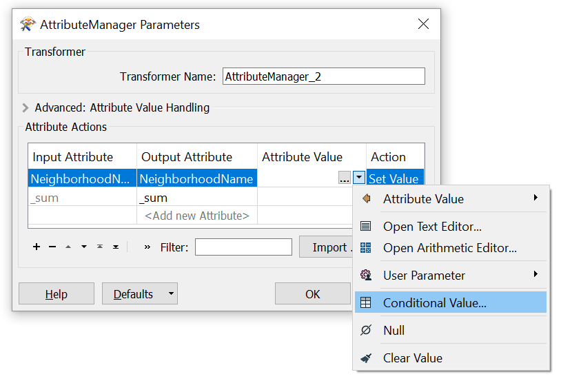](https://github.com/safesoftware/FMETraining/blob/FME-Desktop-Data-Integration-2018/Integration3LabExercises/ConditionalValue.png)

我们将设置AttributeManager以将NeighborhoodName的值设置为Stanley Park（如果它还没有值）。双击行If和列Test Environment中的单元格。在新窗口中，对于Left Value，选择属性NeighborhoodName。对于运算符选择属性为空字符串。最后，在Attribute Value&gt; Attribute Value下，输入Stanley Park。您的对话框将如下所示：

[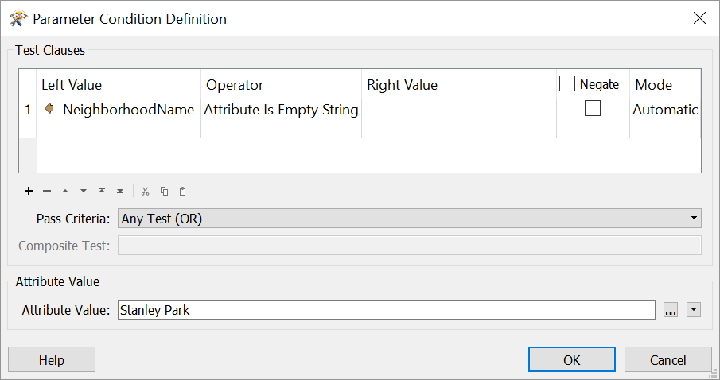](https://github.com/safesoftware/FMETraining/blob/FME-Desktop-Data-Integration-2018/Integration3LabExercises/ParameterConditionDefinition.png)

单击确定。现在您的参数条件定义应如下所示：

[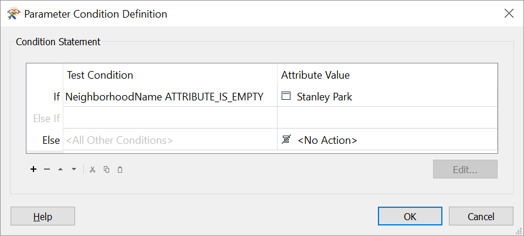](https://github.com/safesoftware/FMETraining/blob/FME-Desktop-Data-Integration-2018/Integration3LabExercises/ConditionStatement.png)

再次单击确定。现在，您的属性管理器将如下所示：

[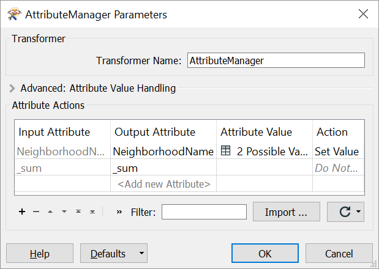](https://github.com/safesoftware/FMETraining/blob/FME-Desktop-Data-Integration-2018/Integration3LabExercises/NeighborhoodNameFix.png)

大！现在，我们的AttributeManager将处理该空的NeighborhoodName值并将其替换为Stanley Park。

我们也将这些结果写成地理数据库中的表格。单击“写模块”&gt;“添加要素类型”。称之为BikePathSummaryStats，并为其指定几何类型geodb\_no\_geom。单击确定。添加新要素类型后，将其连接到自行车路径StatisticsCalculator的摘要端口。你的画布应如下所示：

[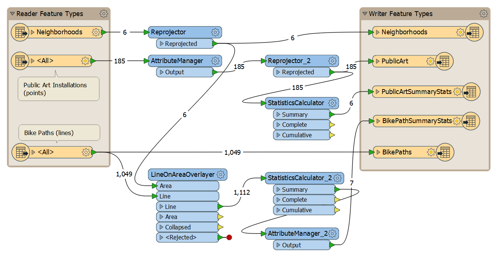](https://github.com/safesoftware/FMETraining/blob/FME-Desktop-Data-Integration-2018/Integration3LabExercises/BikePathSummaryStats.png)

如果需要，您可以运行转换并检查表格。请注意新Stanley Park值的存在。

  
**12）创建图表**  
最后，让我们创建两个图表来总结我们的发现。

将ChartGenerator转换器添加到画布。将其附加到公共艺术StatisticsCalculator的Summary输出端口。打开它的参数。在图表设置下，对于类型选择饼状图。标题输入：街区公共艺术的分布，，温哥华，不列颠哥伦比亚省。在“数据系列”下，将“数据属性”设置为\_count，将“标签属性”设置为“街区名称”。将显示百分比更改为是。您的对话框应如下所示：

[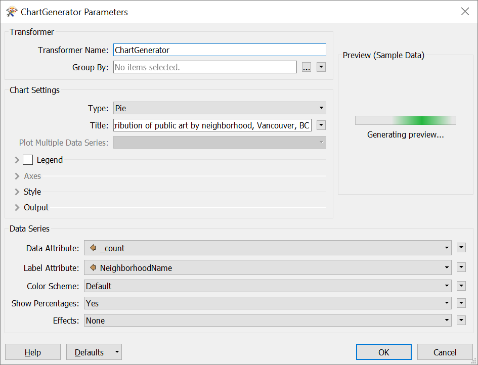](https://github.com/safesoftware/FMETraining/blob/FME-Desktop-Data-Integration-2018/Integration3LabExercises/PublicArtChart.png)

|  技巧 |
| :--- |
|  如果要更改此区域或自行车路径图表中的街区顺序，请在ChartGenerator之前添加Sorter转换器。 |

将另一个ChartGenerator添加到画布，这次连接到自行车路径StatisticsCalculator的Summary输出端口。让我们制作这个图表类型为条形并输入标题：街区自行车路径长度，温哥华，BC。更改以下参数：

* 轴\| X轴标签：NeighborhoodName
* 轴\| Y轴标签：长度（m）
* 轴\| Axes字体：Arial，6
* 轴\| Tick字体：Arial，6
* 样式\| 标题字体：Arial，10
* 数据系列\| 数据属性：\_sum
* 数据系列\| 数据标签属性：NeighborhoodName

这将生成一个图表，显示每个社区中自行车道的总长度。您的对话框应如下所示：

[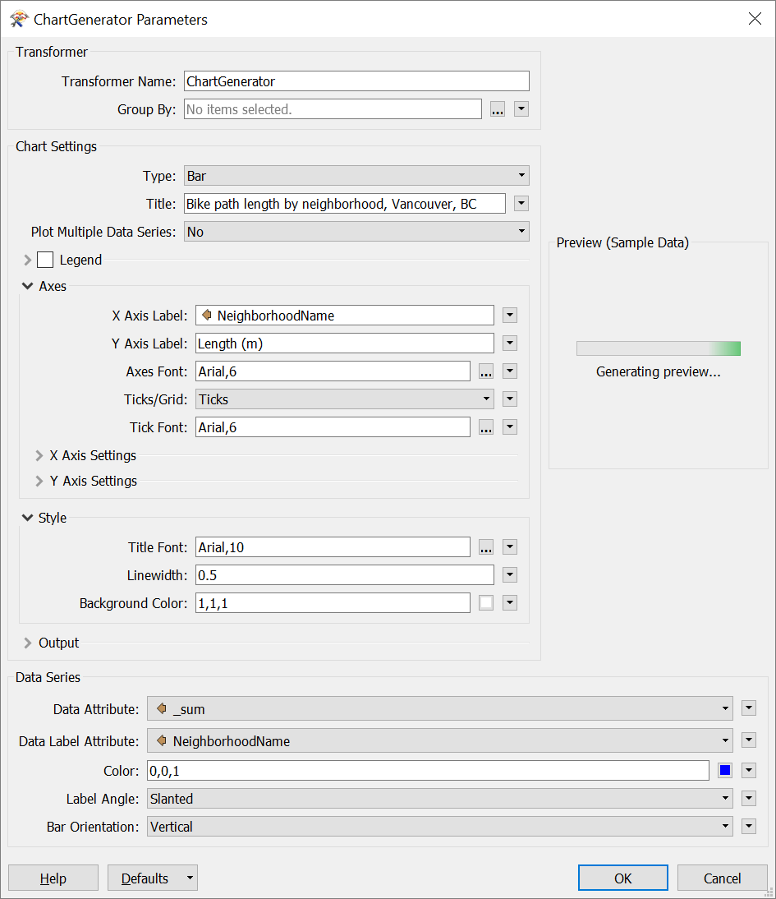](https://github.com/safesoftware/FMETraining/blob/FME-Desktop-Data-Integration-2018/Integration3LabExercises/BikePathsChart.png)

单击确定/应用。

  
**13）将图表写入PNG**  
现在让我们将这些ChartGenerator挂钩到写模块，这样我们就可以将图表写入为图像。单击写模块&gt; 添加 写模块并使用以下参数：

| 写模块格式 | PNG（便携式网络图形） |
| :--- | :--- |
| 写模块数据集 | C:\FMEData2018\Output\Training |

对于“添加要素类型”&gt;“栅格文件定义”，请选择“手动”。我们选择这个是因为我们不希望这些图表图像映射我们工作空间中已存在的任何模式。对话框应如下所示：

[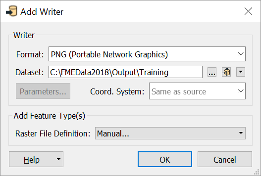](https://github.com/safesoftware/FMETraining/blob/FME-Desktop-Data-Integration-2018/Integration3LabExercises/PNGWriter.png)

单击确定。

将打开另一个对话框以指定PNG写模块的要素类型。对于“栅格文件名”，请输入PublicArtChart。将栅格&gt;世界文件生成更改为否。您的对话框应如下所示：

[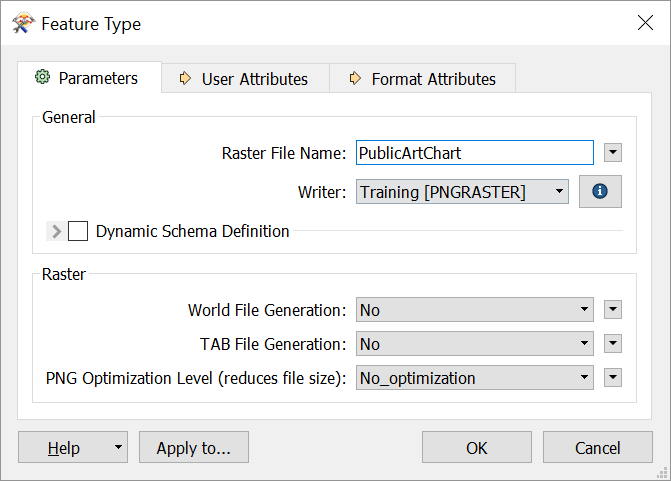](https://github.com/safesoftware/FMETraining/blob/FME-Desktop-Data-Integration-2018/Integration3LabExercises/PublicArtChartFT.png)

单击确定。现在将新的写模块要素类型连接到公共艺术ChartGenerator的输出端口。

对名为BikePathChart的新要素类型重复此过程：单击Writers&gt; Add Writer（s）并确保Writer设置为PNGRASTER。将其连接到自行车道路ChartGenerator。由于这是我们将在此示例中进行的操作，因此请添加书签和/或注释以解释您的工作空间（如果您需要提醒如何执行此操作，请参阅[“样式”部分](https://github.com/safesoftware/FMETraining/blob/FME-Desktop-Data-Integration-2018/Integration3LabExercises/..%5CIntegration2LabDemonstration%5C2.24.Style.md)）。之后你的画布应该是这样的：

[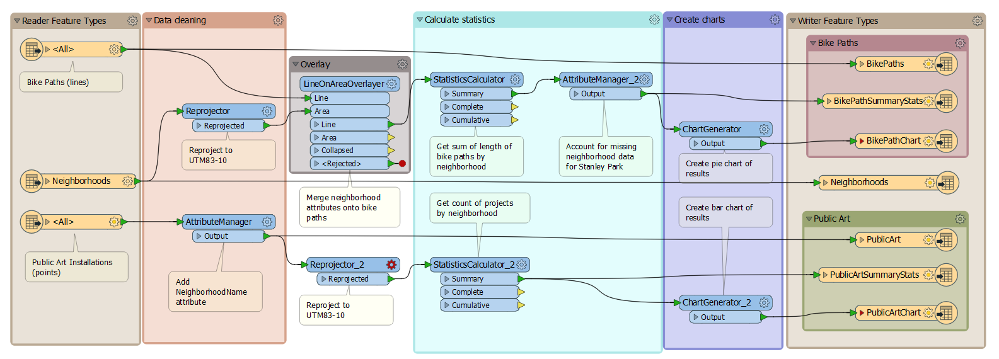](https://github.com/safesoftware/FMETraining/blob/FME-Desktop-Data-Integration-2018/Integration3LabExercises/FinalWorkspace.png)

<table>
  <thead>
    <tr>
      <th style="text-align:left">恭喜</th>
    </tr>
  </thead>
  <tbody>
    <tr>
      <td style="text-align:left">
        
通过完成本练习，您已学会如何：
           
        

        <ul>
          <li>使用单个写模块上的多个要素类型将数据集成到单个数据库中</li>
          <li>使用Overlayer转换器合并数据</li>
          <li>使用ChartGenerator进行分析集成数据</li>
        </ul>
      </td>
    </tr>
  </tbody>
</table>现在你已经有了一些整合数据的练习，轮到你了！使用您在先前练习中获得的技能将另外一个数据集添加到工作空间以回答问题或解决问题。

以下是一些示例问题：

1. 有多少个地址（C：\ FMEData2018 \ Data \ Addresses \ Addresses.gdb）距离自行车道100米范围内？

* **提示**：使用Bufferer和PointOnAreaOverlayer转换器。在分析之前，不要忘记确保所有数据共享一个坐标系。

1. 这个城市在哪里可以找到一个新的公共艺术安装地点？首先要找出哪个街区拥有最少的公共艺术安装地点。然后在离现有公共艺术安装地点最远的社区里找一个城市所有的房产\(C:\FMEData2018\Data\ \CityProperties\ cityproperty .shp\)。这是一个新安装的地点。

* **提示**：使用Sorter，Tester，PointOnAreaOverlayer，NeighborFinder（查看\_distance属性）和Sampler（查看Sampling Type：First N Features）转换器。

1. 是否有任何城市公园（C：\ FMEData2018 \ Data \ Parks \ Parks.tab）无法使用自行车道？如果是这样，是哪些？如果没有，哪些是最好的，哪些是最差的?

* **提示**：使用Bufferer，LineOnAreaOverlayer和/或NeighborFinder。

提醒一下，请参考您的[实验室要求](https://github.com/safesoftware/FMETraining/blob/FME-Desktop-Data-Integration-2018/Integration3LabExercises/..%5CIntegration3LabExercises%5C3.12.DataIntegrationScenario.md#introduction)。

下一部分包含您可能必须执行的某些步骤的可选建议，具体取决于您选择的数据。

最后，不要忘记回答您的[实验室问题](https://github.com/safesoftware/FMETraining/blob/FME-Desktop-Data-Integration-2018/Integration3LabExercises/..%5CIntegration3LabExercises%5C3.15.LabQuestions.md)。

