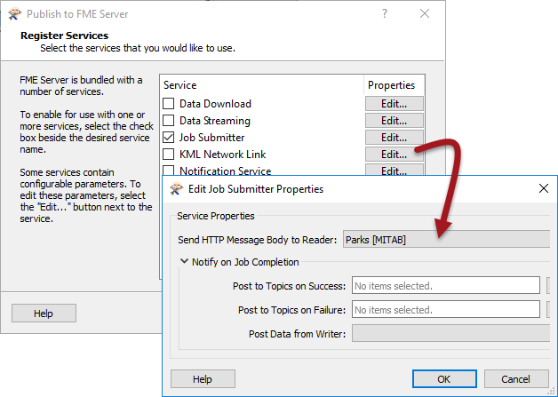
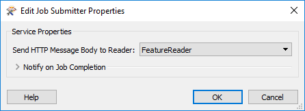

# FME Server服务

自助服务是通过FME Server上的许多服务实现的。服务是客户端和服务器之间通信的特定方法。FME Server提供广泛的服务来执行不同形式的数据自助服务。

## 什么是服务？

用最简单的术语来说，服务是一种处理客户端和服务器之间通信的软件。换句话说，它是一个允许用户通过简化的界面访问复杂功能的工具。

就FME Server而言，客户端通常 - 但不总是 - 使用服务将请求传递给FME Server的Web浏览器。

简而言之，服务允许向FME Server发送特定类型的请求，并允许以特定方式将结果提供给客户端应用程序。

例如，您可以使用一个web页面来请求将工作空间结果作为压缩在zip文件中的数据包，而不是仅仅运行工作空间。

|  空间FME教授，ETL说...... |
| :--- |
|  早上好。我将在这里指导您完成有关FME自助服务的这一章。  让我们从服务理念开始。虽然这个概念听起来很复杂，但服务只是将请求传递给FME Server的一种比使用API​​更简单的方式。此外，FME Server包含许多预定义的服务，涵盖了您可能需要的许多功能。 |

## 可用服务

FME Server包括以下服务：

<table>
<tbody><tr><td>数据下载服务</td><td rowspan="4">转换服务</td></tr>
<tr><td>数据流服务</td></tr>
<tr><td>作业提交者服务</td></tr>
<tr><td>KML网络链接服务</td></tr>
<tr><td>数据上传服务</td><td rowspan="4">实用工具服务</td></tr>
<tr><td>令牌服务</td></tr>
<tr><td>REST服务</td></tr>
<tr></tr>
<tr><td>通知服务</td><td>通知服务</td></tr>
</tbody></table>

请记住，服务可以双向通信。转换服务 - 例如数据下载 - 主要是服务器的自助服务工具，用于向最终用户提供数据。

实用工具服务可以被描述为“帮助”服务。它们与FME Server交互以协助下载数据或提供令牌安全性等琐碎任务。在大多数情况下，作者或开发人员将以一种对用户隐藏的方式使用这些工具。

通知服务用于将短消息传入和传出FME Server。传入消息通知FME Server采取某些操作，而传出消息则警告最终用户（或系统）发生某种事件。

---

|  技巧 |
| :--- |
|  FME的早期版本具有专门用于OGC服务的服务，例如WMS和WFS。现在，Safe Software建议希望提供OGC Web服务的客户使用实现标准的工作空间和服务于输出的数据流服务的组合来实现OGC Web服务。  这种提供OGC服务的新方法更加灵活，因为您可以完全控制OGC功能的实现。有关更多信息和示例工作空间的链接，请参阅[FME Server文档](https://docs.safe.com/fme/html/FME_Server_Documentation/Content/AdminGuide/Providing-Support-OGC-Services.htm?Highlight=ogc)。 |

---

## 工作空间和服务

将工作空间发布到FME Server时，发布向导的最后一个面板用于将其注册到特定服务：

每当发布工作空间时，都会在FME Server发布向导中自动选择“作业提交者”服务，但也可以使用许多其他服务。

使用服务注册工作空间可以使工作空间在该服务中可用，尽管您会发现，并不是每个工作空间都能被每个服务使用。

请注意每项服务右侧的“编辑”按钮。

每个服务都有一组可用的参数，用于确定如何使用该服务运行工作空间：

请注意这些参数如何包括通知主题的参数，以便在工作空间完成时触发。

---

|  2018.1的新变化 |
| :--- |
|  对于2018.1的新变化，FeatureReader现在在注册服务时被识别为读模块。   |

---

|  警告 |
| :--- |
|  重要的是要理解工作空间可能注册于一个服务、多个服务**或根本没有服务！** |

---

|  Vector小姐说...... |
| :--- |
|  如果工作空间未针对任何服务进行注册，您如何运行它？选择所有符合条件的。    [1.使用FMEServerJobSubmitter转换器](http://52.73.3.37/fmedatastreaming/Manual/QAResponse2017.fmw?chapter=22&question=2&answer=1&DestDataset_TEXTLINE=C%3A%5CFMEOutput%5CQAResponse.html)  [2.使用Web界面中的运行对话框](http://52.73.3.37/fmedatastreaming/Manual/QAResponse2017.fmw?chapter=22&question=2&answer=2&DestDataset_TEXTLINE=C%3A%5CFMEOutput%5CQAResponse.html)  [3.在运行对话框中的Developer Information下指定URL](http://52.73.3.37/fmedatastreaming/Manual/QAResponse2017.fmw?chapter=22&question=2&answer=3&DestDataset_TEXTLINE=C%3A%5CFMEOutput%5CQAResponse.html)  [4.通过将其设置为按计划运行](http://52.73.3.37/fmedatastreaming/Manual/QAResponse2017.fmw?chapter=22&question=2&answer=4&DestDataset_TEXTLINE=C%3A%5CFMEOutput%5CQAResponse.html) |

