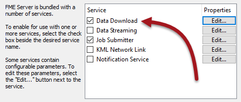

# 实施自助服务

实现自助服务系统利用FME Server上可用的适当服务。

## 创建数据下载服务

创建和使用数据下载服务非常简单。当作者在将数据发布到FME Server时将其注册到数据下载服务时，工作空间可用于数据下载使用：

以这种方式注册后，数据下载成为运行此工作空间的可接受方式。这可能以多种方式运行，其中一种方式是选择Data Download作为FME Server Web界面中的服务：

工作空间的结果不会写入特定的输出位置; 相反，它们以链接到压缩数据集的超链接形式传递给用户：

## 创建数据上传服务

数据上传服务的不同之处在于工作空间未专门注册到此实用工具服务。而在工作空间中发布源数据集参数允许进行数据上传。

在FME Server上，有两种上传数据的方式，具体取决于数据的要求。有一个特定的数据上传服务，还有资源文件系统。

数据上传服务将数据上传到特定存储库中的特定工作空间。临时保存数据以运行工作空间。

|  Spatial FME教授，ETL说...... |
| :--- |
|  您将已经遇到过数据上传服务：它是在Workbench FME Server发布向导中将数据发布到工作空间旁边的存储库中时使用的服务。 |

资源文件系统允许将数据上传到文件夹以供任何存储库中的任何工作空间使用。此上传是持久的，数据将在此需要保存多久就保存多久。

在创建涉及数据上传的自定义解决方案时，开发人员可以选择是使用数据上传服务还是使用资源文件系统。主要区别在于数据是需要永久驻留在服务器上还是暂时驻留在服务器上。

|  Vector小姐说...... |
| :--- |
|  当工作空间针对数据下载服务（而不是其他）注册时，您如何运行它？选择所有符合条件的。    [1.使用FMEServerJobSubmitter转换器](http://52.73.3.37/fmedatastreaming/Manual/QAResponse2017.fmw?chapter=22&question=3&answer=1&DestDataset_TEXTLINE=C%3A%5CFMEOutput%5CQAResponse.html)  [2.使用Web界面中的运行对话框](http://52.73.3.37/fmedatastreaming/Manual/QAResponse2017.fmw?chapter=22&question=3&answer=2&DestDataset_TEXTLINE=C%3A%5CFMEOutput%5CQAResponse.html)  [3.在运行对话框中的Developer Information下指定URL](http://52.73.3.37/fmedatastreaming/Manual/QAResponse2017.fmw?chapter=22&question=3&answer=3&DestDataset_TEXTLINE=C%3A%5CFMEOutput%5CQAResponse.html)  [4.通过将其设置为按计划运行](http://52.73.3.37/fmedatastreaming/Manual/QAResponse2017.fmw?chapter=22&question=3&answer=4&DestDataset_TEXTLINE=C%3A%5CFMEOutput%5CQAResponse.html) |

