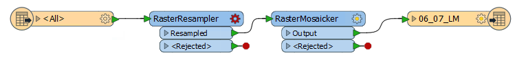

# 练习3.1：数据下载系统：工作空间创建

|  练习3.1 |  数据下载系统：工作空间创建 |
| :--- | :--- |
| 数据 | 正射影像（GeoTIFF） |
| 总体的目标 | 为正射影像创建FME Server数据下载系统 |
| 演示 | 创建工作空间并使用数据下载运行它 |
| 启动工作空间 | 无 |
| 结束工作空间 | C:\FMEData2018\Workspaces\ServerAuthoring\SelfServe1-Ex1-Complete.fmw |

作为当地城市GIS部门的技术分析师，您拥有使用FME Desktop的丰富经验，并且刚刚开始使用FME Server。

其他部门经常要求GIS团队提供城市的正射影像。他们选择的格式通常是JPEG。目前，您使用FME Desktop转换数据，向工作空间添加任何特殊请求，例如特定分辨率，特定感兴趣区域，甚至是标记在栅格上的矢量数据集。

无论您对FME Workbench有多熟练，都需要时间来设置每个单独的请求。如果其他部门可以自己处理栅格数据，并且内置所有特殊请求的选项，那将会好得多。

当然，您很快就会意识到在FME Server上实施的数据下载系统将是一个理想的解决方案。

|  Vector小姐说...... |
| :--- |
|  如果您有丰富的FME Workbench经验 - **如果您的指导老师同意** - 只需打开上面标题中列出的工作空间并跳到第6步。但是一定要检查转换器和它们的参数，这样你就知道你在用什么了。 |

  
**1）创建工作空间**  
让我们从创建基本FME工作空间开始，以转换和变换源栅格数据。启动FME Workbench并选择Readers&gt; Add Reader。出现提示时输入以下参数：

| 读模块格式 | GeoTIFF（地理参考标记图像文件格式） |
| :--- | :--- |
| 读模块数据集 | C:\FMEData2018\Data\Orthophotos\06-07-LM.tif |
| 读模块参数 | 要素类型名称：来自文件名称 |
| 工作流程选项 | 单一合并要素类型 |

使用“单一合并要素类型”选项很重要，因为有许多数据源瓦片，我们可能希望读取其中任何一个，而不必将它们添加为单独的要素类型。

要素类型名称参数很重要，因为它将帮助我们以后允许用户选择要读取的图层。

  
**2）添加写模块**  
现在我们需要一个写模块。从菜单栏中选择Writers&gt; Add Writer。出现提示时输入以下参数：

| 写模块格式 | JPEG（联合图像专家组） |
| :--- | :--- |
| 写模块数据集 | C:\FMEData2018\Output\Training |
| 添加要素类型 | 从读模块复制 |

您的工作空间现在看起来像这样：

  
**3）添加转换器**  
我们将从工作空间开始使用两台转换器; RasterResampler和RasterMosaicker。所以放置其中一个并连接工作空间中的所有内容：

  
**4）设置转换器参数**  
检查RasterResampler的参数并设置：

| 尺寸规格 | 单元格大小 |
| :--- | :--- |
| X单元格间距 | 5 |
| Y单元格间距 | 5 |

您可以检查RasterMosaicker的参数，但目前没有任何需要更改的参数。

  
**5）保存并运行工作空间**  
保存工作空间 - 只是为了确保在FME Workbench中运行良好。结果应该是一个JPEG文件\(06\_07\_LM.jpg\)和一个world文件\(06\_07\_LM.wld\)。

  
**6）发布工作空间**  
现在将工作空间发布到FME Server。将其注册到数据下载服务。如果您正在使用远程服务器（例如FME 云实例），则需要使用工作空间发布数据或将其上载到FME Server资源文件夹。

  
**7）运行工作空间**  
登录FME Server Web界面，找到工作空间并运行它。

工作空间将运行，您将看到一个指向输出数据集的zip文件的超链接：

<table>
  <thead>
    <tr>
      <th style="text-align:left">恭喜</th>
    </tr>
  </thead>
  <tbody>
    <tr>
      <td style="text-align:left">
        
通过完成本练习，您已学会如何：
           
        

        <ul>
          <li>创建工作空间以读取和写入栅格数据</li>
          <li>使用数据下载服务发布和运行工作空间</li>
        </ul>
      </td>
    </tr>
  </tbody>
</table>