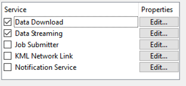
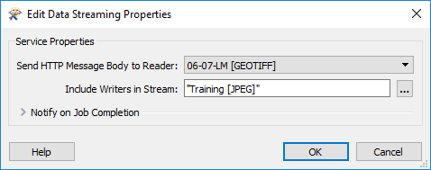
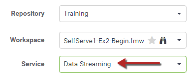
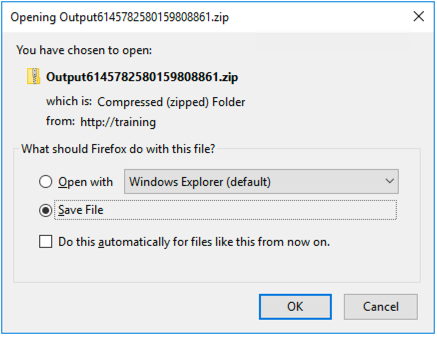
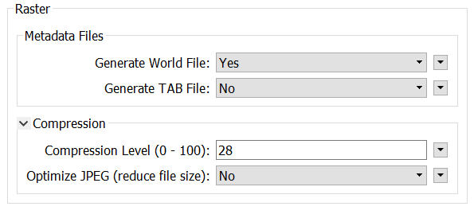
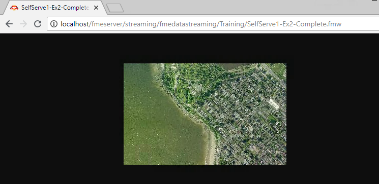

# 练习3.2：数据流系统

|  练习2 |  数据流系统 |
| :--- | :--- |
| 数据 | 正射影像（GeoTIFF） |
| 总体目标 | 为正射影像创建FME服务器数据流系统 |
| 演示 | 数据流 |
| 启动工作空间 | C:\FMEData2018\Workspaces\ServerAuthoring\SelfServe1-Ex2-Begin.fmw |
| 结束工作空间 | C:\FMEData2018\Workspaces\ServerAuthoring\SelfServe1-Ex2-Complete.fmw |

作为一个城市的GIS部门的技术分析师，您刚刚创建了一个系统，允许其他部门下载正射影像数据，而不是要求您为他们创建它。

有时最终用户将数据下载为JPEG只是为了在浏览器或图像查看器中打开它来检查它。您意识到，在这种情况下，他们可能能够使用数据流服务，而不是数据下载。

  
**1）打开工作空间**  
从练习1或上面列出的开始工作空间打开工作空间。

  
**2）发布到FME服务器**  
  
将工作空间重新发布到FME Server。

在发布向导的最后一个对话框中，选中复选框以使用数据下载和数据流注册工作空间（但不要单击“完成”）：

单击Data Streaming服务的Edit按钮。确保服务正在使用JPEG写模块的输出（现在我们将数据流限制为JPEG格式）：

  
**3）运行工作空间**  
在FME Server Web界面中找到新发布的工作空间并运行它。在工作空间的参数中，请确保将Web服务设置为数据流而不是数据下载

此转换的结果不是流式JPEG文件。相反，转换返回一个zip文件：

如果您打开zip文件，您会看到它包含JPEG文件和wld（World）文件。这就是FME返回一个zip文件的原因。只要结果是多个文件，它就会压缩数据流服务的结果。

|  2018.1的新变化 |
| :--- |
|  额外的World文件不再影响2018.1中的数据流。如果您正在FME Server 2018.1+上完成此练习，那么如果数据按预期流式传输，您可以在此处结束。如果您收到了下载文件，请继续执行步骤4。 |

  
**4）关闭世界文件创建**  
  
要真正流式传输数据，我们应该关闭工作空间中的世界文件创建。检查JPEG写模块的要素类型的属性，并将Generate World File参数设置为No：

  
**5）发布和运行工作空间**  
  
重新发布工作空间并在FME Server上运行它。您应该会发现转换结果将作为流式JPEG文件返回。很可能它会直接在您的网络浏览器中打开：

<table>
  <thead>
    <tr>
      <th style="text-align:left">恭喜</th>
    </tr>
  </thead>
  <tbody>
    <tr>
      <td style="text-align:left">
        
通过完成本练习，您已学会如何：
           
        

        <ul>
          <li>设置工作空间以在数据流服务中使用</li>
          <li>将工作空间发布到数据流服务</li>
        </ul>
      </td>
    </tr>
  </tbody>
</table>