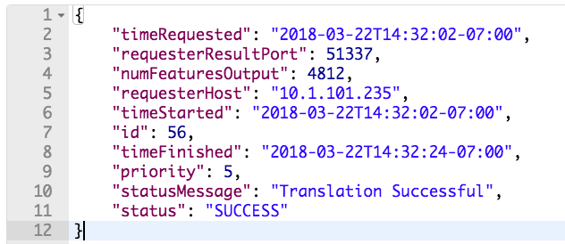
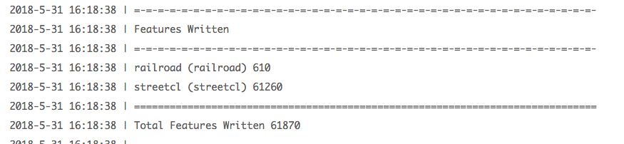

|  练习4 |  使用标准参数运行同步作业 |
| :--- | :--- |
| 数据 | 无 |
| 总体目标 | 使用FME REST API同步运行作业 |
| 演示 | 如何使用Transact调用 |

本练习演示了Transact（处理）调用，该调用用于在FME Server上同步运行作业。要查找有关Transact调用的更多信息，请访问FME REST API页面并查找转换部分或访问[Rest API转换](https://docs.safe.com/fme/html/FME_REST/apidoc/v3/index.html#!/transformations)文档。

同步运行作业的一个示例是：

&lt;style type =“text / css”&gt; .tg {border-collapse：collapse; border-spacing：0;} .tg td {font-family：Arial，sans-serif; font-size：14px; padding：10px 5px ; border-style：solid; border-width：1px; overflow：hidden; word-break：normal; border-color：black;} .tg th {font-family：Arial，sans-serif; font-size：14px; font-weight：normal; padding：10px 5px; border-style：solid; border-width：1px; overflow：hidden; word-break：normal; border-color：black;} .tg .tg-ao4k {background-color ：＃e6ffe6;颜色：＃333333; vertical-align：top} .tg .tg-a080 {background-color：＃e6ffe6; vertical-align：top} &lt;/ style&gt;

| POST | HTTP：// &lt;yourServerHost&gt; /fmerest/v3/transformations/transact/Samples/austinDownload.fmw |
| :--- | :--- |


请注意，**Transact**语句向FME服务器指示您将在结束之前等待该进程完成。在Postman中，您还需要设置标头部分和URL。执行以下步骤以在Postman中设置此调用。

|  警告 |
| :--- |
|  请注意，提交作业的所有调用 - 无论是同步还是异步 - 都需要授权 |

|  注意 |
| :--- |
|  虽然与异步调用相比，同步调用在Web应用程序中更容易使用，但应用程序将在调用完成之前停止运行。工作空间中处理的数据越多，等待的时间就越长。虽然一些工作几乎可以立即完成，但涉及大量数据或复杂计算的工作可能会花费大量时间。对于短期工作，最好保存同步调用。这是在使用FME Server REST API进行开发时应该考虑的权衡。 |

  
**1）输入URL**

单击加号以在Postman中打开新选项卡。第一步是在Postman中添加URL。将URL粘贴到工具栏中，然后使用下拉列表将GET更改为POST。  

&lt;style type =“text / css”&gt; .tg {border-collapse：collapse; border-spacing：0;} .tg td {font-family：Arial，sans-serif; font-size：14px; padding：10px 5px ; border-style：solid; border-width：1px; overflow：hidden; word-break：normal; border-color：black;} .tg th {font-family：Arial，sans-serif; font-size：14px; font-weight：normal; padding：10px 5px; border-style：solid; border-width：1px; overflow：hidden; word-break：normal; border-color：black;} .tg .tg-ao4k {background-color ：＃e6ffe6;颜色：＃333333; vertical-align：top} .tg .tg-a080 {background-color：＃e6ffe6; vertical-align：top} &lt;/ style&gt;

| POST | HTTP：// &lt;yourServerHost&gt; /fmerest/v3/transformations/transact/Samples/austinDownload.fmw |
| :--- | :--- |


  
培训计算机上的用户可以将&lt;yourServerHost&gt;更改为localhost，其他用户应将yourServerHost更改为其服务器的主机名。

Transact调用文档可以在[这里](https://docs.safe.com/fme/html/FME_REST/apidoc/v3/index.html#!/transformations/transact_post_23)找到。

[](https://github.com/xuhengxx/FMETraining-1/tree/b47e2c2ddcf98cce07f6af233242f0087d2d374d/FMESERVER_RESTAPI4Workspaces/Images/image4.1.1.TransactURL.png)

  
**2）输入标头**

在这个调用中，我们有一个请求主体，它将是JSON。这将显示在“内容类型”部分中。另外，我们正在请求JSON，这是在Accept = application / JSON下。授权是您输入令牌的地方。

* **Content-Type：** application / json
* **Accept：** application / json
* **Authorization：** fmetoken token = &lt;yourTOKEN&gt;

要输入令牌，我们可以使用上一练习中创建的预设。在键值中，键入单词“令牌”，将显示创建的预设。

输入此调用所需的标头。单击Headers标签，如下所示。

[](https://github.com/xuhengxx/FMETraining-1/tree/b47e2c2ddcf98cce07f6af233242f0087d2d374d/FMESERVER_RESTAPI4Workspaces/Images/image4.1.2.TransactPostman.png)

  
**3）输入主体并选择“原始”选项**

接下来，我们需要输入调用的主体。_单击调用的主体部分，_然后_单击原始按钮_并粘贴提供的主体。_在Postman中，您需要使用键盘快捷键进行复制和粘贴。_

身体：

```text
{
  "publishedParameters": [
    {
      "name": "MAXY",
      "value": "42"
    },
    {
      "name": "THEMES",
      "value": [
        "airports",
        "cenart"
      ]
    }
  ]
}
```

[](https://github.com/xuhengxx/FMETraining-1/tree/b47e2c2ddcf98cce07f6af233242f0087d2d374d/FMESERVER_RESTAPI4Workspaces/Images/image4.1.3.TransactBody.png)

  
**4）单击“发送”**

点击发送！现在，等待直到调用返回\(大约20秒\)，您将收到这样的消息。

[](https://github.com/xuhengxx/FMETraining-1/tree/b47e2c2ddcf98cce07f6af233242f0087d2d374d/FMESERVER_RESTAPI4Workspaces/Images/image4.1.4.TransactResponsePostman.png)

  
**5）在FME Server中查看**

现在已提交作业，您可以在FME Server中查看它。转到您的FME Server并以restapi用户身份登录，然后单击左侧边栏上的“作业”&gt;“已完成”页面。

[](https://github.com/xuhengxx/FMETraining-1/tree/b47e2c2ddcf98cce07f6af233242f0087d2d374d/FMESERVER_RESTAPI4Workspaces/Images/image4.1.5.Job.png)

你应该能够注意到一些事情。该工作由restapi运行，因为使用的令牌属于restapi。

  
**6）找到工作日志并找到主题**

单击作业。

作业页面提供了有关作业的更详细说明。在这里，我们可以找到工作日志。作业日志提供的信息包括：写入了哪些要素，写入了多少要素，用什么引擎来完成这项作业。

  
 向下滚动到“作业日志”

作业日志将始终位于完成的部分之后。完成的部分快速概述了日志更加详细的作业。

  
 在日志中找到主题

只需点击ctrl + f，即可在日志中找到THEMES。它应该显示'airports cenart'。

我们知道作业是用所请求的参数完成的。

[](https://github.com/xuhengxx/FMETraining-1/tree/b47e2c2ddcf98cce07f6af233242f0087d2d374d/FMESERVER_RESTAPI4Workspaces/Images/image4.1.5b.Themes.png)

让我们更新参数并再次尝试调用。

  
**7）找到工作空间的已发布参数**

转到RunWorkspace页面。然后，选择Samples作为存储库，选择austinDownload.fmw作为工作空间。向下滚动页面，直到看到高级部分。单击加号，然后找到已发布的参数。在这里，我们可以在工作空间中修改所有参数。看看选项，这次我们将使用railroad和streetcl选项运行调用。

  
**8）打开Postman并修改主体**

如果保持Postman打开，只需再次单击body选项卡。现在将THEMES值更改为railroad和streetcl。

[](https://github.com/xuhengxx/FMETraining-1/tree/b47e2c2ddcf98cce07f6af233242f0087d2d374d/FMESERVER_RESTAPI4Workspaces/Images/image4.1.6.newparameters.png)

然后单击“发送”。

  
**9）在FME Server中查找作业**

打开您的FME Server，然后单击服务器的左侧面板，其中显示作业。单击最新的austinDownload作业。向下滚动以查找作业日志。

在这里，您可以调查作业是否成功完成以及使用了哪些参数。在这里，我们可以看到写入了正确的要素。

[](https://github.com/xuhengxx/FMETraining-1/tree/b47e2c2ddcf98cce07f6af233242f0087d2d374d/FMESERVER_RESTAPI4Workspaces/Images/image4.1.7.FeaturesWritten.png)

<table>
  <thead>
    <tr>
      <th style="text-align:left">恭喜</th>
    </tr>
  </thead>
  <tbody>
    <tr>
      <td style="text-align:left">
        <p>通过完成本练习，您已学会如何：
          <br />
        </p>
        <ul>
          <li>创建一个同步运行作业的调用</li>
          <li>检查作业日志以查看作业是否正确运行并使用正确的参数</li>
          <li>更改调用中的参数</li>
        </ul>
      </td>
    </tr>
  </tbody>
</table>
