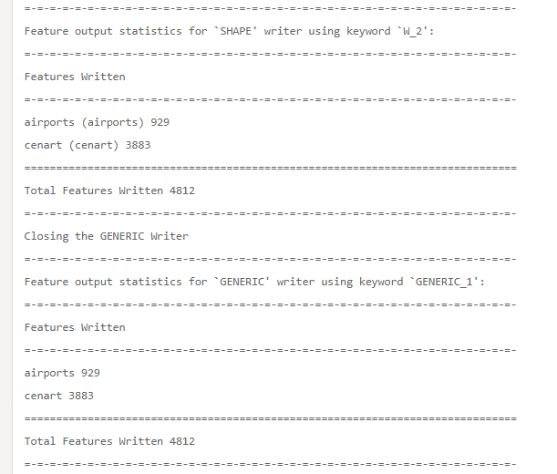

|  练习5 |  异步运行作业 |
| :--- | :--- |
| 数据 | 无 |
| 总体目标 | 使用FME REST API异步运行作业 |
| 演示 | 如何使用提交调用 |

本练习演示了提交调用，该调用用于在FME Server上异步运行作业。要查找有关“提交”调用的更多信息，请访问FME REST API页面并查找转换部分或访问[Rest API转换](https://docs.safe.com/fme/html/FME_REST/apidoc/v3/index.html#!/transformations)文档。

如果异步运行作业，则在进行下一次调用之前不必等待作业完成。通过异步运行作业，您将从FME Server收到一个ID。您可以使用此ID再次调用FME服务器以获取调用状态更新。

我们将运行完全相同的调用，但不是Transact，而是将URL更改为Submit。通过提交，您将提交工作进行处理。

  
**1）将下面的URL粘贴到Postman中**

单击加号以在Postman中打开新选项卡。复制下面的URL并将其粘贴到Postman中。  

&lt;style type =“text / css”&gt; .tg {border-collapse：collapse; border-spacing：0;} .tg td {font-family：Arial，sans-serif; font-size：14px; padding：10px 5px ; border-style：solid; border-width：1px; overflow：hidden; word-break：normal; border-color：black;} .tg th {font-family：Arial，sans-serif; font-size：14px; font-weight：normal; padding：10px 5px; border-style：solid; border-width：1px; overflow：hidden; word-break：normal; border-color：black;} .tg .tg-ao4k {background-color ：＃e6ffe6;颜色：＃333333; vertical-align：top} .tg .tg-a080 {background-color：＃e6ffe6; vertical-align：top} &lt;/ style&gt;

| POST | HTTP：// &lt;yourServerHost&gt; /fmerest/v3/transformations/submit/Samples/austinDownload.fmw |
| :--- | :--- |


  
**2）输入标头**

填写Postman的标头：

* **Content-Type：** application / json
* **Accept：** application / json
* **Authorization：** fmetoken token = &lt;yourTOKEN&gt;

要输入令牌，我们可以使用之前创建的预设。在键值中，键入单词“令牌”，将显示创建的预设。

输入此调用所需的标头。单击Headers标签，如下所示。

[](https://github.com/xuhengxx/FMETraining-1/tree/b47e2c2ddcf98cce07f6af233242f0087d2d374d/FMESERVER_RESTAPI4Workspaces/Images/image4.2.1.SubmitPostman.png)

  
**3）输入主体**

接下来，我们需要输入调用的主体。单击调用的主体部分，然后单击原始按钮并粘贴提供的主体。_在Postman中，您需要使用键盘快捷键进行复制和粘贴。_

身体：

```text
    {
      "publishedParameters": [
        {
          "name": "MAXY",
          "value": "42"
        },
        {
          "name": "THEMES",
          "value": [
            "airports",
            "cenart"
          ]
        }
      ]
    }
```

[](https://github.com/xuhengxx/FMETraining-1/tree/b47e2c2ddcf98cce07f6af233242f0087d2d374d/FMESERVER_RESTAPI4Workspaces/Images/image4.2.2.SubmitBody.png)

  
**单击发送**

  
**4）查看响应**

调用的响应应该是：

[](https://github.com/xuhengxx/FMETraining-1/tree/b47e2c2ddcf98cce07f6af233242f0087d2d374d/FMESERVER_RESTAPI4Workspaces/Images/image4.2.3.Response.png)

请注意，您可能会从FME服务器收到不同的号码。这没关系，它只是作业ID。

  
**5）在FME服务器中找到作业**

打开您的FME服务器，然后单击服务器的左侧菜单，其中显示作业。单击与从FME Server收到的号码匹配的作业ID。请注意，即使您已收到回复，转换仍可能仍在运行。这是因为此作业异步运行。单击“作业ID”以查看其完整状态。

[](https://github.com/xuhengxx/FMETraining-1/tree/b47e2c2ddcf98cce07f6af233242f0087d2d374d/FMESERVER_RESTAPI4Workspaces/Images/image4.2.4.JobResult.png)

然后，找到日志。如果滚动到几乎页面底部，您可以看到写入要素的摘要。

[](https://github.com/xuhengxx/FMETraining-1/tree/b47e2c2ddcf98cce07f6af233242f0087d2d374d/FMESERVER_RESTAPI4Workspaces/Images/image4.2.5.JobLog.png)

在这里，您可以调查作业是否成功完成以及使用了哪些参数。在这里，我们可以看到写入了正确的要素。

<table>
  <thead>
    <tr>
      <th style="text-align:left">恭喜</th>
    </tr>
  </thead>
  <tbody>
    <tr>
      <td style="text-align:left">
        <p>通过完成本练习，您已学会如何：
          <br />
        </p>
        <ul>
          <li>创建一个异步运行作业的调用</li>
          <li>检查作业日志以查看作业是否正确运行并使用正确的参数</li>
        </ul>
      </td>
    </tr>
  </tbody>
</table>
