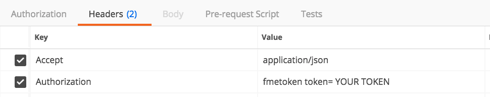
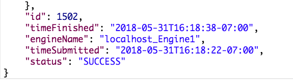

# 4.3练习6-检索作业结果

|  练习6 |  使用REST API检索作业结果 |
| :--- | :--- |
| 数据 | 无 |
| 总体目标 | 使用REST API检索有关已完成作业的信息 |
| 演示 | 如何使用作业调用 |

提交调用并收到ID后，您可以通过以下调用检查作业状态：

要查找有关此调用的文档，请访问[Rest API 转换 - GET作业](https://docs.safe.com/fme/html/FME_REST/apidoc/v3/index.html#!/transformations/get_get_13)文档。

**请注意，此调用需要获得授权**

  
**1\) 在Postman中输入以下URL**

单击加号以在Postman中打开新选项卡。要输入此URL，您需要将最后的数字修改为您在上一次调用中从响应中收到的作业ID。

| GET | http://&lt;yourServerHost&gt;/fmerest/v3/transformations/jobs/id/&lt;JobID&gt; |
| :--- | :--- |

  
**2\) 在Postman中输入以下标头**

* **Accept**: application/json
* **Authorization**: fmetoken token=&lt;yourToken&gt;

这将返回作业已完成的响应。

此信息将显示在Postman中响应的底部。

<table>
  <thead>
    <tr>
      <th style="text-align:left">恭喜</th>
    </tr>
  </thead>
  <tbody>
    <tr>
      <td style="text-align:left">
        
通过完成本练习，您已学会如何：
           
        

        <ul>
          <li>根据作业ID查找作业结果。</li>
        </ul>
      </td>
    </tr>
  </tbody>
</table>
