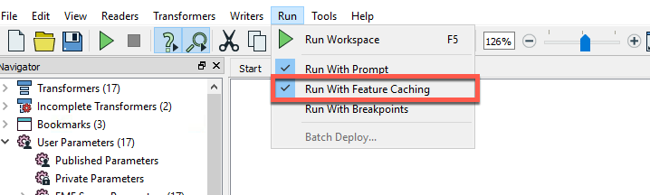
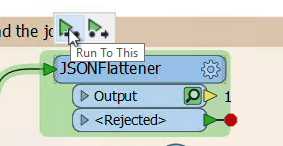
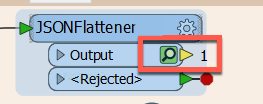
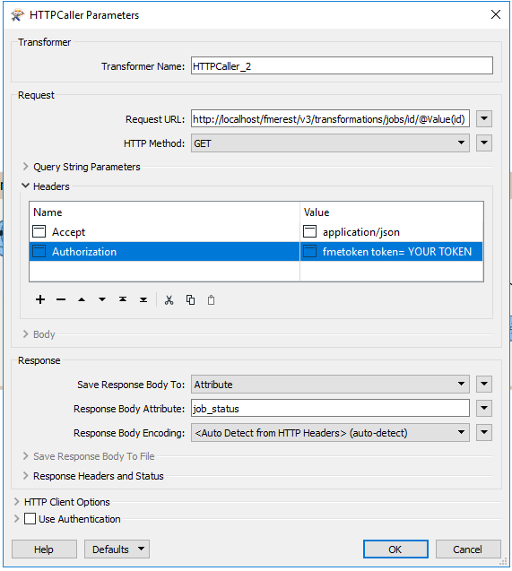

# 4.6练习8-使用FME Workbench中的REST API将作业链接在一起

|  练习8 |  在工作空间练习中使用REST API命令 |
| :--- | :--- |
| 数据 | 无 |
| 总体目标 |  在工作空间中使用REST API |
| 演示 | 如何使用HTTPCaller访问FME Server |
| 启动工作空间 | 无 |
| 结束工作空间 | C:\FMEData2018\Resources\RESTAPI\Chapter4Exercise8\Chapter4Exercise8.Complete.fmw |

您可以创建一个非常简单的工作空间，它可以触发FME Server中的多个工作空间。在这个工作空间中，我们将逐步增加一个工作空间来异步运行，等待响应，如果响应是肯定的，则下一个工作空间将运行。那么让我们开始吧！

[](https://github.com/xuhengxx/FMETraining-1/tree/b47e2c2ddcf98cce07f6af233242f0087d2d374d/FMESERVER_RESTAPI4Workspaces/Images/image4.6.1.1stStep.png)

  
_创建一个异步运行的调用_

  
**1）在Workbench中创建一个新工作空间，并将一个Creator转换器添加到画布**  


打开一个新的FME工作空间，然后将Creator转换器添加到画布。保持默认设置是可以的。Creator创建一个启动HTTPCaller的单一要素。

  
**2）将HTTPCaller添加到画布**  
 接下来，添加HTTPCaller。使用请求URL编写提交命令。您可以使用下面的调用，或者使用另一个工作空间测试它。

在HTTPCaller中使用FME Server进行授权有几种不同的方法：

1. 使用URL中的令牌作为查询字符串参数
2. 在授权标头中使用令牌
3. 勾选使用身份验证并设置为基本身份验证并输入您的用户名和密码
4. 勾选使用身份验证并设置FME Server Web连接

|  注意 |
| :--- |
|  在课程开始时，我们讨论了身份验证和授权之间的区别。这是指从FME Server发送的响应代码。身份验证错误和授权错误之间存在差异。但是，在HTTPCaller中，对调用进行身份验证或授权可以互换使用。 |

**请注意，本节中的所有调用都需要授权。**

要填写的HTTPCaller中的第一部分是请求和标头。HTTPCaller中的布局非常简单，因为要填充的所有区域都有清晰的令牌。

请注意，这是一个示例调用，可以在[Rest API POST](https://docs.safe.com/fme/html/FME_REST/apidoc/v3/index.html#!/transformations/submit_post_22)文档中找到。

首先，粘贴请求URL。然后，将HTTP方法更改为Post。更新标头。 &lt;style type =“text / css”&gt; .tg {border-collapse：collapse; border-spacing：0;} .tg td {font-family：Arial，sans-serif; font-size：14px; padding：10px 5px ; border-style：solid; border-width：1px; overflow：hidden; word-break：normal; border-color：black;} .tg th {font-family：Arial，sans-serif; font-size：14px; font-weight：normal; padding：10px 5px; border-style：solid; border-width：1px; overflow：hidden; word-break：normal; border-color：black;} .tg .tg-ao4k {background-color ：＃e6ffe6;颜色：＃333333; vertical-align：top} .tg .tg-a080 {background-color：＃e6ffe6; vertical-align：top} &lt;/ style&gt;

| POST | HTTP：// &lt;yourServerHost&gt; /fmerest/v3/transformations/submit/Samples/austinDownload.fmw |
| :--- | :--- |


**标头：**

* **Accept：** application / json
* **Authorization：** fmetoken token = &lt;yourToken&gt;

[](https://github.com/xuhengxx/FMETraining-1/tree/b47e2c2ddcf98cce07f6af233242f0087d2d374d/FMESERVER_RESTAPI4Workspaces/Images/image4.6.2.Header.png)

当您插入调用的主体部分时，请找到**上传**主体并单击下拉菜单。单击“打开文本编辑器”并将“上传主体”粘贴到调用中。

```text
{
  "publishedParameters": [
    {
      "name": "MAXY",
      "value": "42"
    },
    {
      "name": "THEMES",
      "value": [
        "airports",
        "cenart"
      ]
    }
  ]
}
```

接下来，找到**Content Type**部分并指定JSON（application / json）。主体看起来像这样：

[](https://github.com/xuhengxx/FMETraining-1/tree/b47e2c2ddcf98cce07f6af233242f0087d2d374d/FMESERVER_RESTAPI4Workspaces/Images/image4.6.3.UploadBody.png)

  
**3）检查HTTPCaller的输出**

|  FME Workbench 2018的新变化 |
| :--- |
|  在本练习中，我们使用了要素缓存。要素缓存是一种工具，允许用户在运行后检查工作空间中每个转换器的输出。它还允许部分运行工作空间。这意味着您不必从工作空间的开头开始并运行到最后。您可以选择运行开始和结束的位置。有关要素缓存的更多信息，请阅读[要素缓存](https://blog.safe.com/2018/05/caching-data-fme-evangelist174/)上的Safe博客文章 |

将Logger转换器连接到HTTPCaller上的Output端口，并在启用了要素缓存的情况下运行工作空间。为此，请单击顶部工具栏中的“运行”，然后选择“使用要素缓存运行”。

[](https://github.com/xuhengxx/FMETraining-1/tree/b47e2c2ddcf98cce07f6af233242f0087d2d374d/FMESERVER_RESTAPI4Workspaces/Images/image4.6.4.RunwithFeatureCaching.png)

Logger将写入保存工作空间的文本文件，并写入FME Workbench底部的转换日志。

日志文件包括响应主体和响应代码。

[](https://github.com/xuhengxx/FMETraining-1/tree/b47e2c2ddcf98cce07f6af233242f0087d2d374d/FMESERVER_RESTAPI4Workspaces/Images/image4.6.5.Logfile.png)

对于响应主体，我们只想公开id值，但忽略JSON格式。因此，我们使用JSON Flattener。

在继续下一步之前，请删除Logger。

|  Ricky RESTless说...... |
| :--- |
| 虽然FME Server REST API不限制您可以进行的调用数量。其他API可能会限制您可以免费进行的调用数量。在这种情况下，要素缓存是一个非常方便的工具。您可以检查输出并调整工作空间，而无需对服务器进行其他调用。 |

  
**4）将JSONFlattener添加到画布**

现在您可以添加JSONFlattener。JSONFlattener允许您选择要暴露的JSON的一部分，在我们的示例中，我们应该暴露id，因此我们可以将它用于下一次调用。

参数应如下所示：

**JSON文档\(JSON Document\)：** _\_response\_body_

**递归展平对象/数组\(Recursively Flatten Objects/Arrays\)：**是的

**要暴露的属性\(Attributes to Expose\)：** id

**JSON解析错误的列表属性\(List Attribute for JSON Parsing Errors\)：** _\_json\_error_

[](https://github.com/xuhengxx/FMETraining-1/tree/b47e2c2ddcf98cce07f6af233242f0087d2d374d/FMESERVER_RESTAPI4Workspaces/Images/image4.6.5.JSONFlattener.png)

  
**5）选择JSONFlattener并单击Run To This\(运行至此\)**

我们想要检查JSONFlattener并确保它只生成一个Job ID的属性。

[](https://github.com/xuhengxx/FMETraining-1/tree/b47e2c2ddcf98cce07f6af233242f0087d2d374d/FMESERVER_RESTAPI4Workspaces/Images/image4.6.6.RunThis.png)

一旦我们返回工作空间，我们可以选择Data Inspector符号来检查输出。  
 [](https://github.com/xuhengxx/FMETraining-1/tree/b47e2c2ddcf98cce07f6af233242f0087d2d374d/FMESERVER_RESTAPI4Workspaces/Images/image4.6.7.Inspect.png)

_单击放大镜查看结果_

[](https://github.com/xuhengxx/FMETraining-1/tree/b47e2c2ddcf98cce07f6af233242f0087d2d374d/FMESERVER_RESTAPI4Workspaces/Images/image4.6.8.jobid.png)

_在这里，我们可以看到新属性已成功创建_

**获取工作状态概观**

目标是在下一部分是向服务器发送一个调用以检查先前的作业是否成功。如果调用成功，那么我们可以运行一个新作业。但是，此工作空间运行速度非常快，以至于FME Server在进行新调用之前没有时间处理上一个作业。因此，在本节中，我们将创建一个自定义转换器，它将持续获取作业状态，直到作业完成。

  
**6）添加HTTPCaller**

我们将添加一个**HTTPCaller**并将其附加到JSONFlattener。最简单的方法是复制原始HTTPCaller，然后修改参数。在HTTPCaller中，单击“Request URL”旁边的下拉菜单，然后单击“打开文本编辑器”。粘贴请求，对于id，双击FME特性属性侧面板上的这个图标[](https://github.com/xuhengxx/FMETraining-1/tree/b47e2c2ddcf98cce07f6af233242f0087d2d374d/FMESERVER_RESTAPI4Workspaces/Images/image4.6.7a.png)。您的调用应该是这样的： &lt;style type =“text / css”&gt; .tg {border-collapse：collapse; border-spacing：0;} .tg td {font-family：Arial，sans-serif; font-size：14px; padding：10px 5px ; border-style：solid; border-width：1px; overflow：hidden; word-break：normal; border-color：black;} .tg th {font-family：Arial，sans-serif; font-size：14px; font-weight：normal; padding：10px 5px; border-style：solid; border-width：1px; overflow：hidden; word-break：normal; border-color：black;} .tg .tg-ej3l {background-color ：＃66ccff; vertical-align：top} .tg .tg-ufe5 {background-color：＃66ccff; vertical-align：top} &lt;/ style&gt;

| GET | http:///fmerest/v3/transformations/jobs/id/@Value\(id\) |
| :--- | :--- |


**标头：**

* **Accept：** application / json
* **Authorization：** fmetoken token = &lt;yourSeverHost&gt;

现在，对于HTTPCaller中的响应，我们将把响应主体属性更改为job\_status。所以你的HTTPCaller应该是这样的：

[](https://github.com/xuhengxx/FMETraining-1/tree/b47e2c2ddcf98cce07f6af233242f0087d2d374d/FMESERVER_RESTAPI4Workspaces/Images/image4.6.8.HTTPCallerParam.png)

  
**7）检查HTTPCaller的输出**

现在，右键单击HTTPCaller\_2并选择Run to This。从这里我们可以点击放大镜在FME Data Inspector中查看响应。

[](https://github.com/xuhengxx/FMETraining-1/tree/b47e2c2ddcf98cce07f6af233242f0087d2d374d/FMESERVER_RESTAPI4Workspaces/Images/image4.6.9.Pulled.png)

从上图中可以看出，原始形式的响应非常长。

但是，最后，我们可以看到状态。在这里你应该看到"status":"PULLED"。

所以知道我们需要提取响应的那一部分来测试调用是否成功。为此，我们需要另一个JSONFlattener。

  
**8）添加JSONFlattener**

回到FME Workbench，添加另一个JSONFlattener。那么，对于JSON Document下的输入参数，我们将选择job\_status。然后在attributes to expose（要暴露的属性）下输入status。

[](https://github.com/xuhengxx/FMETraining-1/tree/b47e2c2ddcf98cce07f6af233242f0087d2d374d/FMESERVER_RESTAPI4Workspaces/Images/image4.6.10.JSONFlatParams.png)

  
**9）添加一个Tester**

现在我们将添加一个**Tester**来确定工作空间是否被拉动\(PULLED\)或运行。如果状态为“PULLED”，则作业尚未运行。因此，对于要完成的作业，状态不能等于PULLED。

Tester应该命名为Tester\_JobNotPulled。通过更改转换器的名称，它允许用户快速了解Tester正在测试的内容。

* **左测值**应该是属性值状态。
* **运算符**是！=。这意味着不相等。
* **右侧值**为PULLED。

Tester正在测试作业状态是否不是pulled。如果是pulled，它将被发送到Failed端口。如果不是pulled它将进入Passed端口。

  
 Tester应该像这样设置：

[](https://github.com/xuhengxx/FMETraining-1/tree/b47e2c2ddcf98cce07f6af233242f0087d2d374d/FMESERVER_RESTAPI4Workspaces/Images/image4.6.11.TesterJobNotPulled.png)

如果状态为PULLED，则作业尚未运行，我们需要重新运行该调用以检查状态。为此，我们需要使用looper制作自定义转换器。

  
**10）创建自定义转换器**

选择HTTPCaller\_2，JSONFlattener\_2和JobNotPulled，右键单击并选择Create Custom Transformer（创建自定义转换器）。

[](https://github.com/xuhengxx/FMETraining-1/tree/b47e2c2ddcf98cce07f6af233242f0087d2d374d/FMESERVER_RESTAPI4Workspaces/Images/image4.6.12.CustomTransformers.png)

输入以下详细信息：

* **名称：** JobStatusTester
* **类别：**Web
* **概述：**此转换器将继续检查作业是否已从PULLED阶段传递。

单击确定。自定义转换器应如下所示：

[](https://github.com/xuhengxx/FMETraining-1/tree/b47e2c2ddcf98cce07f6af233242f0087d2d374d/FMESERVER_RESTAPI4Workspaces/Images/image4.6.13.JobStatusTester.png)

  
**11）添加一个Looper转换器**

右键单击工作空间，然后选择“插入转换器循环”。您将收到一个对话框，其中显示：选择要循环到的输入。默认值为Loop to：HTTPCaller\_2\_Input。

这意味着将循环HTTPCaller\_2，它将再次检查作业ID。将此循环连接到JobNotPulled的failed输出。

运行工作空间！

[](https://github.com/xuhengxx/FMETraining-1/tree/b47e2c2ddcf98cce07f6af233242f0087d2d374d/FMESERVER_RESTAPI4Workspaces/Images/image4.6.14.CustomOverview.png)

一旦我们运行了工作空间，我们应该看到这样的东西：

[](https://github.com/xuhengxx/FMETraining-1/tree/b47e2c2ddcf98cce07f6af233242f0087d2d374d/FMESERVER_RESTAPI4Workspaces/Images/image4.6.15.CustomRun.png)

定制转换器在通过最后一个测试仪之前要运行57次。但是，总的转换只有3.8秒。

|  技巧 |
| :--- |
|  这个循环正在尽可能快地在FME Server上签入。虽然转换器运行了57次，如果这是一个较慢的作业，它可能会数千次击中FME Server。这是Decelerator（减速器）可以派上用场的地方。Decelerator会降低自定义转换器的速度，因此它可以减少对FME Server的调用。 |

  
**12）将输出添加到自定义转换器。**

右键单击并选择“插入转换器输出”并将其连接到Tester\_JobNotPulled的passed端口。_现在，我们可以切换回主画布。_

  
**13）添加测试仪**

现在我们要添加一个**Tester**来确定工作空间是否成功运行。

测试程序应命名为Tester\_Successfully\_Run。通过更改转换器的名称，它允许用户快速了解Tester正在测试的内容。

* **左侧值**应该是属性值状态。
* **运算符**是=。
* **右侧值**是SUCCESS。

这是测试作业的状态是否等于success\(成功\)。

tester\(测试仪\)应该像这样设置：

[](https://github.com/xuhengxx/FMETraining-1/tree/b47e2c2ddcf98cce07f6af233242f0087d2d374d/FMESERVER_RESTAPI4Workspaces/Images/image4.6.16.SuccessTester.png)

如果状态为SUCCESS，则作业在FME Server上成功运行，并且将触发下一个工作空间。

_**新作业开始运行**_

  
**14）添加另一个HTTPCaller**

最后，使用第三个HTTPCaller同步运行新作业。要执行此操作，请使用我们之前使用的相同调用，这是Transact调用。 &lt;style type =“text / css”&gt; .tg {border-collapse：collapse; border-spacing：0;} .tg td {font-family：Arial，sans-serif; font-size：14px; padding：10px 5px ; border-style：solid; border-width：1px; overflow：hidden; word-break：normal; border-color：black;} .tg th {font-family：Arial，sans-serif; font-size：14px; font-weight：normal; padding：10px 5px; border-style：solid; border-width：1px; overflow：hidden; word-break：normal; border-color：black;} .tg .tg-ao4k {background-color ：＃e6ffe6;颜色：＃333333; vertical-align：top} .tg .tg-a080 {background-color：＃e6ffe6; vertical-align：top} &lt;/ style&gt;

| POST | HTTP：// &lt;yourServerHost&gt; /fmerest/v3/transformations/transact/Samples/austinDownload.fmw |
| :--- | :--- |


**标头：**

* **Content-Type：** application / json
* **Accept：** application / json
* **Authorization：** fmetoken token = &lt;yourServerHost&gt;

主体：

```text
  {
    "publishedParameters": [
      {
        "name": "MAXY",
        "value": "42"
      },
      {
        "name": "THEMES",
        "value": [
          "airports",
          "cenart"
        ]
      }
    ]
  }
```

[](https://github.com/xuhengxx/FMETraining-1/tree/b47e2c2ddcf98cce07f6af233242f0087d2d374d/FMESERVER_RESTAPI4Workspaces/Images/image4.6.16.FinalHttp.png)

虽然这不是最实用的示例，因为我们运行相同的工作空间两次，但是以两种不同的方式，它演示了如何使用FME。它演示了运行一个工作空间和使用响应来确定下一个操作的功能。

最终工作空间应如下所示：

[](https://github.com/xuhengxx/FMETraining-1/tree/b47e2c2ddcf98cce07f6af233242f0087d2d374d/FMESERVER_RESTAPI4Workspaces/Images/image4.6.17.FinalWorkspace.png)

<table>
  <thead>
    <tr>
      <th style="text-align:left">恭喜</th>
    </tr>
  </thead>
  <tbody>
    <tr>
      <td style="text-align:left">
        <p>通过完成本练习，您已学会如何：
          <br />
        </p>
        <ul>
          <li>使用HTTPCaller转换器在工作空间中使用FME Server REST API</li>
          <li>创建一个自定义转换器，持续检查FME Server以查看作业是否已完成</li>
          <li>使用FME Server REST API连续运行多个作业</li>
        </ul>
      </td>
    </tr>
  </tbody>
</table>