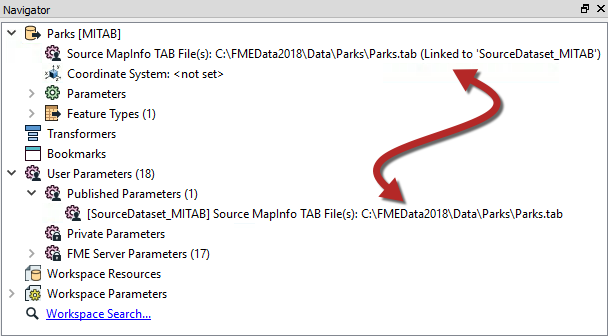

# 预链接参数

在某些情况下，用户参数会自动创建并链接到FME参数，而不会由工作空间作者进行任何手动操作。

例如，只要将读模块或写模块添加到工作空间，其源/目标数据集参数就会自动转换为用户参数。

这里，Source MapInfo TAB参数自动链接到名为SourceDataset\_MITAB的用户参数：

对于对最终用户很重要且几乎出现在所有工作空间中的参数，会发生自动链接。

|  Vector小姐说... |
| :--- |
|  如果您 - 作为工作空间作者 - 不希望或要求最终用户访问预先链接的参数，那么您可以做什么？  [1. 删除读模块/写模块](http://52.73.3.37/fmedatastreaming/Manual/QAResponse2017.fmw?chapter=11&question=4&answer=1&DestDataset_TEXTLINE=C%3A%5CFMEOutput%5CQAResponse.html) [2. 取消链接用户参数](http://52.73.3.37/fmedatastreaming/Manual/QAResponse2017.fmw?chapter=11&question=4&answer=2&DestDataset_TEXTLINE=C%3A%5CFMEOutput%5CQAResponse.html) [3. 删除FME参数](http://52.73.3.37/fmedatastreaming/Manual/QAResponse2017.fmw?chapter=11&question=4&answer=3&DestDataset_TEXTLINE=C%3A%5CFMEOutput%5CQAResponse.html) [4. 删除用户参数](http://52.73.3.37/fmedatastreaming/Manual/QAResponse2017.fmw?chapter=11&question=4&answer=4&DestDataset_TEXTLINE=C%3A%5CFMEOutput%5CQAResponse.html) |

