# 用户参数和属性

有时，FME参数设计为接受固定值或属性值。我们将这些参数称为\_OR\_ATTR参数，因为它们允许值**或**属性。

对于工作空间作者，还可以定义用户参数以允许此操作。具体来说，用户参数可以允许：

* 仅限固定值
* 固定值或属性
* 仅属性

这些允许值中的前两个由名为Attribute Assignment的用户参数中的设置控制。

## FME参数和属性

一些FME参数 - 但不是全部 - 允许使用属性代替固定值。我们称之为属性分配：

[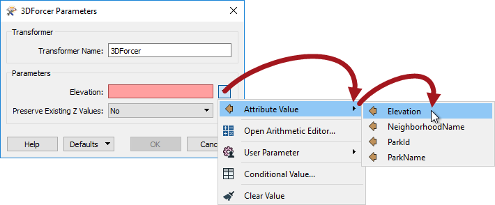](https://github.com/safesoftware/FMETraining/blob/Desktop-Advanced-2018/DesktopAdvanced4Parameters/Images/Img4.036.ORATTRParameterInTransformer.png)

当创建用户参数或将其链接到这些FME参数之一时，它也会选择该功能：

[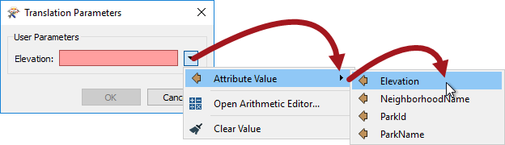](https://github.com/safesoftware/FMETraining/blob/Desktop-Advanced-2018/DesktopAdvanced4Parameters/Images/Img4.037.ORATTRParameterPrompting.png)

因此，这允许最终用户输入固定值或选择提供该值的属性。

## 属性分配和用户参数

当作者创建用户参数并且必须决定是否允许最终用户选择属性时，属性分配很重要。

例如，此处工作空间有一个UpdatedBy字段，以及一个AttributeManager转换器，它使用一个用户参数设置UpdatedBy，提示用户输入其名称：

[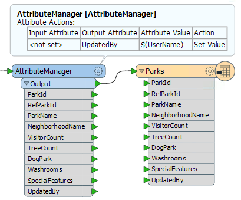](https://github.com/safesoftware/FMETraining/blob/Desktop-Advanced-2018/DesktopAdvanced4Parameters/Images/Img4.039.ParameterProvidedValue.png)

提示时，用户可以输入他们的名字; 但他们也可以选择一个属性：

[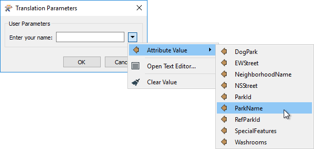](https://github.com/safesoftware/FMETraining/blob/Desktop-Advanced-2018/DesktopAdvanced4Parameters/Images/Img4.040.ParameterUnwantedAttrSelection.png)

显然，这没有任何意义。作者不希望用户能够选择属性，只能输入字符串。允许作者控制此设置的设置称为属性分配，可在参数定义对话框中找到：

[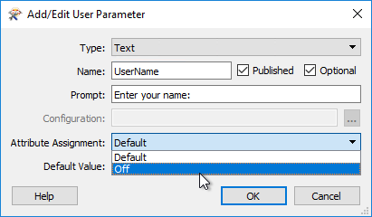](https://github.com/safesoftware/FMETraining/blob/Desktop-Advanced-2018/DesktopAdvanced4Parameters/Images/Img4.041.AttributeAssignmentSetting.png)

通过将此项从“默认”更改为“关闭”，不再允许用户在“翻译参数”提示中选择属性：

[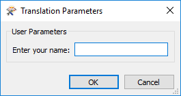](https://github.com/safesoftware/FMETraining/blob/Desktop-Advanced-2018/DesktopAdvanced4Parameters/Images/Img4.042.ParameterNoUnwantedAttrSelection.png)

---

|  分析师女士说...... |
| :--- |
|  您现在可能想知道“默认值”的含义。你可能认为我们应该选择Yes / No作为选项。    好吧 - 如上所述 - 并非每个FME参数都允许属性分配，并且使其成为用户参数不会改变这一点。例如，Snapper容差永远不允许属性分配。对链接到它的用户参数使用“是/否”选项是没有意义的，因为从不允许使用“是”。这就是我们使用“默认”一词的原因。    当然，这意味着你**在哪里**应用用户参数是很重要的。“默认值”意味着，它默认在哪里应用。如果链接到允许属性分配的FME参数，则Default将允许用户选择属性。如果链接到不允许属性分配的FME参数，则Default将不允许用户选择属性。    并且 - 因为我知道你在想 - 如果它是共享的并且同时链接到允许属性分配的FME参数和不允许属性分配的FME参数，那么FME采用安全选项并且不允许属性选择。 |

## 属性名称参数

因此，属性分配处理您希望用户输入固定值的情况，您还可以为最终用户提供选择属性的选项。

但是，也必须处理相反的情况：您不希望用户能够输入固定值，您_只_希望他们能够选择属性。

例如，这里的作者正在为数据添加标签：

[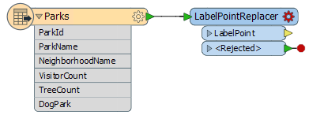](https://github.com/safesoftware/FMETraining/blob/Desktop-Advanced-2018/DesktopAdvanced4Parameters/Images/Img4.043.LabelReplacerNeedsUserInput.png)

作者希望允许用户选择一个属性来提供标签，但不能输入文本。在这种情况下，他们需要创建一个名为Attribute Name的特殊类型的用户参数：

[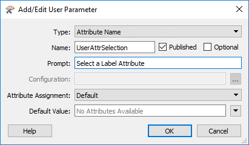](https://github.com/safesoftware/FMETraining/blob/Desktop-Advanced-2018/DesktopAdvanced4Parameters/Images/Img4.044.AttrNameParameter.png)

将此用户参数链接到LabelPointReplacer的FME参数后，当运行工作空间时，允许用户选择属性，并且只允许选择属性：

[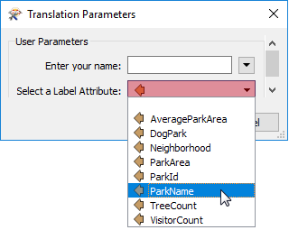](https://github.com/safesoftware/FMETraining/blob/Desktop-Advanced-2018/DesktopAdvanced4Parameters/Images/Img4.045.AttrNameSelection.png)

**然而！**

这个操作有一个问题。用户参数 - 如类型所示 - 仅返回属性名称; 它不返回属性值。

如果工作空间以此状态运行，那么LabelPointReplacer将提供属性名称（而不是值）并将其用作标签，如下所示：

[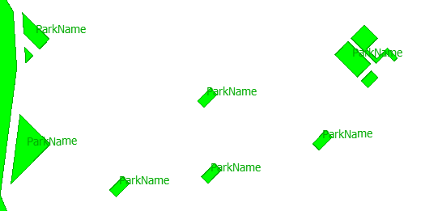](https://github.com/safesoftware/FMETraining/blob/Desktop-Advanced-2018/DesktopAdvanced4Parameters/Images/Img4.046.AttrNameParameterBadResult.png)

作者必须做的是将用户参数名称嵌入到FME函数中以获取它所引用的属性的值。

为此，作者找到LabelPointReplacer参数并将其更改（直接在FME参数中或通过文本编辑器窗口）：**@ Value（$（UserAttrSelection））**

@Value（）函数用其实际值替换属性的名称：

[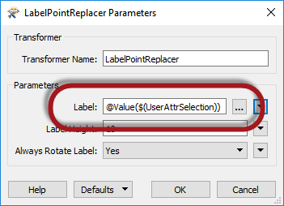](https://github.com/safesoftware/FMETraining/blob/Desktop-Advanced-2018/DesktopAdvanced4Parameters/Images/Img4.047.AttrNameParameterUsedCorrectly.png)

现在，当工作空间运行时，输出将是正确的：

