# 练习：参数化元数据编写器

|  练习1 |  参数化元数据写模块 |
| :--- | :--- |
| 数据 | 公园（MapInfo TAB） |
| 总体的目标 | 允许用户输入元数据字段 |
| 演示 | 使用FME参数。 创建和使用用户参数 |
| 启动工作空间 | C:\FMEData2018\Workspaces\DesktopAdvanced\Parameters-Ex1-Begin.fmw |
| 结束工作空间 | C:\FMEData2018\Workspaces\DesktopAdvanced\Parameters-Ex1-Complete.fmw |

在此示例中，假设您是一名为城市规划部门工作的GIS技术人员。

负责维护公园的团队有一个工作空间，可以将他们的数据从源MapInfo TAB格式转换为Google KML。它还会写一个XML元数据文件，以显示谁在何时转换数据。

目前他们面临着许多问题。

* XML输出格式不是特别好
* online XML属性被在线XML验证程序拒绝
* 所有XML元数据字段都在AttributeCreator转换器中进行了硬编码。这非常不方便（特别是当他们想在FME Server上运行工作空间时！）

您已被指派帮助解决这些问题。其中至少有一个要求您创建用户参数来代替硬编码值。

  
**1）启动Workbench**  
 启动Workbench并打开工作空间 C:\FMEData2018\Workspaces\DesktopAdvanced\Parameters-Ex1-Begin.fmw

[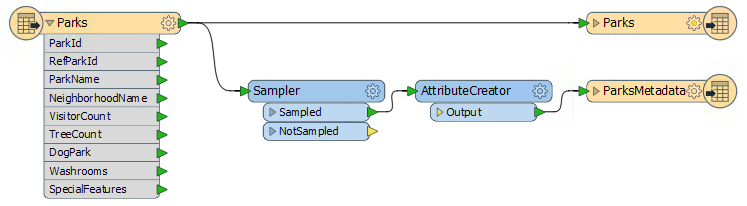](https://github.com/safesoftware/FMETraining/blob/Desktop-Advanced-2018/DesktopAdvanced4Parameters/Images/Img4.200.Ex1.InitialWorkspace.png)

|  .1更新 |
| :--- |
|  FME2018.1有一个新版本的AttributeCreator转换器，具有更高的性能。如果需要，右键单击AttributeCreator并选择Upgrade Transformer以升级此工作空间中的转换器。 |

转换的元数据部分包括两个转换器和XML写模块要素类型。

Sampler转换器通过丢弃除一个要素之外的所有要素，确保只将一个记录写入输出元数据，并且AttributeCreator创建一组属性以写入元数据。

依次检查每个转换器的参数。这些是FME参数，由工作空间作者设置，不供最终用户使用。例如，这里是Sampler转换器的参数：

[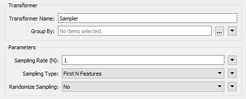](https://github.com/safesoftware/FMETraining/blob/Desktop-Advanced-2018/DesktopAdvanced4Parameters/Images/Img4.201.Ex1.SamplerParameters.png)

您可以在Parmeter Editor窗口，转换器的Parameters对话框以及Navigator窗口的Transformers部分下找到这些参数。

  
**2）更改XML写模块**  
参数名为Pretty Print的FME参数控制正在写入的XML文件的样式：

[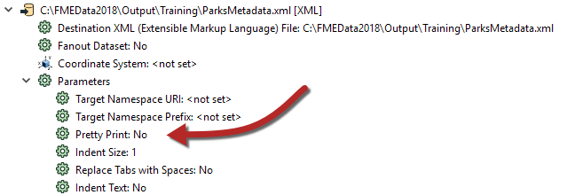](https://github.com/safesoftware/FMETraining/blob/Desktop-Advanced-2018/DesktopAdvanced4Parameters/Images/Img4.202.Ex1.PrettyPrintParameter.png)

为确保输出始终格式良好，我们应将此参数设置为Yes - 但我们不会从中创建用户参数，因为我们不希望最终用户更改它。

在“导航”窗口中，找到XML写模块，展开参数列表，然后找到标记为Pretty Print的参数。双击它。

在打开的对话框中，将值更改为“是”，然后单击“确定”关闭对话框。

[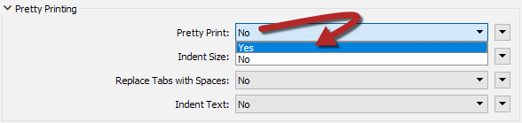](https://github.com/safesoftware/FMETraining/blob/Desktop-Advanced-2018/DesktopAdvanced4Parameters/Images/Img4.203.Ex1.SetPrettyPrintParameter.png)

我们现在 - 作为工作空间作者 - 改变了FME参数。

  
**3）创建用户参数**  
输出模式有三个变量属性：用户名，用户公司（组织）和用户电子邮件。我们应该为每个参数创建一个用户参数，以允许最终用户输入该信息。

首先，找到Navigator窗口的User Parameters部分，右键单击它，然后选择Add Parameter选项：

[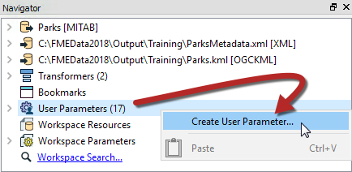](https://github.com/safesoftware/FMETraining/blob/Desktop-Advanced-2018/DesktopAdvanced4Parameters/Images/Img4.204.Ex1.AddUserParameter.png)

在新对话框中，选择Text作为要创建的参数类型（下一节中有更多参数类型）。每个参数都需要一个名称，因此请将此名称称为UserNameParam。现在输入提示，例如“输入您的姓名”。

[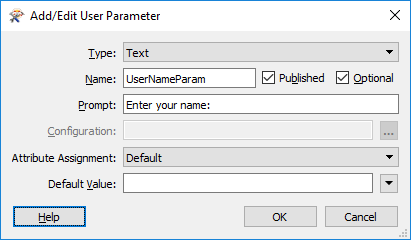](https://github.com/safesoftware/FMETraining/blob/Desktop-Advanced-2018/DesktopAdvanced4Parameters/Images/Img4.205.Ex1.AddUserParameterDialog.png)

单击“确定”关闭对话框并创建参数，该参数现在显示在“导航”窗口中。

  
**4）创建剩余的用户参数**  
创建其他两个必需参数（_UserEmailParam_和_UserCompanyParam_）的最快方法是复制_UserNameParam_参数。

因此，右键单击_UserNameParam_参数并选择Duplicate选项：

[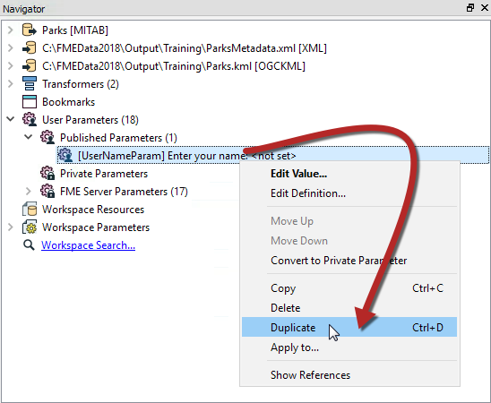](https://github.com/safesoftware/FMETraining/blob/Desktop-Advanced-2018/DesktopAdvanced4Parameters/Images/Img4.206.Ex1.DupUserParameter.png)

将打开复制参数的设置对话框。将其_命名为UserMailParam_并将提示设置为“输入您的电子邮件地址”。

重复复制过程，这次创建一个名为_UserCompanyParam_的参数，并提示“输入您的公司名称”。

完成后，导航窗口如下所示：

[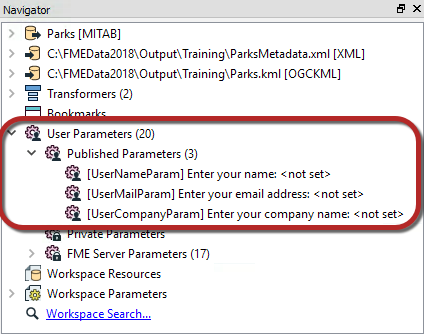](https://github.com/safesoftware/FMETraining/blob/Desktop-Advanced-2018/DesktopAdvanced4Parameters/Images/Img4.207.Ex1.CreatedUserParameters.png)

  
**5）使用用户参数 - 方法1**  
我们刚刚定义的每个用户参数都提供了需要在写模块模式中进入属性的值。有很多方法可以为这样的目的提取值，我们将为每个参数使用不同的方法，只是为了说明不同的方法。

因此，首先找到AttributeCreator的参数（参数编辑器窗口或AttributeCreator参数对话框）。此转换器是当前为输出创建属性的变量。

单击AuthorName属性的Attribute Value字段。单击下拉箭头，然后选择User Parameter&gt; UserNameParam。

完成后，数值字段将更改为特殊图标并显示所选的参数：

[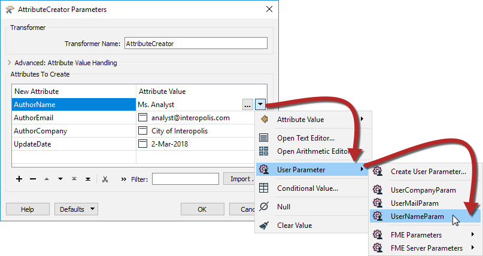](https://github.com/safesoftware/FMETraining/blob/Desktop-Advanced-2018/DesktopAdvanced4Parameters/Images/Img4.208.Ex1.UseUserParameter1.png)

在这里，单击AuthorEmail和AuthorCompany字段，然后按减号按钮删除它们，以便我们可以演示这些不同的处理方式。

  
**6）修复日期属性**  
查看AttributeCreator，我们可以看到日期字段是作为固定值输入的。虽然不是这样的用户参数，但显然用户必须在运行时手动设置它。

此外，日期结构不符合ISO标准，这就是输出无法通过XML验证的原因。

让我们解决这些问题。首先单击UpdateDate Attribute Value字段旁边的下拉箭头，然后选择Open Text Editor：

[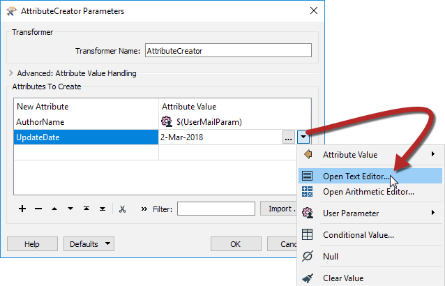](https://github.com/safesoftware/FMETraining/blob/Desktop-Advanced-2018/DesktopAdvanced4Parameters/Images/Img4.209.Ex1.SetDateAttributeOpenEditor.png)

在文本编辑器中删除所有现有内容并将其替换为：

```text
@DateTimeFormat（@DateTimeNow（），％Y-％间 - ％d）
```

这使用FME日期/时间函数在符合ISO日期标准的结构中返回今天的日期。

|  消防队员Mapp说...... |
| :--- |
|  另一种方法是简单地将日期值设置为@DateTimeNow（）并使用DateTimeConverter转换器将其转换为ISO日期标准中的实际日期：  [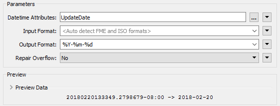](https://github.com/safesoftware/FMETraining/blob/Desktop-Advanced-2018/DesktopAdvanced4Parameters/Images/Img4.255.Ex1.DateTimeConverterParam.png)  |

  
**7）使用用户参数 - 方法2**  
从用户参数中提取值的第二种方法是使用ParameterFetcher转换器。

放置一个ParameterFetcher转换器（在AttributeCreator正常之后）。检查参数。

选择_UserEmailParam_作为要获取的参数。输入AuthorEmail作为目标属性的名称，然后选择_UserCompanyParam_并输入AuthorCompany作为目标属性：

[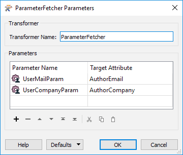](https://github.com/safesoftware/FMETraining/blob/Desktop-Advanced-2018/DesktopAdvanced4Parameters/Images/Img4.210.Ex1.ParameterFetcherTransformer.png)

|  分析师女士说...... |
| :--- |
|  您是否注意到可用参数列表包含许多与FME相关的系统参数？这些对于与FME Server一起使用特别有用。 |

  
**8）使用用户参数 - 方法3**  
从用户参数中提取值的最终方法是使用模式属性值。

为实现这一目标，我们将再创建一个属性，这次记录FME内部版本号。打开ParksMetadata要素类型参数并切换到“用户属性”选项卡。如果尚未将属性定义切换为手动。然后在Name下输入BuildNumber并将类型设置为xml\_char。单击确定：

[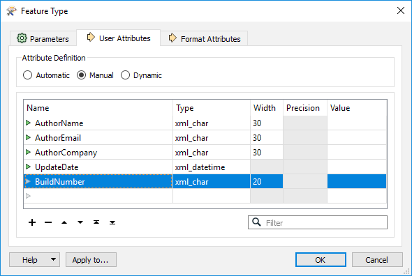](https://github.com/safesoftware/FMETraining/blob/Desktop-Advanced-2018/DesktopAdvanced4Parameters/Images/Img4.211.Ex1.MetadataParameters.png)

现在，右键单击ParksMetadata要素类型上的BuildNumber属性。然后选择“编辑值”选项：

[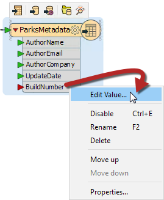](https://github.com/safesoftware/FMETraining/blob/Desktop-Advanced-2018/DesktopAdvanced4Parameters/Images/Img4.211.Ex1.AttributeValueSetMenu.png)

在打开的对话框中，您可以输入固定（常量）值，但在我们的示例中，我们将单击下拉箭头，选择用户参数，然后选择FME参数，然后选择FME\_BUILD\_NUM：

[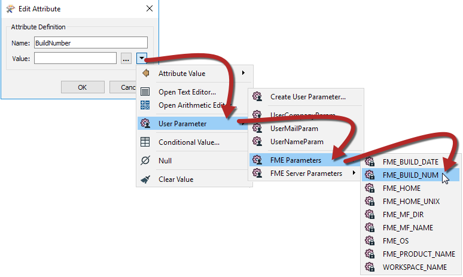](https://github.com/safesoftware/FMETraining/blob/Desktop-Advanced-2018/DesktopAdvanced4Parameters/Images/Img4.212.Ex1.AttributeValueSetDialog.png)

单击“确定”关闭对话框，要素类型应如下所示。请注意现在如何使用特定图标突出显示已设置其值的属性：

[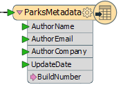](https://github.com/safesoftware/FMETraining/blob/Desktop-Advanced-2018/DesktopAdvanced4Parameters/Images/Img4.213.Ex1.AttributeValueSetCanvas.png)

  
**9）保存并运行工作空间**  
保存工作空间，然后 - 就像您是最终用户一样 - 运行它。请务必先在工具栏上设置“提示”选项：

[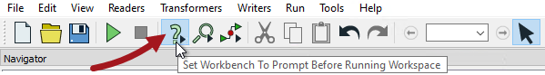](https://github.com/safesoftware/FMETraining/blob/Desktop-Advanced-2018/DesktopAdvanced4Parameters/Images/Img4.214.Ex1.PromptOption.png)

当系统提示您在新创建的字段中输入您的详细信息时，请注意我们创建的BuildNumber参数不在提示中。这是因为它是一个FME特定的私有参数，用户无需更改：

[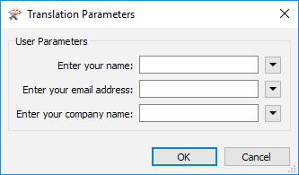](https://github.com/safesoftware/FMETraining/blob/Desktop-Advanced-2018/DesktopAdvanced4Parameters/Images/Img4.214.Ex1.RunWithPromptDialog.png)

找到并打开XML文件以确保按预期插入内容：

[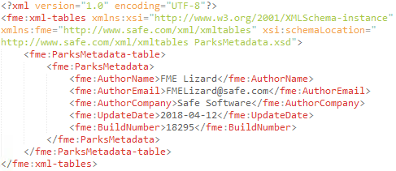](https://github.com/safesoftware/FMETraining/blob/Desktop-Advanced-2018/DesktopAdvanced4Parameters/Images/Img4.215.Ex1.OutputXML.png)

<table>
  <thead>
    <tr>
      <th style="text-align:left">恭喜</th>
    </tr>
  </thead>
  <tbody>
    <tr>
      <td style="text-align:left">
        <p>通过完成本练习，您已学会如何：</p>
        <ul>
          <li>设置FME参数（在XML写模块上）</li>
          <li>创建文本类型用户参数</li>
          <li>复制现有参数</li>
          <li>在常规转换器中使用用户参数</li>
          <li>在ParameterFetcher转换器中使用用户参数</li>
          <li>在“编辑值”对话框中使用用户参数</li>
          <li>在文本编辑器中使用DateTimeNow和DateTimeFormat函数来创建XML有效日期</li>
        </ul>
      </td>
    </tr>
  </tbody>
</table>