|  练习2 |  代码审查同事的工作空间 |
| :--- | :--- |
| 数据 | 社区地图（文件地理数据库） |
| 总体的目标 | 使用用户参数来简化工作空间 |
| 演示 | 创建和使用复杂的用户参数 |
| 启动工作空间 | C:\FMEData2018\Workspaces\DesktopAdvanced\Parameters-Ex2-Begin.fmw |
| 结束工作空间 | C:\FMEData2018\Workspaces\DesktopAdvanced\Parameters-Ex2-Complete.fmw |

该市的公共安全部门刚刚购买了FME并开始使用它进行数据转换。

但是，由于尚未参加FME桌面培训课程，他们作为用户并不自信，并希望得到一些帮助。

您的任务是在其中一个工作空间上执行**“** [**代码审查**](https://en.wikipedia.org/wiki/Code_review) **”**。您发现的至少一个问题可能涉及创建用户参数来代替硬编码值。

  
**1）启动Workbench**  
 启动Workbench并打开工作空间C：\ FMEData2018 \ Workspaces \ DesktopAdvanced \ Parameters-Ex2-Begin.fmw

这是您的同事创建的工作空间：

[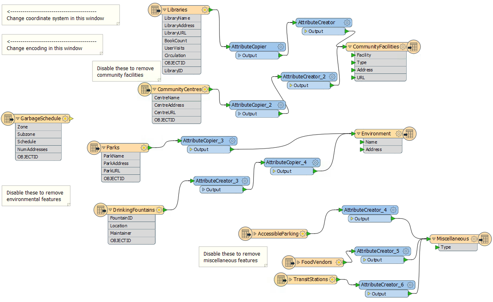](https://github.com/safesoftware/FMETraining/blob/Desktop-Advanced-2018/DesktopAdvanced4Parameters/Images/Img4.216.Ex2.InitialWorkspace.png)

|  .1更新 |
| :--- |
|  FME2018.1有一个新版本的AttributeCreator和AttributeCopier转换器，具有更高的性能。如果需要，请依次右键单击每个此类转换器，然后选择“升级转换器”以在此工作空间中升级它们。 |

请注意，它从Esri地理数据库转换为Esri Shapefile格式。目前，要处理的表是通过禁用工作空间中不需要的表来选择的。同样，他们使用Navigator参数设置目标坐标系和数据编码。这都是用户加强的。

另请注意，工作空间中的唯一注释可帮助最终用户进行此类编辑。没有必要这样做; 发布的参数应该提示用户，这就是我们将在这里实现的。

  
**2）清理自动创建的用户参数**  
打开“导航”窗口的“用户参数”部分。请注意源数据集和目标数据集的用户参数如何：

[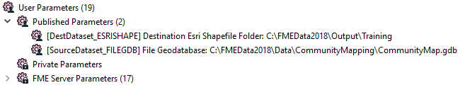](https://github.com/safesoftware/FMETraining/blob/Desktop-Advanced-2018/DesktopAdvanced4Parameters/Images/Img4.217.Ex2.InitialUserParameters.png)

您的公共安全同事告诉您，源数据永远不会改变，因此该参数无用。因此，请删除标记为“SourceDataset\_FILEGDB”的用户参数。

但是，她告诉您目标位置可以由用户设置，因此请保留DestDataset\_ESRISHAPE的参数。

  
**3）创建编码参数**  
公共安全团队希望更容易设置输出数据集的编码。目前，用户通过工作空间注释指向导航器上写模块参数存在的位置!

[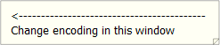](https://github.com/safesoftware/FMETraining/blob/Desktop-Advanced-2018/DesktopAdvanced4Parameters/Images/Img4.218.Ex2.EncodingAnnotation.png)

这让你知道他们在“导航”窗口中找到正确参数的难度。让我们用一个用户参数来解决这个问题。

在“导航”窗口中找到“Shape”写模块，然后展开FME参数列表。识别Character Encoding参数，右键单击它并选择Create User Parameter：

[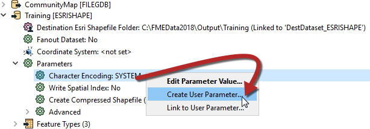](https://github.com/safesoftware/FMETraining/blob/Desktop-Advanced-2018/DesktopAdvanced4Parameters/Images/Img4.219.Ex2.ShapeEncodingParameter.png)

只需在打开的对话框中单击“确定”，即可创建用户参数并将其链接到FME。现在有一个用户参数可以轻松设置该FME参数。

  
**4）创建坐标系参数**  
您被告知，另一个要求是设置输出坐标系的能力。同样，这通过使用注释将用户指向导航器窗口来完成。

但是，如果您只是发布写模块的坐标系参数 - 尝试并查看 - 则会出现问题。该参数将允许最终用户选择FME支持的任何坐标系。

这不一定非常有用。由于数据位于不列颠哥伦比亚省温哥华市，因此用户无法将其重新投影到（例如）NZMG（新西兰坐标系）。

如果参数仅允许最终用户从较小的列表中选择坐标系，这将是可取的。

现在创建一个新的用户参数（右键单击“用户参数”&gt;“创建用户参数”），&gt;并将“Type”设置为**“Choice with Alias”**。将Name设置为CoordSysParam，并将提示设置为Select Output Coordinate System：

[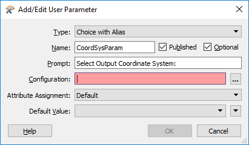](https://github.com/safesoftware/FMETraining/blob/Desktop-Advanced-2018/DesktopAdvanced4Parameters/Images/Img4.220.Ex2.ChoiceWithAliasParameter.png)

现在单击配置设置右侧的\[...\]按钮。这将打开一个对话框，可在其中配置参数。通常我们会在Choice with Alias参数中手动输入值，但对于坐标系（以及读模块/写模块格式），我们可以选择让FME为我们定义它们。

单击标记为Import的按钮，然后选择Coordinate System（s）：

[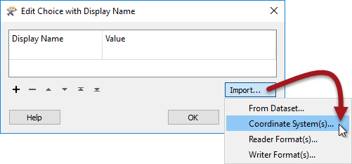](https://github.com/safesoftware/FMETraining/blob/Desktop-Advanced-2018/DesktopAdvanced4Parameters/Images/Img4.221.Ex2.ChoiceWithAliasImportCoordsys.png)

这将打开一个坐标系列表，我们可以在用户参数中将其作为值导入。

在以下坐标系的框中找到并勾选：

* UTM83-10
* BCALB-83
* LL83
* CANBC-LCC

然后单击“确定”关闭此对话框。您将返回到配置对话框，并发现已为这些坐标系自动输入名称和值：

[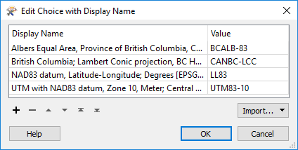](https://github.com/safesoftware/FMETraining/blob/Desktop-Advanced-2018/DesktopAdvanced4Parameters/Images/Img4.222.Ex2.ChoiceWithAliasImportedCoordsys.png)

左侧显示提示用户选择的内容，右侧显示输入FME的值将是什么。

单击“确定”，然后再次单击“确定”以关闭其余对话框并创建用户参数。

  
**5）链接坐标系参数**  
现在我们有了用户的选择，但我们仍然必须将它应用于真实参数。因此，找到写模块的坐标系参数，右键单击它，然后选择Link to User Parameter：

[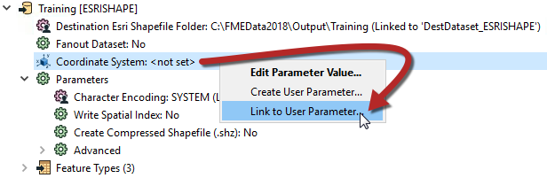](https://github.com/safesoftware/FMETraining/blob/Desktop-Advanced-2018/DesktopAdvanced4Parameters/Images/Img4.223.Ex2.LinkCoordsysParameter.png)

出现提示时，选择新创建的_CoordSysParam_，然后单击“确定”接受选择。现在，当工作空间运行时，系统会提示用户选择一个坐标系，并将该系统的短名称值传递给FME。

  
**6）创建表参数**  
这里我们的最后一项任务是创建一种方法来决定要读取哪些表。如果您还记得，目前您的同事这样做的方法是禁用各种读模块要素类型。但是，必须有一个更好的方法。

这是一个有趣的任务，因为我们想要控制源表（库，公园等），但是基于目标表的选择（CommunityFacilities，Environment和Miscellaneous）。

例如，我们希望用户选择输出要素类型，例如“Environment”，它需要“Parks”和“DrinkingFountains”读模块要素类型。

但是，我们可以很容易地做到这一点。首先在CommunityMap读模块“要读取的要素”参数中找到要读取的要素类型参数（在“导航”窗口中）：

[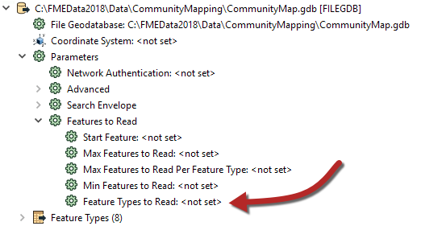](https://github.com/safesoftware/FMETraining/blob/Desktop-Advanced-2018/DesktopAdvanced4Parameters/Images/Img4.224.Ex2.FeatureTypesToReadParameter.png)

右键单击它，然后选择“创建用户参数”。将打开一个对话框，其中已填充了要素类型列表：

[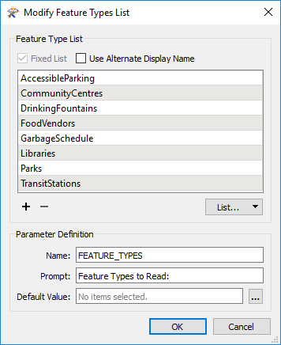](https://github.com/safesoftware/FMETraining/blob/Desktop-Advanced-2018/DesktopAdvanced4Parameters/Images/Img4.225.Ex2.FeatureTypesToReadUserParameter.png)

选中标记为“使用备用显示名称”的框。这样就可以为每种要素类型提供替代名称。我们需要做的是使用此对话框在单个显示名称下将常用读模块要素类型组合在一起。

删除GarbageSchedule的条目，因为此数据未连接且不需要。

然后，通过编辑显示名称来匹配工作空间的内容。它们应匹配如下（顺序并不重要）：

| 显示名称 | 要素类型 |
| :--- | :--- |
| Community Facilities | Libraries |
| Community Facilities | CommunityCentres |
| Environment | Parks |
| Environment | DrinkingFountains |
| Miscellaneous | FoodVendors |
| Miscellaneous | TransitStations |
| Miscellaneous | AccessibleParking |

[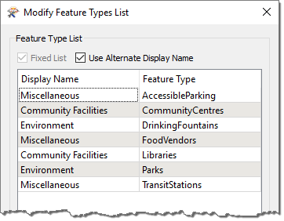](https://github.com/safesoftware/FMETraining/blob/Desktop-Advanced-2018/DesktopAdvanced4Parameters/Images/Img4.226.Ex2.FeatureTypesToReadUserParameter2.png)

在其下方更改提示以读取“要写入的表”，然后单击“确定”关闭对话框。

[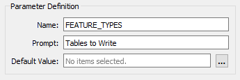](https://github.com/safesoftware/FMETraining/blob/Desktop-Advanced-2018/DesktopAdvanced4Parameters/Images/Img4.227.Ex2.FeatureTypesToReadUserParameter3.png)

我们在这里做的是设置一个可供选择的输出图层列表，其中包含每个引用的输入图层列表。

  
**7）保存并运行工作空间**  
保存工作空间。然后启动位于FME Desktop Utilities文件夹下的“开始”菜单上的FME Quick Translator应用程序。通过使用此工具，我们将确保提示用户输入参数值。

在那里，从“入门”菜单中选择“运行”：

[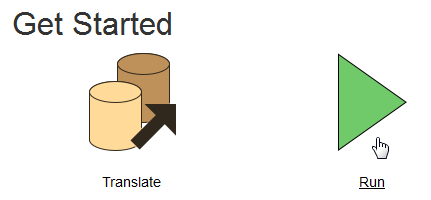](https://github.com/safesoftware/FMETraining/blob/Desktop-Advanced-2018/DesktopAdvanced4Parameters/Images/Img4.228.Ex2.QuickTranslatorStartPage.png)

浏览到新保存的工作空间，选择它，然后单击“打开”。您将看到已发布参数的列表，就像最终用户看到的一样：

[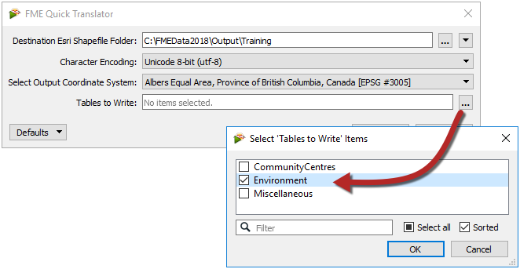](https://github.com/safesoftware/FMETraining/blob/Desktop-Advanced-2018/DesktopAdvanced4Parameters/Images/Img4.229.Ex2.FinalPromptsToUser.png)

选择Unicode 8位（utf-8）作为编码。选择一个坐标系，注意用户如何被限制用我们选择的坐标系。选择要写入的一个或两个表，然后单击“确定”以运行工作空间。

转换将进行。检查数据以确保结果正确。社区设施 - 例如 - 应该由图书馆和社区中心组成。

|  高级练习 |
| :--- |
|  说到最佳实践，不要忘记整理工作空间并赋予其更好的风格和结构！ |

<table>
  <thead>
    <tr>
      <th style="text-align:left">恭喜</th>
    </tr>
  </thead>
  <tbody>
    <tr>
      <td style="text-align:left">
        
通过完成本练习，您已学会如何：

        <ul>
          <li>删除预先链接的参数</li>
          <li>创建一个简单的预链接参数</li>
          <li>创建一个Choice with Alias用户参数</li>
          <li>使用Choice with Alias参数来定义坐标系</li>
          <li>手动将用户参数链接到FME参数</li>
          <li>将要素类型发布到读取参数</li>
          <li>在要读取的要素类型参数中设置和使用备用名称</li>
        </ul>
      </td>
    </tr>
  </tbody>
</table>
