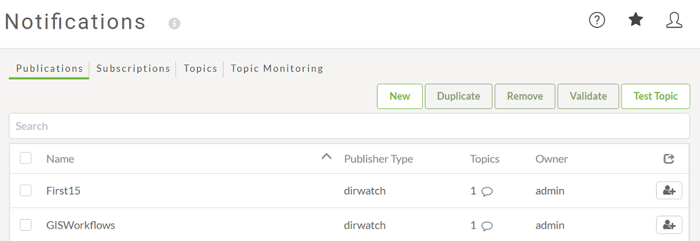
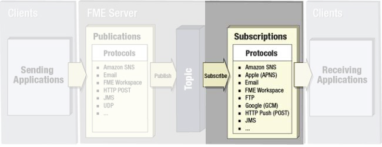

# 发布和订阅

## 发布

发布（Publication）是一个FME Server组件，用于接收来自客户端的传入通知。

要在FME Server中接收通知，工作空间作者（或管理员）必须创建新的发布。将在“通知”页面的FME Server Web界面中创建发布：

## 订阅

订阅（Subscription）是一种FME Server组件，可将传出通知发送到客户端。

要在FME Server中发送通知，工作空间作者（或管理员）必须创建新的订阅。订阅将在“通知”页面上的FME Server Web界面中创建：

FME会在安装时自动创建一些订阅，例如，提醒客户已经运行的作业成功或失败。

|  重要 |
| :--- |
|  尽管这些行为在名字上看起来很奇怪 – 发布接收消息，订阅发送它们– 这是正确的。它们的命名与它们与主题的交互方式有关。 因此，发布将数据**发布**到主题（即，它将数据发送到主题）并且订阅**订阅**主题（即，它从主题接收数据）。 |

