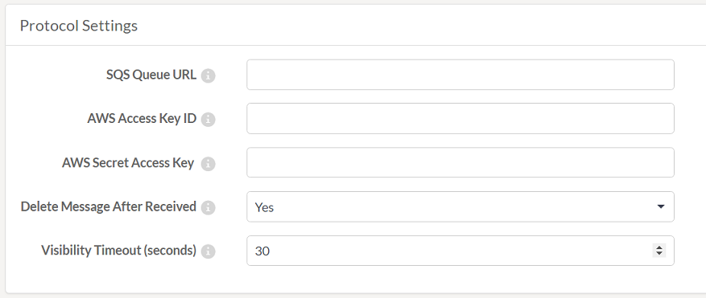

# 通知协议

协议是FME Server和客户端之间的数据交换系统。

我们已经知道FME发送和接收通知。协议是发送和接收这些通知的方法。使用特定通信协议定义每个发布和订阅。

要通过电子邮件触发传入通知，例如，您可以使用电子邮件协议创建FME发布。要向Apple移动设备发送通知，您可以使用Apple Push协议创建FME订阅。

FME Server中有许多不同的协议; 其中一些仅用于发布，一些仅用于订阅，其中一些可用于两种通知类型。

此表列出了不同的发布和订阅协议，以下页面详细介绍了一些最重要的协议。

| 协议 | 描述 | 发布 | 订阅 |
| :--- | :--- | :--- | :--- |
| Amazon S3 | 通知（文件）与Amazon的简单存储服务的通信 |  | Y |
| Amazon S3 Watch | 监视AWS S3 bucket以查找活动 | Y |  |
| Amazon SNS | 与Amazon 的简单通知服务进行通信 | Y | Y |
| Amazon SQS | 与Amazon 的简单队列服务进行通信 | Y | Y |
| Apple推送通知 | 与Apple移动设备通信 |  | Y |
| Directory Watch | 监视新文件的文件夹作为触发机制 | Y |  |
| Dropbox | 通知（文件）与Dropbox Web服务的通信 |  | Y |
| Dropbox Watch | 与Directory Watch一样，但监控存储在Dropbox Web服务中的文件夹 | Y |  |
| Email（IMAP） | 通过电子邮件服务进行通信 | Y |  |
| Email（SMTP） | 通过电子邮件服务器进行通信 | Y | Y |
| FME Workspace | 将通知传达给FME工作空间 |  | Y |
| FTP | 与FTP站点通信 |  | Y |
| FTP Watch | 监视FTP站点的活动 | Y |  |
| Google Cloud Messaging | 与Android移动设备通信 |  | Y |
| JMS | 与Java消息服务的通信 | Y | Y |
| Logger | 输出到简单的日志文件 |  | Y |
| Push | 通过HTTP请求进行通信 |  | Y |
| SFTP | 与SFTP站点通信 |  | Y |
| UDP | 通过用户数据报协议端口进行通信 | Y |  |
| WebSocket | 通过WebSocket通道进行通信 | Y | Y |

协议是FME Server体系结构中的预定义组件，无需在Web界面中定义。

但是，当设置发布或订阅以使用该协议时，可以使用许多字段来配置它们。

例如，以下是Amazon SQS订阅的参数：

必须在创建订阅时设置这些参数，以便能够使用协议发送通知。

|  Vector小姐说...... |
| :--- |
|  告诉我，这些陈述中的哪一个是正确的：    [1. SMTP和IMAP都可以用作订阅和/或发布协议](http://52.73.3.37/fmedatastreaming/Manual/QAResponse2017.fmw?chapter=24&question=3&answer=1&DestDataset_TEXTLINE=C%3A%5CFMEOutput%5CQAResponse.html)  [2. SMTP既可以用作订阅，也可以用作发布; IMAP只能用于发布](http://52.73.3.37/fmedatastreaming/Manual/QAResponse2017.fmw?chapter=24&question=3&answer=2&DestDataset_TEXTLINE=C%3A%5CFMEOutput%5CQAResponse.html)  [3. SMTP只能用于发布; IMAP只能用作订阅和发布](http://52.73.3.37/fmedatastreaming/Manual/QAResponse2017.fmw?chapter=24&question=3&answer=3&DestDataset_TEXTLINE=C%3A%5CFMEOutput%5CQAResponse.html)  [4. SMTP只能用于订阅; IMAP只能用于发布](http://52.73.3.37/fmedatastreaming/Manual/QAResponse2017.fmw?chapter=24&question=3&answer=4&DestDataset_TEXTLINE=C%3A%5CFMEOutput%5CQAResponse.html) |

