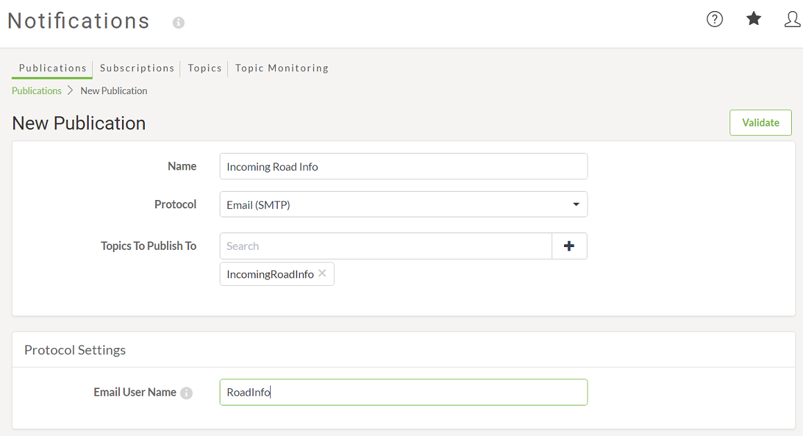

# 电子邮件发布：SMTP

通过直接电子邮件将数据发布到FME Server时，将使用SMTP发布。FME Server接收电子邮件并触发主题作为响应。

此类发布是可能的，因为FME Server包含内置电子邮件服务器作为其组件之一。但是，这确实要求主机服务器具有向DNS名称服务器注册的域名。

|  Intuitive修女说… |
| :--- |
|  FME Server参考手册中介绍了为通知设置内置电子邮件服务器的步骤。  但是，FME云实例会自动配置为电子邮件通知，并且也具有公共域名，因此您无需进行任何其他设置。 |

## 创建SMTP发布

通过为新发布选择电子邮件（SMTP）协议，可以在FME Server Web界面的“通知”部分中创建SMTP发布。

选择协议类型后，还必须为发布提供名称和选择要触发的现有主题。最后一个参数是电子邮件用户名，不需要是现有用户或电子邮件; 在上面的例子中，它被设置为RoadInfo。请注意，您无需将 _@FMEServer-Hostname.com_添加到电子邮件用户名。

请注意，作者使用“Incoming”为发布和主题名称添加前缀，这样就不会混淆哪些主题用于传入通知以及哪些主题用于传出通知。

现在，每当向RoadInfo@_YourFMEServerHostname_发送电子邮件时 - 例如，某人正在发送电子邮件以报告路上的雪 - 会触发_IncomingRoadInfo_主题。

