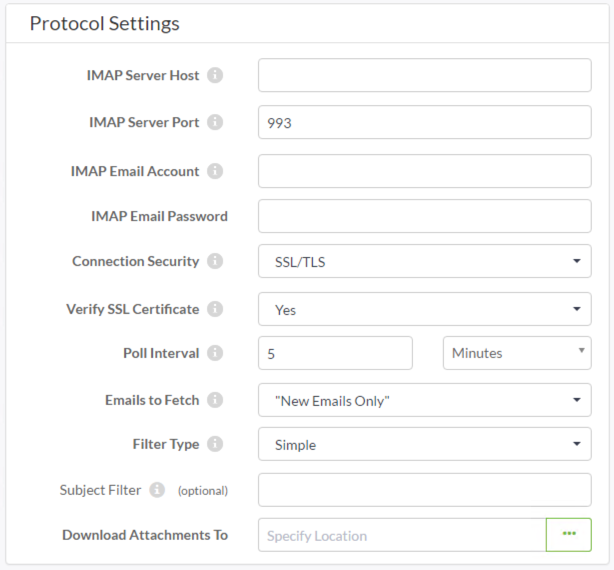

# 电子邮件发布：IMAP

IMAP \(Internet Message Access Protocol\)（Internet消息访问协议）是用于传入（发布）通知的电子邮件的变体。

IMAP发布不是使用内置电子邮件服务器，而是连接到另一个电子邮件服务器并监视它以接收传入的电子邮件。当电子邮件到达该帐户时，将触发与该出版物绑定的任何主题。

## 创建IMAPP发布

与SMTP协议一样，通过创建新的发布和（在本例中）选择电子邮件（IMAP）协议，在Web界面的“通知”页面中设置IMAP发布：

请注意，大多数参数用于定义IMAP（电子邮件）服务器连接。

通过两个重要参数，您可以确定检查电子邮件的时间间隔，并决定是仅提取所有未读电子邮件还是新电子邮件。

还有一个参数可用于选择存储任何电子邮件附件的FME Server资源位置。

|  D. Server先生说 … |
| :--- |
|  大多数电子邮件服务器都支持IMAP功能，大多数基于云的电子邮件提供商也是如此，例如Gmail，Outlook.com，Yahoo！等; 所以让FME Server扫描一个Gmail帐户（例如）接收邮件非常容易，然后对其内容采取行动。 |

