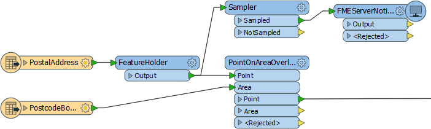

# Q + A答案

以下是本章问题的答案。

|  Vector小姐说...... |
| :--- |
|  所有通知设置必须具有以下哪些：  1.传入组件（发布，发布者）和传出组件（订阅，订阅者） 2.传入组件或传出组件或两者 3.传入组件或传出组件但从不同时存在 4.没有以上  尽管图表\(在通知系统的元素下\)显示了一个连续的过程，但并不需要在设置中使用所有这些组件。如果系统专为FME Server设计，仅接收通知，则只需要发布者/发布。同样，如果系统仅供FME Server发送通知，则只需要订阅者/订阅。但如果需要接收和发送通知，则所有组件都适用。 |

|  Vector小姐说...... |
| :--- |
|  请不要弄错!发布和主题有什么关系？  1.一：一（每个发布有一个主题，每个主题属于一个发布） 2。一个：多个（每个发布可以有很多主题，每个主题属于一个发布） 3。多个：一个（每个发布有一个主题） ，每个主题可以属于多个发布） 4。多个：多个（每个发布可以有多个主题，每个主题可以属于多个发布）  你弄错了？我并不生气......只是非常非常失望！ |

|  Vector小姐说...... |
| :--- |
|  告诉我，这些陈述中的哪一个是正确的：  1. SMTP和IMAP都可以用作订阅和/或发布协议 2. SMTP既可以用作订阅，也可以用作发布; IMAP只能用于发布 3. SMTP只能用于发布; IMAP只能用作订阅和发布 4. SMTP只能用于订阅; IMAP只能用于发布  请参阅通知协议下的表，以获取可用于哪种通知类型的协议的完整列表。 |

|  Vector小姐说...... |
| :--- |
|  当工作空间是通知系统的一部分，处理传入的消息时，它是...  1.订阅 2.发布 3.协议 4.客户端  它是客户端！在这种情况下，它是订阅者（它订阅了发布产生的消息）。如果它正在发送消息，那么它将是发布者（向订阅发布消息）。  它不是发布或订阅，因为它们是FME Server的特定组件。 |

|  Vector小姐说...... |
| :--- |
|  我希望我的工作空间在运行时向我发送电子邮件，因此我知道人们何时使用它来下载数据。当我发布它时，我该将它注册到什么？  1.通知服务 2.数据下载服务 3.电子邮件（SMTP）协议 4.工作空间订阅者协议  我正在为人们下载数据进行设置，因此我将其注册为数据下载服务。就这么简单。要获得通知，我只需要在数据下载设置中选择要触发的主题。当然，要获得电子邮件，我必须设置一个与该主题相关的电子邮件订阅 - 但这与我如何注册工作空间没有任何关系！ |

|  Vector小姐说...... |
| :--- |
|  我有一个工作空间，可以读取50,000个要素，转换它们并将它们写出来。如果我想发送一个已经读取过要素的通知，哪种转换器组合最常用？  1. Creator / FeatureWriter / FMEServerNotifier 2. Creator / FMEServerJobSubmitter 3. Creator / FeatureReader / FMEServerNotifier 4. FeatureHolder / Sampler / FMEServerNotifier  我正在发送通知（不运行作业）所以我使用FMEServerNotifier。我已经有一个读模块，所以我不需要转换器来读取或写入数据。但是我确实需要一个Sampler转换器来将要素数量减少到一个; 否则我会发送50,000个通知。FeatureHolder确保在读取所有要素之前不会触发通知。它看起来像这样：   |

|  Vector小姐说...... |
| :--- |
|  哪个接收者转换器有一个参数来阻止它连续运行？选择所有符合条件的。  1. SQSReceiver 2. WebSocketReceiver 3. JMSReceiver 4. TCPIPReceiver  SQSReceiver能够切换到要读取的大量消息，并且TCPIPReceiver可以选择在发布客户端断开连接后关闭连接。 |

|  Vector小姐说...... |
| :--- |
|  在高容量消息流设置中写入数据库需要将事务间隔设置为什么值？  1. &lt;未设置&gt; 2.零（0） 3。一（1） 4。无穷大（∞）  将事务间隔设置为1表示每条消息在到达时都已提交。任何其他值（至少在此列表中）可能意味着在工作空间终止之前，数据永远不会被提交。 |

