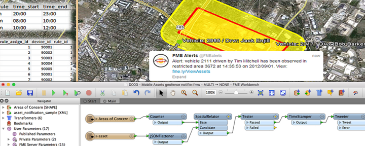

# 第4章：使用FME Server实时操作

实时系统是指在事件发生时对事件起作用的系统，并在信息可用时发送信息。

实时通常用于监视传感器网络、运行事件驱动处理和/或向移动设备\(如手机\)发送警报。因此，实时数据处理通常用于处理少量信息\(而不是大型数据集\)，它们作为单个事件或连续通信流到达。

作为单独事件到达的数据的真实示例包括处理来自车辆跟踪系统的简单位置数据或者向系统管理员发送电子邮件以响应数据库表更新。连续数据的一个例子是处理从温度传感器或闪电探测器发送的数据流。

FME Server中的实时数据以两种方式处理：通知和消息流。

## 通知

通知是FME Server处理单个消息和警报的方式。

FME Server具有特定的通知服务，可以将其设置为侦听来自FME外部的传入消息，并触发响应中的某个操作，或者可以设置为发送单个警报以响应发生的事件在FME服务器上。

支持的协议包括email、WebSockets以及针对苹果和安卓设备的通知。

## 消息流

通知是一次性消息，而消息流涉及处理连续的信息流。

处理消息流不是为每个消息运行一次工作空间，而是涉及创建一个工作空间，该工作空间将连接到流并在发送后立即连续运行接收消息。由于减少了开销，这种技术可以以比通知服务快得多的速度处理数据。

