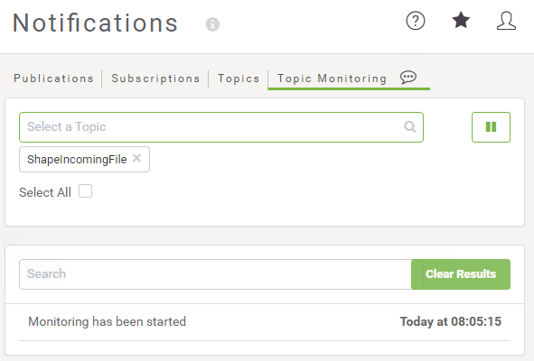

|  练习4.1 |  建筑物更新通知系统 |
| :--- | :--- |
| 数据 | 建筑物占地面积（Esri Shapefile） |
| 总体目标 | 触发新文件的通知 |
| 演示 | 通知主题和目录监视发布 |
| 启动工作空间 | N / A |
| 结束工作空间 | N / A |

作为GIS部门的技术分析师，您希望开始在FME Server中尝试通知。目录监视协议似乎是一个很好的起点，您已经在考虑一个共享文件夹，用户可以在其中放置Shapefile数据集以添加或更新公司数据库。

  
**1）创建资源文件夹**  
第一步是创建一个资源文件夹来复制数据。打开FME Server Web界面并导航到“资源”页面。

浏览到Data文件夹并创建一个名为BuildingUpdates的新子文件夹：

|  Vector小姐说...... |
| :--- |
|  本练习使用FME Server资源文件夹，但FME Server中中也有本地支持来监视Amazon S3 bucket、Dropbox和FTP中的新资源。 使用此处描述的相同概念，您可以使用这些协议之一而不是目录监视。 |

  
**2）创建发布**  
现在创建一个将由新文件触发的发布和主题。导航到“通知”页面，单击“发布”选项卡，然后单击“新建”按钮。

输入“Incoming Building Footprints”作为新发布的名称。

接下来，单击要发布到的主题旁边的文本框。键入ShapeIncomingFile，然后单击下拉列表中显示的具有该名称的条目。这将创建一个新主题并将其分配给此发布。

  
**3）设置发布协议**  
现在从下拉列表中选择目录监视作为此发布的协议。在出现的对话框中，单击“要监视的目录”参数的“浏览”按钮，然后选择新创建的资源文件夹：

回到发布定义中，对于Filter参数，删除MODIFY和DELETE操作。我们要监视的是新文件到达，而不是旧文件被删除：

将轮询间隔更改为1分钟，然后单击确定以创建新发布。然后在右上角，单击“验证”按钮以验证发布。这可确保正确设置发布：

  
**4）监控主题**  
单击“通知”页面上的“主题监控”选项卡。开始在Select a Topic搜索栏中键入ShapeIncomingFile，然后选择它。如果未出现该主题，则表示它不是使用该发布制作的。您可以在此处创建主题，但您需要返回“Incoming Building Footprints”发布并添加主题。

添加主题后，主题监控将自动开始，底部将显示一份备忘录，说明已启动监控及其启动时间。要开始或暂停监控，请单击顶部的播放或暂停按钮。

|  技巧 |
| :--- |
|  监控主题时，“主题监控”选项卡需要保持打开状态。如果您要离开此页面，但希望继续监控主题，请使用FME Server打开新选项卡并继续工作。 |

  
**5）测试主题**  
现在让我们测试一下这个主题。在C：\ FMEData2018 \ Data \ Engineering \ BuildingFootprints中找到源Shapefile数据集。为一个数据集选择一组文件（.dbf，.prj，.shp，.shx）并从中创建压缩的zip文件（右键单击&gt;发送到&gt;压缩（压缩）文件夹）。

现在将zip文件上传到新创建的资源文件夹中。有两种方法可以做到这一点。

您可以使用文件系统（通过将文件复制到C：\ ProgramData \ Safe Software \ FME Server \ resources \ data \ BuildingUpdates）或使用FME Server Web界面。如果您使用Web界面，请打开一个新窗口或选项卡，以便我们继续监视ShapeIncomingFile主题。

在“主题监控”窗口中进行检查，您将看到新文件已触发该主题：

|  Vector小姐说...... |
| :--- |
|  请记住，发布设置为每分钟只检查一次文件夹 - 因此，如果主题监控没有立即显示结果，请不要惊慌！要有耐心，很快就会出现。 |

现在我们知道目录监视通知如何工作！我们将在后续练习中看到如何处理这些信息。

<table>
  <thead>
    <tr>
      <th style="text-align:left">恭喜</th>
    </tr>
  </thead>
  <tbody>
    <tr>
      <td style="text-align:left">
        
通过完成本练习，您已学会如何：
           
        

        <ul>
          <li>创建一个新的发布</li>
          <li>创建新主题作为创建发布过程的一部分</li>
          <li>使用目录监视来触发主题和通知</li>
          <li>使用主题监控测试发布和主题</li>
        </ul>
      </td>
    </tr>
  </tbody>
</table>
