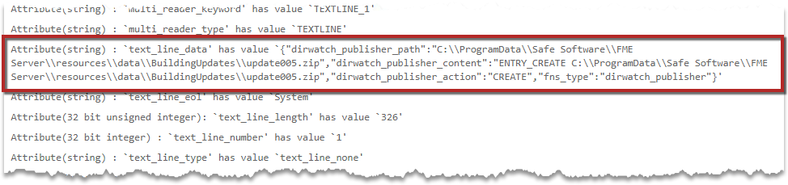
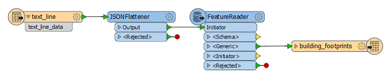
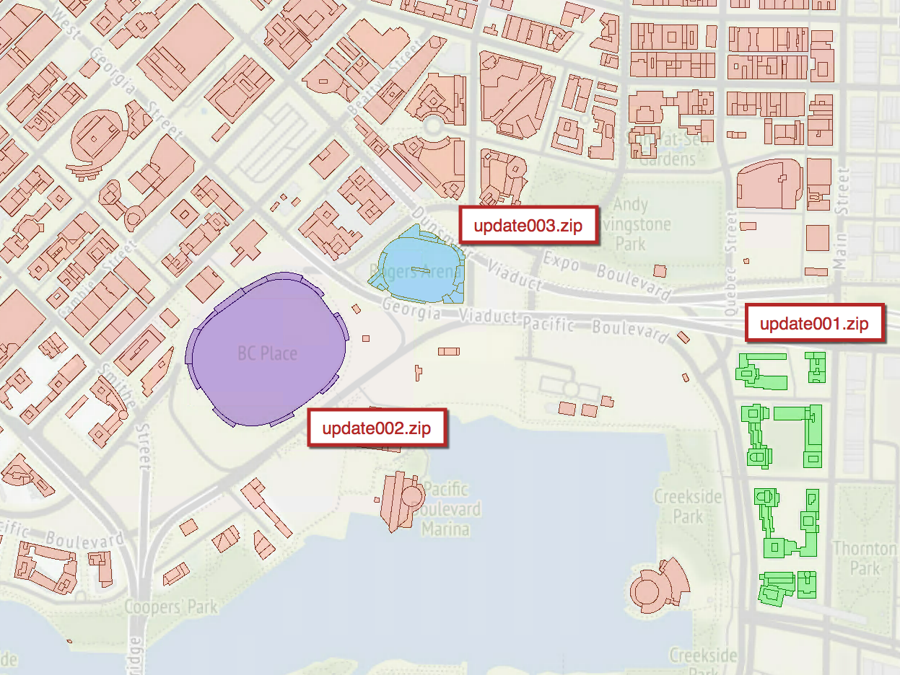

# 练习4.3：构建更新通知系统：传入消息

|  练习4.3 |  建筑更新通知系统 |
| :--- | :--- |
| 数据 | 建筑脚印（Esri Shapefile） |
| 总体目标 | 触发对数据库的实时更新 |
| 演示 | 处理目录监视通知 |
| 启动工作空间 | 无 |
| 结束工作空间 | C:\FMEData2018\Workspaces\ServerAuthoring\RealTime-Ex3-Complete.fmw |

现在您已经学会了如何运行工作空间以响应通知，现在是时候采用该基本工作空间并根据您的总体目标进行调整：为您的公司数据库提供实时更新。

实现此目标的下一步是了解如何从通知中提取信息并配置FME工作空间以处理传入的数据。

|  Vector小姐说...... |
| :--- |
|  这个练习在练习2结束的地方继续。你必须完成练习2才能进行这个练习。 |

  
**1）创建工作空间**  
启动FME Workbench并从空工作空间开始。

从菜单栏中选择“读模块”&gt;“添加读模块”。提示时设置参数如下：

| 读模块格式 | 文本文件 |
| :--- | :--- |
| 读模块数据集 | C:\FMEData2018\readme.txt |
| 读模块参数 | 一次读取整个文件：是的 |

我们现在使用什么文本文件来源并不重要; 在此步骤中设置源数据集只是为了满足文本文件读模块的要求。在运行时，源数据集将被传入消息的内容替换。

  
**2）添加JSONFlattener**  
现在在文本文件读模块之后将JSONFlattener转换器添加到工作空间。传入消息的格式为JSON，此转换器将在画布上暴露属性 - 使它们可用。

检查转换器参数，并在JSON Document参数下选择属性_text\_line\_data_作为JSON内容的来源。

将Logger转换器添加到JSONFlattener上的每个输出端口。

|  Workbench博士说...... |
| :--- |
|  我们可以使用JSON读模块而不是使用文本读模块&gt; JSONFlattener。我们为什么不呢？JSON读模块需要一个具有有效模式的源文件。在练习的这个阶段，我们还没有具有此结构的文件。 |

  
**3）发布到FME Server**  
将工作空间发布到FME Server，在Job Submitter服务下注册它。

  
**4）更新订阅**  
现在登录到FME Server Web界面并导航到“通知”页面。

单击“订阅”选项卡，然后选择现有的“Process Building Updates”订阅以对其进行编辑。

将指定的工作空间从练习2中创建的工作空间更改为上一步中上传的工作空间。

工作空间的更改将导致出现“源文本文件”参数。这里只需选中右侧的复选框，即_从主题消息中获取值_。

单击“确定”以更新订阅。

  
**5）测试主题**  
再次（如在练习1和2中）在C：\ FMEData2018 \ Data \ Engineering \ BuildingFootprints中找到源Shapefile数据集update003.shp，并从Shapefiles集合中创建压缩（zip）文件（.dbf， .prj，.shp，.shx）。

请务必为之前使用过的zip文件指定一个不同的名称。

将zip文件复制到资源文件夹data \ BuildingUpdates中。您可以通过文件系统（通过将文件复制到C：\ ProgramData \ Safe Software \ FME Server \ resources \ data \ BuildingUpdates）或使用FME Server Web界面执行此操作。

  
**6）检查结果**  
在Web界面中打开“作业”页面。已完成的作业列表应包括您在订阅中更新的工作空间。查看或下载日志文件并查找记录的要素。您应该会发现它有一个包含JSON的属性和从JSON中提取的许多属性。

| dirwatch\_publisher\_action | CREATE\(创建\) |
| :--- | :--- |
| dirwatch\_publisher\_content | ENTRY\_CREATE C：\ ProgramData \ Safe Software \ FME Server \ resources \ data \ BuildingUpdates \ update002.zip |
| dirwatch\_publisher\_path | C：\ ProgramData \ Safe Software \ FME Server \ resources \ data \ BuildingUpdates \ update002.zip |

所以现在我们知道数据是什么样的，并且可以相应地处理它。

|  Flibble先生说...... |
| :--- |
|  您可以从主题监控练习中识别这些属性 - 实际上您可以在那里查看相同的信息，而无需通过添加Logger转换器的过程！ |

  
**7）编辑JSONFlattener转换器**  
返回FME Workbench再次检查JSONFlattener转换器参数。在“要显示的属性” _下，_通过单击“浏览”按钮添加属性_dirwatch\_publisher\_path_，然后手动将其键入：

  
**8）添加FeatureReader转换器**  
现在删除Logger转换器并将FeatureReader转换器添加到JSONFlattener的输出：

这是一个转换器，可以让我们在转换过程中将数据集的内容读入工作流。检查转换器的参数并设置以下值：

| **读模块格式** | Esri Shapefile |
| :--- | :--- |
| **读模块数据集** | 选择属性值&gt; dirwatch\_publisher\_path |
| **输出端口** | 单输出端口 |

选择具有单输出端口：

  
**9）添加写模块**  
从Shapefile读取数据后，我们现在可以将它添加到公司数据库中。

从菜单栏中选择Writers&gt; Add Writer。提示时设置参数如下：

| 写模块格式 | SpatiaLite |
| :--- | :--- |
| 写模块数据集 | C:\FMEData2018\Data\Engineering\BuildingFootprints\building\_footprints.sl3 |
| 写模块参数 | 覆盖现有数据库：否 |
| 添加要素类型 | 表定义：手动 |

在创建的新要素类型中，将Table Name参数更改为_building\_footprints_：

确保将表处理设置为“如果需要则创建”。单击“确定”关闭对话框，然后将新要素类型连接到FeatureReader转换器的&lt;Generic&gt;输出端口。

  
**10）检查数据** 添加写模块后，单击building\_footprints要素类型以显示弹出菜单。然后单击“检查”按钮以在FME Data Inspector中打开数据集。building\_footprints.sl3数据集中已有数据，但我们应该注意数据的样子，这样一旦我们用新数据更新数据集，我们就会知道它在哪里发生了变化。红色框内的区域将是新数据的添加位置：

  
**10）重新发布工作空间**  
返回FME Workbench，将工作空间发布回FME Server。如果您在本练习开始时打开了相同的FME Workbench会话，则可以使用工具栏上或“文件”菜单下的“重新发布”选项。

  
**11）将数据集添加到FME Server**  
由于此通知系统的目的是_更新_我们的数据库 - 让我们确保它可以在FME Server中访问。为此，我们将_building\_footprints.sl3_ SpatiaLite数据库上传到FME Server的共享资源。

使用FME Server Web界面在**Resources&gt; Data**中创建一个新文件夹**Output**并上传位于C：\ FMEData2018 \ Data \ Engineering \ BuildingFootprints \ building\_footprints.sl3的文件

  
**12）编辑订阅**  
导航到“通知”页面并打开“处理建筑更新订阅”以进行编辑。现在，参数应包括输出数据库的参数。使用浏览按钮找到上一步中上传的数据库：

单击“确定”以保存更改。

  
**13）测试解决方案**  
现在通过将update001.zip，update002.zip或update003.zip放入BuildingUpdates文件夹来**测试解决方案**。如果这些文件已存在，请先删除它们，然后重新添加它们。您会发现放入该文件夹的每个数据集都会添加到SpatiaLite数据库中。

检查“已完成的作业”页面以确认工作空间已运行。然后在FME Data Inspector中，添加一个新数据集，并浏览到C：\ ProgramData \ Safe Software \ FMEServer \ resources \ data \ Output \文件夹并添加building\_footprints.sl3数据集。根据您添加的更新文件，您应该看到添加到数据集的三个建筑物之一：

<table>
  <thead>
    <tr>
      <th style="text-align:left">恭喜</th>
    </tr>
  </thead>
  <tbody>
    <tr>
      <td style="text-align:left">
        
通过完成本练习，您已学会如何：
           
        

        <ul>
          <li>识别传入主题消息上的JSON属性</li>
          <li>使用FeatureReader转换器读取添加到监视文件夹的数据集</li>
        </ul>
      </td>
    </tr>
  </tbody>
</table>