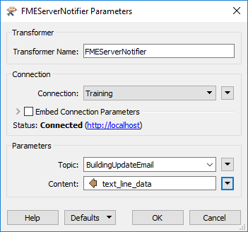

# 练习4.5：构建更新通知系统：传出消息

|  练习4.5 |  建筑更新通知系统 |
| :--- | :--- |
| 数据 | 建筑足迹（Esri Shapefile） |
| 总体目标 | 提供电子邮件驱动的更新通知 |
| 演示 | 电子邮件订阅 |
| 启动工作空间 | C:\FMEData2018\Workspaces\ServerAuthoring\RealTime-Ex5-Begin.fmw |
| 结束工作空间 | C:\FMEData2018\Workspaces\ServerAuthoring\RealTime-Ex5-Complete.fmw |

在配置FME Server以使用目录监视和电子邮件发布处理建筑足迹更新后，您的主管想知道他们是否可以在更新企业数据库时收到电子邮件。

使用外部电子邮件服务器，您认为可以在FME Server中配置另一个通知以满足此要求。

|  Vector小姐说...... |
| :--- |
|  这个练习在练习4结束的地方继续。你必须完成练习4才能进行这个练习。 在本练习中，需要访问SMTP电子邮件服务器才能发送电子邮件。Gmail，Outlook和Yahoo! 如果您无法访问内部电子邮件服务器，那么例如Gmail, Outlook, and Yahoo!都是可接受的基于Web的解决方案。 |

  
**1）添加订阅**  
打开FME Server Web界面并导航到“通知”页面。单击“订阅”选项卡，然后单击“新建”以创建新的订阅。这将是一个电子邮件服务，通过该服务发送响应。

为订阅命名，例如_Send Building Update Email\(发送建筑更新电子邮件\)_，并为其创建一个新主题，例如_BuildingUpdateEmail_（使用与以前练习不同的主题非常重要）。

将协议设置为“电子邮件”并设置SMTP电子邮件服务器参数。

如果有用，Gmail的服务器信息如下：

| SMTP服务器主机 | smtp.gmail.com |
| :--- | :--- |
| 服务器端口 | 465 |
| 连接安全 | SSL / TLS |

无论电子邮件提供商如何，您都应该按如下方式设置这些参数：

| 电邮来自 | 您的帐户名称（例如fmeshapeprocessing@gmail.com） |
| :--- | :--- |
| 电子邮件主题 | 建筑足迹数据库已更新 |

大多数常规设置（电子邮件收件人，电子邮件模板等）将由我们要提供的内容设置，因此一旦设置了上述内容，请单击确定以保存订阅。

|  注意 |
| :--- |
|  您可能需要创建特定于应用程序的密码才能允许FME Server登录该帐户，具体取决于您的Gmail安全设置。如果您注意到连接到您帐户的错误，请参阅此文章：[IMAP发布或电子邮件订阅不会从Gmail中读取电子邮件](https://knowledge.safe.com/articles/394/imap-publisher-not-reading-emails-from-gmail.html) 另外，如果您无权访问电子邮件帐户，请将此订阅的协议更改为“Logger”。当触发BuildingUpdateEmail主题时，这将在其中一个FME Server日志文件中添加一个条目。 |

  
**2）编辑工作空间**  
从练习4（或上面列出的开始工作空间）打开工作空间。

添加两个新转换器 - [FMEServerEmailGenerator](https://hub.safe.com/transformers/fmeserveremailgenerator)（自定义转换器）和FMEServerNotifier - 作为单独的数据流，连接到FeatureReader的&lt;Initiator&gt;输出端口：

_**注意：**_ _将这两个转换器连接到FeatureReader的&lt;Initiator&gt;端口很重要，其中只会出现一个要素。如果将它们连接到&lt;Generic&gt;输出端口，那么您将收到Shapefile数据集中每个要素的电子邮件！_

  
**3）编辑FMEServerEmailGenerator**  
检查**FMEServerEmailGenerator**的参数。此转换器可用于覆盖步骤1中创建的电子邮件订阅中的配置。

每个字段还可以接受允许动态配置电子邮件的属性。为了我们在培训过程中的目的，请手动设置以下参数：

| 发至 | （您有权查看的电子邮件） |
| :--- | :--- |
| 主题 | 建筑足迹数据库更新 |
| 内容 | 建筑足迹数据库已更新！ |

  
**4）检查FMEServerEmailGenerator输出**  
 FMEServerEmailGenerator创建一个名为_text\_line\_data_的新属性。将Inspector转换器连接到FMEServerEmailGenerator并运行工作空间以查看该属性的内容。

你会看到它创建一个像这样的JSON字符串：  
`{ "email_to" : "fmeservertraining@safe.com","email_cc" : "", "email_bcc" : "", "email_from" : "", "email_replyto" : "", "email_subject" : "Building Footprints Database Updated", "subscriber_content" : "The Building Footprints database has been updated!" }`

具有值集的每个关键字（例如email\_to，email\_subject和subscriber\_content）将覆盖我们创建的电子邮件订阅中的设置。这将允许我们根据工作空间内发生的事情动态更改发送的电子邮件的部分内容。

  
**5）编辑FMEServerNotifier**  
现在编辑FMEServerNotifier转换器的参数。

设置FME Server Connection参数，选择之前创建的主题（BuildingUpdateEmail），并为Content选择属性_text\_line\_data_（此属性由FMEServerEmailGenerator创建）：

  
**6）发布工作空间**  
保存并发布工作空间。

您可以更新已发布的工作空间或重命名它。

在FME Server中，导航到FME Workspace Subscriptions页面。请注意，在上一个练习中使用通知服务注册工作空间时，将自动创建Subscription。例如，如果工作空间名为RealTime-Ex4，则订阅名称将类似于admin.Training.RealTime-Ex44：

单击此通知以更改其参数，并设置/确保Workspace参数指向刚刚发布的工作空间。

  
**7）测试工作空间**  
通过向发布电子邮件地址发送电子邮件来测试工作空间。请务必将C：\ FMEData2018 \ Data \ Engineering \ BuildingFootprints中的Shapefile数据集（.dbf，.prj，.shp，.shx）的zip文件附加到电子邮件中。

如果工作流成功，您应该收到一封回复的电子邮件！

<table>
  <thead>
    <tr>
      <th style="text-align:left">恭喜</th>
    </tr>
  </thead>
  <tbody>
    <tr>
      <td style="text-align:left">
        
通过完成本练习，您已学会如何：
           
        

        <ul>
          <li>设置外发电子邮件订阅</li>
          <li>通过FMEServerNotifier转换器触发电子邮件订阅</li>
        </ul>
      </td>
    </tr>
  </tbody>
</table>