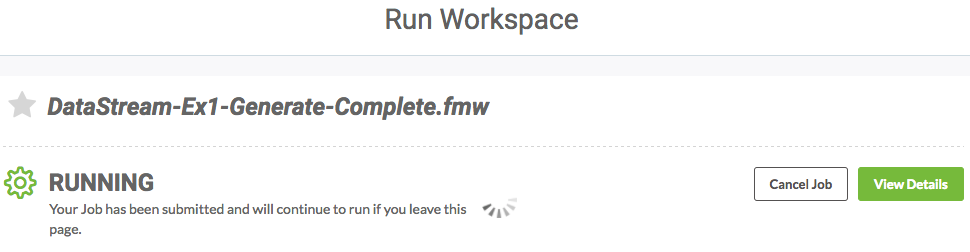
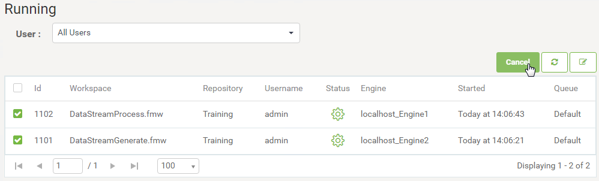
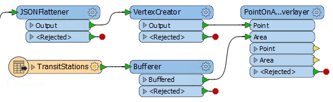
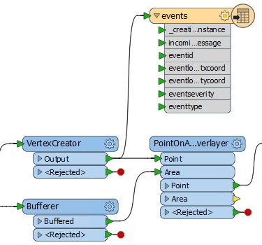
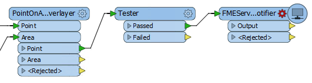

# 练习4.6：处理紧急电话呼叫流

|  练习4.6 |  消息流：处理紧急电话呼叫流 |
| :--- | :--- |
| 数据 | 事件消息（JSON） |
| 总体目标 | 创建工作空间以读取，解析和过滤WebSocket消息; 仅保留影响交通站点的事件。 |
| 演示 | 创建工作空间以处理消息流 |
| 启动工作空间 | C:\FMEData2018\Workspaces\ServerAuthoring\RealTime-Ex6-Begin.fmw |
| 结束工作空间 | C:\FMEData2018\Workspaces\ServerAuthoring\RealTime-Ex6-Generate-Complete.fmw C:\FMEData2018\Workspaces\ServerAuthoring\RealTime-Ex6-Process-Complete.fmw |

作为GIS部门的技术分析师，您需要处理空间数据。有时您需要实时处理这些数据，有时数据可以大量且高速地到达。

在一个这样的情况下，该城市已被允许访问紧急服务的监控系统。这意味着能够访问有关所有紧急呼叫的实时信息。

_我们所说的紧急呼叫是指北美的911呼叫，英国的999呼叫，欧洲大部分的112呼叫以及澳大利亚的000呼叫。_

当然，这些呼叫可以以很快的速度到达，并且间隔时间不详。如果城市希望对这些请求作出响应，即使他们只想记录呼叫的历史记录，您也必须在FME Server中实施消息流设置。

  
**1）打开工作空间**  
不幸的是\(我是从培训的角度讲的\)，我们无法访问实时的紧急电话流，所以我们必须自己生成。

打开工作空间C：\ FMEData2018 \ Workspaces \ ServerAuthoring \ DataStream-Ex1-Begin.fmw

[](https://github.com/xuhengxx/FMETraining-1/tree/f1cdae5373cf9425ee2d148732792713c9043d44/ServerAuthoring4RealTime/Images/Img4.439.Ex6.MessageGeneratingWorkspace.png)

请注意，工作空间会生成一系列事件。在随机时间和随机位置生成随机数量的事件。此外，还会生成随机严重性和事件类型属性。

每个事件都包含在JSON格式的消息中。我们需要做的就是将该消息作为流推送出去。

|  Vector小姐说...... |
| :--- |
|  这个工作空间只是生成“事件”。这些事件可能是雷击，车辆位置，交通事故，甚至是不明飞行物的目击事件！在本练习中，我们假装他们是紧急电话。在现实生活中，您将连接到现有的数据流，而不需要以这种方式生成数据流。 |

  
**2）添加WebSocketSender转换器**  
在JSONTemplater之后添加WebSocketSender转换器。检查参数并将其设置如下：

| WebSocket服务器URL | ws://localhost:7078 |
| :--- | :--- |
| 验证SSL证书 | 没有 |
| 连接前导 |  |
| 数据传输 |  |

如您所见，这些参数打开WebSocket连接（到EmergencyEvents流）并发送信息（EventMessage属性）。保存参数，然后保存工作空间。

  
**3）创建工作空间**  
现在我们能够生成数据流，我们将创建用于处理数据的工作空间。启动Workbench并以空白画布开始（不要关闭流生成器工作空间，因为我们稍后也需要它）。

在空白画布中添加Creator转换器并使用WebSocketReceiver在它后面。检查WebSocketReceiver转换器参数并将其设置如下：

| WebSocket服务器URL | ws://localhost:7078 |
| :--- | :--- |
| 验证SSL证书 | 没有 |
| 连接前导 |  |
| 输出属性 | IncomingMessage |

保存更改并在WebSocketReceiver之后添加Logger转换器。

  
**4）发布工作空间**  
让我们通过发布工作空间并在FME Server上运行它们来测试我们的工作空间。

依次发布每个工作空间。在这两种情况下都使用Job Submitter服务进行注册。我们不需要担心任何数据集或其他参数。

  
**5）运行工作空间**  
登录FME Server Web界面，找到数据流生成器工作空间，然后运行它。对话框响应如下：

[](https://github.com/xuhengxx/FMETraining-1/tree/f1cdae5373cf9425ee2d148732792713c9043d44/ServerAuthoring4RealTime/Images/Img4.440.Ex6.MessageGeneratingWorkspaceRun.png)

工作空间将运行很长时间，我们可以离开它这样做。通过单击主菜单上的“运行工作空间”按钮离开此页面，并在Run Workspace页面中——找到正在处理的工作空间。现在运行它。

同样，响应将报告工作区正在运行，并将继续运行。

  
**6）检查作业和取消**  
导航到“作业”页面，然后单击标记为“正在运行”的选项卡。你会看到两个工作：

[](https://github.com/xuhengxx/FMETraining-1/tree/f1cdae5373cf9425ee2d148732792713c9043d44/ServerAuthoring4RealTime/Images/Img4.441.Ex6.RunningWorkspaces.png)

让工作运行一两分钟。然后选择它们中的每一个并单击“取消”按钮取消它们：

[](https://github.com/xuhengxx/FMETraining-1/tree/f1cdae5373cf9425ee2d148732792713c9043d44/ServerAuthoring4RealTime/Images/Img4.442.Ex6.RunningWorkspacesCancel.png)

取消后，转到已完成的作业选项卡。你会看到两个被取消的工作：

[](https://github.com/xuhengxx/FMETraining-1/tree/f1cdae5373cf9425ee2d148732792713c9043d44/ServerAuthoring4RealTime/Images/Img4.443.Ex6.CancelledWorkspaces.png)

单击处理工作空间作业并检查日志。您应该在日志中看到如下消息：

```text
| ================================================= ==========================
INFORM | WebSocketReceiver_Output：功能是：
INFORM | ++++++++++++++++++++++++++++++++++++++++++++++++ +++++++++++++++++
INFORM |功能类型：'WebSocketReceiver_Output_LOGGED'
INFORM | Attribute（编码：utf-8）：'IncomingMessage'的值为'{“EventID”：6 .....
INFORM | Attribute（string）：'fme_geometry'的值为'fme_undefined'
INFORM | Attribute（编码：utf-8）：'fme_type'的值为'fme_no_geom'
INFORM |几何类型：未知（0）
```

这证明了WebSocketReceiver正在按预期运行并从消息流接收消息。

|  Vector小姐说...... |
| :--- |
|  您已经证明可以创建工作空间来处理消息流，这是本练习的重要部分。但如果你有时间，让我们看看我们可以添加哪些改进来使结果更加真实。 |

  
**7）添加JSONFlattener**  
处理传入消息的第一件事是将信息提取为属性。由于传入的数据是JSON格式，因此在WebSocketReceiver之后将JSONFlattener转换器添加到在处理的工作空间。

检查JSONFlattener的参数并将属性IncomingMessage设置为要处理的JSON文档。

在“要暴露的属性”下手动输入：

* EventID
* EventLocation.EventXCoord
* EventLocation.EventYCoord
* EventSeverity
* EventType

[](https://github.com/xuhengxx/FMETraining-1/tree/f1cdae5373cf9425ee2d148732792713c9043d44/ServerAuthoring4RealTime/Images/Img4.444.Ex6.JSONFlattenerParameters.png)

现在，您可以在工作空间中将消息中的信息作为一组属性使用。

  
**8）添加VertexCreator**  
现在添加一个VertexCreator转换器。将其设置为使用X / Y属性创建真正的点要素：

[](https://github.com/xuhengxx/FMETraining-1/tree/f1cdae5373cf9425ee2d148732792713c9043d44/ServerAuthoring4RealTime/Images/Img4.445.Ex6.VertexCreatorParameters.png)

有了这个，我们现在有了一个真正的地理要素，可以根据需要进行处理。

  
**9）添加读模块**  
城市内的公共交通团队已经了解到您正在使用此紧急数据。如果在交通站点200米范围内发生紧急事件，他们希望立即得到警报。让我们向他们展示设置它是多么容易。

首先我们需要交通站点数据，因此选择Readers&gt; Add Reader并添加以下内容：

| 读模块格式 | Esri地理数据库（File Geodb Open API） |
| :--- | :--- |
| 读模块数据集 | C：\ FMEData2018 \ DATA \ CommunityMapping \ CommunityMap.gdb |

出现提示时（或在参数对话框中），确保仅选择TransitStations表。

  
**10）过滤数据**  
现在让我们过滤紧急情况。

首先，将Bufferer转换器添加到TransitStation要素类型，并将要素缓冲200米。

其次，添加PointOnAreaOverlayer以评估紧急情况是否属于其中一个缓冲区。工作空间现在看起来像这样：

[](https://github.com/xuhengxx/FMETraining-1/tree/f1cdae5373cf9425ee2d148732792713c9043d44/ServerAuthoring4RealTime/Images/Img4.446.Ex6.WorkspaceWithBufferAndOverlay.png)

目前有一个大问题阻止了这种工作。PointOnAreaOverlayer转换器是一个基于组的转换器，有时也称为“阻塞器\(blocker\)”。在输出任何数据之前，它将一直保留这些要素，直到它完成了这些要素的输入。在我们的例子中，我们希望使其成为基于要素的; 即，它将立即处理每个消息。

因此，检查PointOnAreaOverlayer参数并将Areas First设置为Yes：

[](https://github.com/xuhengxx/FMETraining-1/tree/f1cdae5373cf9425ee2d148732792713c9043d44/ServerAuthoring4RealTime/Images/Img4.447.Ex6.PointOnAreaParameters.png)

这告诉转换器所有面要素（缓冲的站点）将首先到达; 因此，可以立即处理任何点要素（消息位置）。

但是，我们必须确保公交要素首先到达。因此，检查Creator转换器的转换器参数，并将Create at End设置为Yes：

[](https://github.com/xuhengxx/FMETraining-1/tree/f1cdae5373cf9425ee2d148732792713c9043d44/ServerAuthoring4RealTime/Images/Img4.448.Ex6.CreatorParameters.png)

现在，一切顺利，公交要素将首先到达PointOnAreaOverlayer转换器。

最后，在PointOnAreaOverlayer之后添加Tester转换器。设置测试以检查\_overlaps&gt; 0（即消息位置落在交通站点缓冲区内）。将一些Logger转换器连接到Tester输出端口：

[](https://github.com/xuhengxx/FMETraining-1/tree/f1cdae5373cf9425ee2d148732792713c9043d44/ServerAuthoring4RealTime/Images/Img4.449.Ex6.TesterToFilterMessages.png)

请注意，如果有其他参数（例如，公交团队只对事件类型7,8,9和10感兴趣），您也可以将它们添加到此测试程序中。

  
**11）发布工作空间**  
现在再次发布两个工作空间（您可能需要也可能不需要将TransitStation地理数据库与工作空间一起上传）并使用与以前相同的过程运行它们，但可能需要更长时间，因为其中一个随机事件可能需要一段时间才能落入交通站点缓冲区。

一旦停止后，检查日志，您应该会看到位于交通站点200米以内的消息被记录下来\(有一个不同的标题\)。

|  Vector小姐说...... |
| :--- |
|  如果要调整设置以更快地获得结果，那么请继续。例如，您可以将缓冲区大小设置为500米而不是200，或者可以减少消息生成器上的间隔时间。随意进行您喜欢的任何参数更改以测试设置。您甚至可以绕过Decelerator转换器（在数据流创建工作空间中）以查看FME处理传入消息的速度有多快！但是，如果这样做，请务必先启动处理的工作空间，否则，在启动处理器时，生成器可能已经完成! |

  
**12）添加写模块**  
正在接收的消息并非全部由公交团队使用，但是我们应该对它们进行记录。所以 - 回到FME Workbench - 从菜单栏中选择Writers&gt; Add Writer。使用以下参数向处理的工作空间添加数据库写模块:

| 写模块格式 | SpatiaLite |
| :--- | :--- |
| 写模块数据集 | C:\FMEData2018\Output\EventMessages.sl3 |
| 写模块参数 | 高级:每个事务的特性= 1 |
| 添加要素类型 | 表定义：自动 |

在新添加的要素类型中，将名称更改为_events\(事件\)_并关闭对话框。将要素类型连接到VertexCreator输出端口（即我们记录所有事件，而不仅仅是过滤的事件）：

[](https://github.com/xuhengxx/FMETraining-1/tree/f1cdae5373cf9425ee2d148732792713c9043d44/ServerAuthoring4RealTime/Images/Img4.450.Ex6.WriterFeatureTypeConnected.png)

属性会自动添加，但包含一些我们不需要的属性。因此，再次为要素类型打开属性对话框，然后单击“用户属性”选项卡。将其从“自动”更改为“手动”并删除属性：

* \_creation\_instance
* incomingmessage
* eventlocation\_eventxcoord
* eventlocation\_eventycoord

[](https://github.com/xuhengxx/FMETraining-1/tree/f1cdae5373cf9425ee2d148732792713c9043d44/ServerAuthoring4RealTime/Images/Img4.451.Ex6.WriterFeatureTypeAttributes.png)

请注意，属性已自动重命名（小写并删除不允许的字符）以符合SpatiaLite要求。

如果您发布并运行工作空间（您可能需要将SpatiaLite数据库输出设置为写入资源文件夹），现在您应该能够看到 - 当工作空间仍在运行时 - 结果将添加到数据库中。您可以在FME Data Inspector中检查该文件以证明这一点。

  
**13）创建通知**  
最后一项任务（我保证）。经过过滤的消息对公交团队来说很重要，但目前他们还一无所获。我们应该建立一种方式来告知他们。

我们可以添加另一个消息传递转换器，例如WebSocketSender，JMSSender，SQSSender，甚至是Tweeter。这将使处理工作空间成为“纯粹”的消息传递工作空间。

另一方面，传出消息与传入消息的速率不同。使用本练习中描述的参数，每分钟只有一次传输消息。因此，我们可以通过设置要经过FME Server通知服务发送的输出消息来创建“混合”解决方案。

转到FME Server Web界面并导航到“通知”页面。

创建一个名为EmergencyTransitMessages的新主题：

[](https://github.com/xuhengxx/FMETraining-1/tree/f1cdae5373cf9425ee2d148732792713c9043d44/ServerAuthoring4RealTime/Images/Img4.452.Ex6.NotificationNewTopic.png)

现在创建一个与该主题相关的新通知订阅。我们可以实际使用各种协议来发送消息（在脑海中出现电子邮件），但是为了本练习的目的，使用Logger协议。将Log Level参数设置为High：

[](https://github.com/xuhengxx/FMETraining-1/tree/f1cdae5373cf9425ee2d148732792713c9043d44/ServerAuthoring4RealTime/Images/Img4.453.Ex6.NotificationNewSubscription.png)

  
**14）添加FMEServerNotifier转换器**  
在Workbench中的处理工作空间，删除工作空间末尾的所有Logger转换器。添加一个FMEServerNotifier转换器连接到Tester:Passed端口：

[](https://github.com/xuhengxx/FMETraining-1/tree/f1cdae5373cf9425ee2d148732792713c9043d44/ServerAuthoring4RealTime/Images/Img4.454.Ex6.FMEServerNotifierOnCanvas.png)

检查转换器参数并将其设置为向EmergencyTransitMessages主题发送消息。将邮件内容设置为您喜欢的任何内容。您可以使用文本编辑器对话框从可用属性中创建一些内容（它可以是纯文本，不必非要是JSON或XML）。

  
**15）发布和运行工作空间**  
重新发布并重新设置工作空间。导航到“通知”页面，然后单击“主题”选项卡。启用主题监控以监视传入通知的EmergencyTransitMessages主题。

在短时间内，您将开始看到如下紧急消息：

[](https://github.com/xuhengxx/FMETraining-1/tree/f1cdae5373cf9425ee2d148732792713c9043d44/ServerAuthoring4RealTime/Images/Img4.455.Ex6.TopicMonitoringResults.png)

访问Resources&gt; Logs&gt; core&gt; current&gt; subscribers&gt; logger.log，查找Logger协议通知记录的结果。

<table>
  <thead>
    <tr>
      <th style="text-align:left">恭喜</th>
    </tr>
  </thead>
  <tbody>
    <tr>
      <td style="text-align:left">
        <p>通过完成本练习，您已学会如何：
          <br />
        </p>
        <ul>
          <li>通过WebSockets发送和接收消息</li>
          <li>发布并运行消息流工作空间</li>
          <li>取消消息流工作空间并检查其日志文件</li>
          <li>从JSON消息中提取属性</li>
          <li>使用转换器来根据其内容转换和过滤消息</li>
          <li>设置工作空间以在实时方案中处理基于组的转换器</li>
          <li>将传入的消息记录到数据库中</li>
          <li>设置具有消息流<b>和</b>通知的混合系统</li>
        </ul>
      </td>
    </tr>
  </tbody>
</table>