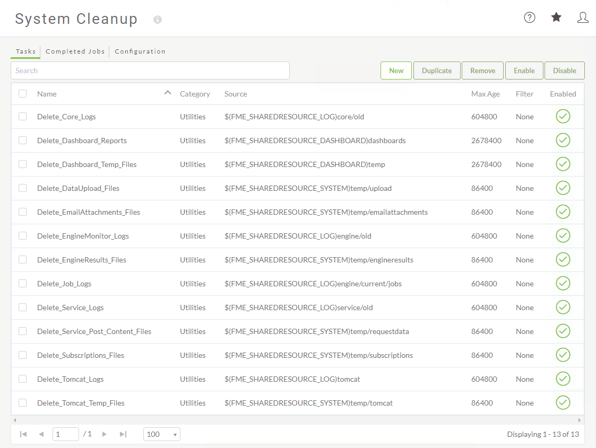
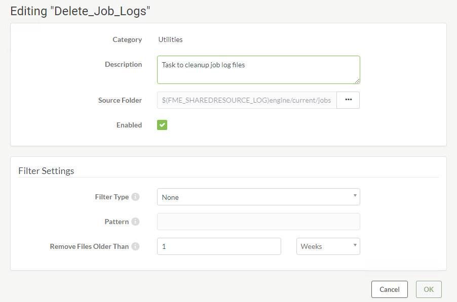

# 系统清理

当FME Server长时间大量使用时，许多文件可能会累积并使用系统资源。这些文件是资源文件（包括多种类型的日志文件）或是作业历史记录。

FME Server使用FME Server Web界面的系统清理页面上定义的任务自动清理这两者。

## 资源

系统清理页面如下所示：

请注意，可以清除多种类型的日志和结果文件。这些条目中的每一个都代表由FME Server不时自动运行的任务。当任务运行并找到超过指定存在时间的指定类型的文件时，这些文件将被删除。

如果您希望将文件保留的时间超过预定义的时间段，您可以编辑文件年龄设置（单击特定的系统清理任务以打开此对话框），选择并删除任务，或者只是禁用该任务。

也可以设置搜索文件并清理它们的新任务。例如，您可以创建清理任务以删除定期上载到资源文件夹的文件。

## Delete\_Job\_Logs配置

Delete\_Job\_Logs配置如下所示：

与资源文件清理任务相比，它要简单得多，因为只需指定一种类型的信息。在这种情况下，您只需要设置在删除之前保留作业历史记录的最大时间长度 - 而不必担心设置过滤器类型或模式。

|  Vector小姐说... |
| :--- |
|  资源清理对话框中的条目究竟是什么？  [1. 它们只是我可以按需运行的实用程序类别中工作空间的快捷方式。](http://52.73.2.37/fmedatastreaming/Manual/QAResponse2017.fmw?chapter=27&question=1&answer=1&DestDataset_TEXTLINE=C%3A%5CFMEOutput%5CQAResponse.html) [2. 它们只是调度以所述间隔运行的任务的快捷方式。](http://52.73.2.37/fmedatastreaming/Manual/QAResponse2017.fmw?chapter=27&question=1&answer=2&DestDataset_TEXTLINE=C%3A%5CFMEOutput%5CQAResponse.html) [3. 它们是FME服务器每天运行一次以帮助系统维护的特定任务。](http://52.73.2.37/fmedatastreaming/Manual/QAResponse2017.fmw?chapter=27&question=1&answer=3&DestDataset_TEXTLINE=C%3A%5CFMEOutput%5CQAResponse.html) [4. 它们是系统资源不足时触发的特定任务。](http://52.73.2.37/fmedatastreaming/Manual/QAResponse2017.fmw?chapter=27&question=1&answer=4&DestDataset_TEXTLINE=C%3A%5CFMEOutput%5CQAResponse.html) |

