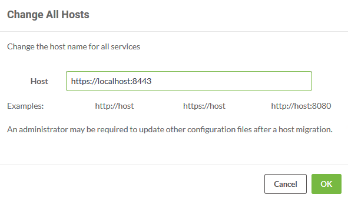

# 练习2：更改FME Server数据库提供程序

|  练习2 |  更改FME Server数据库提供程序 |
| :--- | :--- |
| 数据 | C：\ Program Files \ FMEServer \ Server \ database \ sqlserver \ sqlserver\_createDB.sql C：\ Program Files \ FMEServer \ Server \ database \ sqlserver \ sqlserver\_createUser.sql |
| 总体目标 | 更改FME Server的数据库提供程序 |
| 演示 | 配置新的SQL Server数据库 |

您的公司已经安装了FME Server快速安装，但您的数据库管理员刚刚通知您，该公司将其数据库提供程序从默认FME数据库切换到SQL Server数据库，以便更好地控制数据库安全性。

|  Vector小姐说...... |
| :--- |
|  如果您已完成配置HTTPS练习，请记住连接到FME Server的URL现在是https：// localhost：8443 / fmeserver而不是http：// localhost / fmeserver！ |

  
**1）备份FME服务器**  
在执行任何安装后配置之前，备份当前的FME Server实例是一个重要步骤。更改数据库提供程序后，可以一次性还原FME Server配置，而无需完成手动更改任何设置，重新发布工作空间等的过程。

注意：如果您_已创建FME Server备份_，则可以使用此现有.fsconfig文件并继续执行步骤2。

通过Windows“开始”菜单上的“Web Interface”选项或直接在Web浏览器中打开FME Server Web界面，然后使用用户名和密码_admin_登录。

在左侧栏中的FME Server Web界面的Admin标题下找到**备份＆恢复**，然后单击以展开，然后单击**备份**。

选择_下载_以保存FME Server的备份文件 - 这可以被视为“快照”。在后台运行进程以编译FME Server备份需要很短的时间，一旦完成，它将自动保存到本地下载文件夹。

|  技巧 |
| :--- |
|  如果您安装了PostgreSQL而不是SQLServer，则可以按照[服务器管理员2017课程](https://safe-software.gitbooks.io/fme-server-administration-training-2017/content/ServerAdmin4Scalability/Exercise2_SwitchingToAPostgreSQLDatabaseWithWindowsSystem.html)中的说明进行操作。请注意，从2017年到2018年，路径名称可能略有变化。 |

  
**2）初始数据库配置**  
出于本练习的目的，已为Training Machines安装了单独的SQL Server数据库。

我们将用于此步骤和下一步（3）的两个SQL脚本可以在以下位置找到：\* _C：\ Program Files \ FMEServer \ Server \ database \ sqlserver \*_

* sqlserver\_createDB.sql
* sqlserver\_createUser.sql

我们需要通过为FME Server配置本地SQL Server数据库来创建FMESERVER数据库模式。从Windows“开始”菜单中打开**命令提示符**。

首先，使用sqlserver\_createDB.sql脚本创建一个新数据库。如果愿意，您可以在文本编辑器中查看SQL脚本，但这不是必需的。在**命令提示符中**运行以下**命令**：

```text
sqlcmd -S FMETRAINING -i "C:\Program Files\FMEServer\Server\database\sqlserver\sqlserver_createDB.sql"
```

[](https://github.com/xuhengxx/FMETraining-1/tree/c60c1e291fd9e762b26517c54e4fd7ea9f748055/ServerAdmin4Scalability/Images/4.211.Ex2.CommandPrompt1_fmeserver.png)

现在，在**命令提示符**窗口中，输出应如下所示：

[](https://github.com/xuhengxx/FMETraining-1/tree/c60c1e291fd9e762b26517c54e4fd7ea9f748055/ServerAdmin4Scalability/Images/4.212.Ex2.CommandPrompt2_fmeserver.png)

这确认了新的数据库“fmeserver”已创建。此SQL脚本创建所有与FME Server相关的表，索引，视图和触发器。

  
**3）创建FME Server数据库用户**

接下来，我们将创建新的用户_fmeserver_并向新用户授予所有必要的权限。该SQL脚本创建新的用户_fmeserver_与密码_fmeserver_。它使用sqlserver\_createUser.sql脚本。

```text
sqlcmd -S FMETRAINING -i "C:\Program Files\FMEServer\Server\database\sqlserver\sqlserver_createUser.sql"
```

将使用适当的登录名和权限创建新用户以访问_fmeserver_数据库。

[](https://github.com/xuhengxx/FMETraining-1/tree/c60c1e291fd9e762b26517c54e4fd7ea9f748055/ServerAdmin4Scalability/Images/4.213.Ex2.CommandPrompt3_fmeserver.png)

  
退出**命令提示符**。

  
**5）配置数据库连接**  
打开_fmeCommonConfig.txt_文件，位于_C:\Program Files\FMEServer\Server\_目录，使用管理员模式下的文本编辑器。

在标题为_FME SERVER SETTINGS START下_，找到名为_Database Connection_的部分。我们要禁用与Postgres数据库的默认连接，并指示FME Server连接到SQL Server数据库。

注释掉_DB\_TYPE = postgresql_部分，在每行前面添加一个数字符号（＃），并取消注释_DB\_TYPE = sqlserver_部分。最终编辑应如下所示：

```text
#DB_TYPE=postgresql
#DB_DRIVER=org.postgresql.Driver
#DB_JDBC_URL=jdbc:postgresql://localhost:7082/fmeserver
#DB_USERNAME=fmeserver
#DB_PASSWORD=fmeserver
#DB_CONNECT_EXPIRY=60
#DB_SQLSTMTS_PATH=C:/Program Files/FMEServer/Server/database

DB_TYPE=sqlserver
DB_DRIVER=com.microsoft.sqlserver.jdbc.SQLServerDriver
DB_JDBC_URL=jdbc:sqlserver://localhost:1433;databaseName=fmeserver
DB_USERNAME=fmeserver
DB_PASSWORD=$FME$1ser$ver
DB_CONNECT_EXPIRY=60
DB_SQLSTMTS_PATH=C:/Program Files/FMEServer/Server/database
```

保存并关闭_fmeCommonConfig.txt_文件。

  
**6）SQL Server修改**

从“开始”菜单中，打开**Microsoft SQL Server 2016&gt; SQL Server Management Studio** 接受默认服务器名称_FMETRAINING_和_Windows身份验证_，然后单击“ **连接”**。

[](https://github.com/xuhengxx/FMETraining-1/tree/c60c1e291fd9e762b26517c54e4fd7ea9f748055/ServerAdmin4Scalability/Images/4.214.Ex2.SQLServer_Login.png)

第一步是将数据库服务器设置为允许SQL Server身份验证。这将允许新的_fmeserver_用户连接到数据库。

在_对象资源管理器_树中，右键单击**FMETRAINING**并选择 _属性Properties_。

[](https://github.com/xuhengxx/FMETraining-1/tree/c60c1e291fd9e762b26517c54e4fd7ea9f748055/ServerAdmin4Scalability/Images/4.216.Ex2.SQLServer_Properties2.png)

在结果对话框中单击 _"安全性"，_然后选择 _"SQL Server和Windows身份验证"_选项。

[](https://github.com/xuhengxx/FMETraining-1/tree/c60c1e291fd9e762b26517c54e4fd7ea9f748055/ServerAdmin4Scalability/Images/4.217.Ex2.SQLServer_Properties3.png)

单击“确定”，确认SQL Server需要重新启动。

[](https://github.com/xuhengxx/FMETraining-1/tree/c60c1e291fd9e762b26517c54e4fd7ea9f748055/ServerAdmin4Scalability/Images/4.218.Ex2.SQLServer_Properties4.png)

在_对象资源管理器_树中，右键单击**FMETRAINING**并选择 _"重新启动”_。

[](https://github.com/xuhengxx/FMETraining-1/tree/c60c1e291fd9e762b26517c54e4fd7ea9f748055/ServerAdmin4Scalability/Images/4.219.Ex2.SQLServer_Properties5.png)

出现提示时，单击_是_。

[](https://github.com/xuhengxx/FMETraining-1/tree/c60c1e291fd9e762b26517c54e4fd7ea9f748055/ServerAdmin4Scalability/Images/4.220.Ex2.SQLServer_Properties6.png)

最后，**重启FME Server**。从开始菜单中选择**FME Server 2018.0.0.3&gt;重新启动FME Server**。

  
**6）配置后脚本**  
从2018.0开始，配置后脚本现在由核心在连接到新的FME Server 系统数据库时运行。有一个脚本仍然需要运行（步骤跟在“添加队列”后面）。允许脚本运行几分钟并完成将新元数据加载到数据库中。在此期间尝试登录可能会导致Web UI出现不完整。稍等片刻，然后刷新浏览器。  
  
 **添加作业队列元数据**：仍有一个脚本需要手动运行（这在2018.1中得到解决）。打开\* C：\ Program Files \ FMEServer \ Clients \ utilities \*，通过右键单击该文件并选择_以管理员身份运行_来调用**addQueueNode.bat**。**（仅适用于2018.0）**

此脚本将花费一些时间来运行并创建默认作业队列。接下来，**重新启动FME Server**。从开始菜单中选择**FME Server 2018.0.0.3&gt;重新启动FME Server**。

  
**7）恢复FME Server配置**  
由于在步骤1中创建了FME Server的备份，我们现在可以恢复包含所有以前的FME Server配置设置的同一FME Server实例。

登录FME Server Web界面，然后从左侧边栏中选择“ **备份和还原”&gt;“还原”**。

从本练习开始上传您保存的备份配置文件。导航到_C：\ Users \ Administrator \ Downloads \_并找到FME Server备份文件（提示：它具有_.fsconfig_扩展名！）。将此文件拖放到FME Server Restore页面：

[](https://github.com/xuhengxx/FMETraining-1/tree/c60c1e291fd9e762b26517c54e4fd7ea9f748055/ServerAdmin4Scalability/Images/4.209.Ex2.RestoreConfiguration.png)

如果还原成功，FME Server Web界面将报告。如果不成功，则如果需要进一步调查，可以从该页面轻松访问日志文件。

[](https://github.com/xuhengxx/FMETraining-1/tree/c60c1e291fd9e762b26517c54e4fd7ea9f748055/ServerAdmin4Scalability/Images/4.210.Ex2.RestoreSuccess.png)

  
**8）将服务URL更新为HTTPS**  
 最后，由于恢复配置不会更新服务URL，我们必须重做第3章练习3中的步骤。恢复配置时服务URL未更新的原因是我们可能正在恢复到具有不同URL的完全不同的系统。

  
要为FME Server服务启用SSL，请登录FME Server Web界面（用户名和密码_admin_），然后选择左侧栏上的“ **服务** ”。

[](https://github.com/xuhengxx/FMETraining-1/tree/c60c1e291fd9e762b26517c54e4fd7ea9f748055/ServerAdmin4Scalability/Images/4.221.Ex2.ServicesButton.png)

在“ _服务”_页面上，您可以一次更新特定服务或所有服务。让我们更新所有服务。单击“ **更改所有主机”**

[](https://github.com/xuhengxx/FMETraining-1/tree/c60c1e291fd9e762b26517c54e4fd7ea9f748055/ServerAdmin4Scalability/Images/4.222.Ex2.ChangeAllHosts.png)

将打开“ _更改所有主机”_对话框。确保将**Host**设置为[_https：// localhost：8443_](https://localhost:8443/)，然后单击“ **确定”**。

[](https://github.com/xuhengxx/FMETraining-1/tree/c60c1e291fd9e762b26517c54e4fd7ea9f748055/ServerAdmin4Scalability/Images/4.223.Ex2.ChangeAllHosts2.png)

URL将在“服务”页面上更新为新的正确值。

[](https://github.com/xuhengxx/FMETraining-1/tree/c60c1e291fd9e762b26517c54e4fd7ea9f748055/ServerAdmin4Scalability/Images/4.224.Ex2.NewServiceURLs.png)

<table>
  <thead>
    <tr>
      <th style="text-align:left">恭喜！</th>
    </tr>
  </thead>
  <tbody>
    <tr>
      <td style="text-align:left">
        <p>通过完成本练习，您已学会如何：
          <br />
        </p>
        <ul>
          <li>更改FME Server的数据库提供程序</li>
        </ul>
      </td>
    </tr>
  </tbody>
</table>