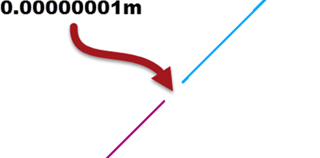
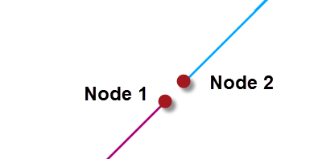
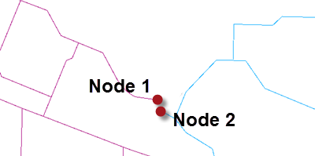

# 容差示例

通常，由于两个问题之一，数据无法加入，会合或交叉。

首先，可以简单地创建数据的几何图形： 

在该示例中，两条线是要连接的，但是具有大约10米的间隙。

问题的第二个来源是由于坐标舍入等问题而具有非常微小缺陷的几何图形：

在这种情况下，两条线是要连接的，但是有一个非常小的间隙为0.00000001米。由于其尺寸小，这种错误很难在视觉上定位。

这样的问题可能是因为坐标舍入（坐标四舍五入到导致间隙的精度），因为不同的数据格式（每种格式以稍微不同的方式存储坐标），或者也许是因为已经进行了一些其他自动的过程。

## 没有容差

当容差设置为无时，则上述要素不被视为匹配。

例如，在TopologyBuilder中，每一种情况下的间隙将导致FME假设每个几何图形都是一条没有连接的道路。两个节点之间会有一个间隙:

根据数据，这可能是也可能不是正确的结果。如果间隙仅为0.00000001米，我们可以放心地假设它在这个例子中是不正确的。

## 自动容差

当容差设置为自动时，FME将评估数据并提出合理的容差来解决小问题。例如，在TopologyBuilder中，FME会正确地确定较小的间隙是应该纠正的错误：

但是，它不会修复导致更大容差间隙的更大错误：

那是因为FME无法合理地将其定义为一个问题，或修复它而不会改变其他类似的间隙。

## 自定义容差

当容差设置为自定义值时，作者正在尝试按照自己选择的规模解决问题。例如，在TopologyBuilder中，他们可以设置10的容差。这将解决小问题和较大的问题：

但它也可能错误地修复了两个点合法地在彼此10米范围内的问题，比如节点2。

因此，在一般情况下，最好使用自动容差，除非您可以确定自定义容差将按您的要求运行。

