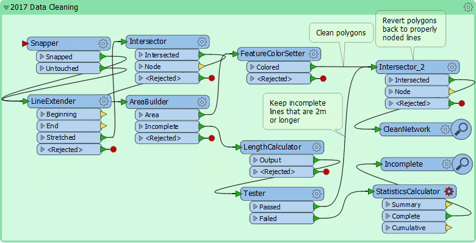
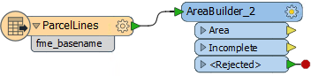
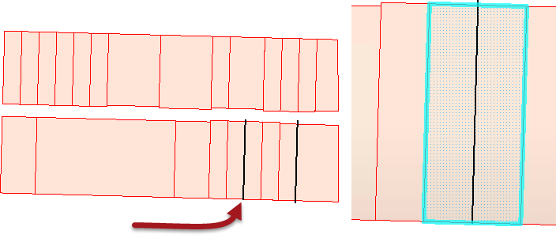
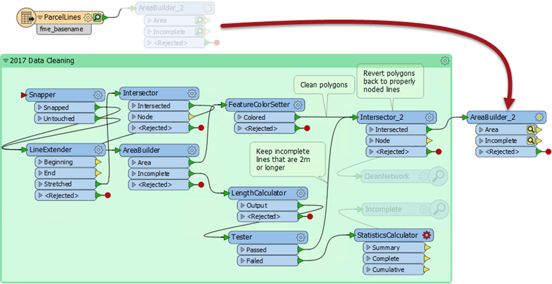
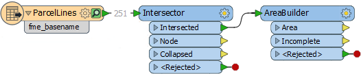
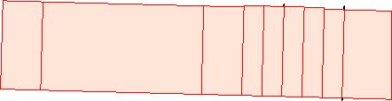

# 练习：容差和数据清理

|  练习 |  容差和数据清理 |
| :--- | :--- |
| 数据 | 房产边界（MicroStation DGN） |
| 总体目标 | 清理线数据以构建房产多边形 |
| 演示 | 交叉点，数据清理和容差 |
| 启动工作空间 | C:\FMEData2018\Workspaces\UpgradingTo2018\Tolerance-Ex1-Begin.fmwt |
| 结束工作空间 | C:\FMEData2018\Workspaces\UpgradingTo2018\Tolerance-Ex1-Complete.fmwt |

作为一个小练习，您被要求将一组线条（表示房产边界）转换为面要素。使用AreaBuilder可以轻松完成此操作。但是......可能有一些数据清理要求并不那么简单。

  
**1）启动Workbench**  
启动FME Workbench并打开起始工作空间模板。

工作空间包括一个读模块，用于读取一组MicroStation DGN要素。它还包括一组书签转换器，以前用于清理FME2017中的数据：

它太老了，甚至还包括Inspector转换器！多么古怪！

  
**2）添加AreaBuilder**  
首先让我们忽略那个带书签的部分，然后简单地添加一个连接到读模块要素类型（ParcelLines）的AreaBuilder转换器：

打开要素缓存并运行工作空间的该部分。检查两个AreaBuilder缓存：

请注意，有几个“未使用”的要素。如果某个要素未使用，则不会创建正确的边界，该区域将覆盖两个（或更多）房产。

  
**3）移动AreaBuilder转换器**  
我们现在知道如果没有一些清理，数据将无法构建正确的多边形。因此，断开AreaBuilder转换器并将其移动到工作空间的末端，并将CleanNetwork Inspector与书签连接起来:

删除任何其他Inspector转换器，将源数据连接到书签中的Snapper转换器，然后运行工作空间。

检查输出。将有完美形成的多边形，没有不完整的要素。

所以我们完成了这个项目。除了......肯定会有更好的方式在2018？

  
**4）删除书签和转换器**  
让我们首先删除2017书签及其所有内容，再加上新的AreaBuilder转换器，这样我们剩下的就是读模块要素类。这只是为了清除杂乱的工作空间。

  
**5）添加Intersector和AreaBuilder转换器**  
放置一个Intersector转换器（它具有新的容差参数，因此可以帮助我们）加上一个新的AreaBuilder转换器：

检查Intersector的参数。确保容差参数设置为“自动”并重新运行工作空间。检查输出：

有一些不完整的要素，但没有那么多坏面。Intersector显然做得很好。但是对于FME来说，需要的容差太多了，无法自动处理。

  
**6）设置手动容差**  
再次检查Intersector参数，这次将Tolerance参数设置为自定义值0.2。重新运行工作空间。结果更好，但不是非常完整。

将公差参数设置为0.3，然后重试。

这次该区域要素正确构建。任何不完整的要素都是小的重叠，可以忽略。

因此，我们通过使用简单的Intersector转换器替换所有书签内容来复制2017工作空间的结果！事实上，结果更好，因为2017年的工作空间产生了一些不应该存在于数据中的奇怪现象（这就是为什么它的面积输出比2018更多）。

<table>
  <thead>
    <tr>
      <th style="text-align:left">恭喜</th>
    </tr>
  </thead>
  <tbody>
    <tr>
      <td style="text-align:left">
        
通过完成本练习，您已学会如何：
           
        

        <ul>
          <li>在Intersector转换器上应用自动容差</li>
          <li>在Intersector转换器上应用自定义容差</li>
        </ul>
      </td>
    </tr>
  </tbody>
</table>
