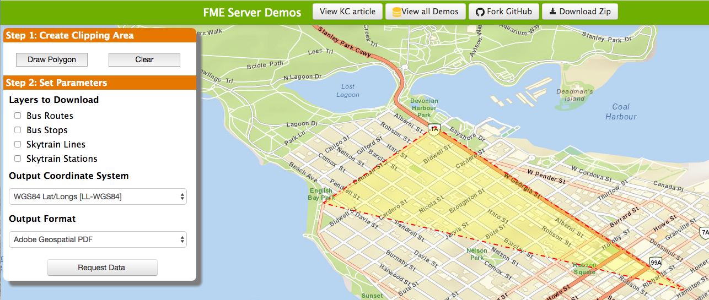
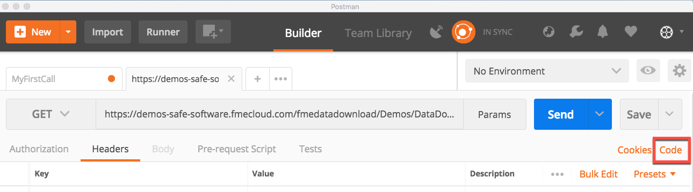

# 5.1练习9-使用直接URL的简介

|  练习9 |  使用直接URL简介 |
| :--- | :--- |
| 数据 | 无 |
| 总体目标 |  使用和理解直接URL |
| 演示 |  如何在Postman中输入直接URL |

在本教程开始时，我们讨论了一个Web应用程序，它允许用户选择温哥华的某个区域，并使用公共交通信息从服务器接收数据。我们现在有了所有必要的信息，可以将查询用作对FME Server的调用。此示例中的URL是直接URL。

## 设置查询

  
 **1）打开URL**

访问[http://demos.fmeserver.com/datadistribution-webmap/index.html?map=arcgis](http://demos.fmeserver.com/datadistribution-webmap/index.html?map=arcgis)

  
 **2）绘制多边形**

单击“绘制多边形”，然后在温哥华区域内绘制多边形。双击以结束绘图并关闭多边形。

[](https://github.com/xuhengxx/FMETraining-1/tree/b47e2c2ddcf98cce07f6af233242f0087d2d374d/FMESERVER_RESTAPI5WebServices/Images/image5.1.1.WebAppSetUp.png)

  
 **3）选择参数**

在**“要下载的层\(Layers to Download\)"**中选择公交路线和公交车站

**输出坐标系**应设置为WGS84 Lat/Longs \[LL-WGS84\]

**输出格式**应设置为Adobe Geospatial PDF

  
 **4）从Web应用程序复制查询。**

突出显示自动生成的查询并将其复制。如果您遇到问题，可以在下面复制查询：

```text
https://demos-safe-software.fmecloud.com/fmedatadownload/Demos/DataDownloadService.fmw?opt_servicemode=sync&opt_responseformat=json&GEOM=POLYGON((-123.19385223388672 49.124194030761714,-123.20209197998047 49.3652066040039,-122.7372329711914 49.39473236083984,-122.7482192993164 49.1125210571289,-123.19385223388672 49.124194030761714))&THEMES=BusRoutes&THEMES=BusStops&COORDSYS=EPSG:4326&GENERIC_FORMAT=PDF2D
```

[](https://github.com/xuhengxx/FMETraining-1/tree/b47e2c2ddcf98cce07f6af233242f0087d2d374d/FMESERVER_RESTAPI5WebServices/Images/image5.1.2.Query.png)

## 在Postman中使用查询

  
 **5）将URL粘贴到Postman中**

将完整的URL粘贴到Postman中，该查询属于顶部栏中的“输入请求URL”。此调用不需要任何头域或主体，因为所需的所有信息都在URL中。将HTTP方法设置为GET。

  
 **6）提交调用**

点击发送！

[](https://github.com/xuhengxx/FMETraining-1/tree/b47e2c2ddcf98cce07f6af233242f0087d2d374d/FMESERVER_RESTAPI5WebServices/Images/image5.1.3.SubmitQuery.png)

## 了解响应

  
 **7）查看Postman底部的响应**

此调用非常高级，因此您将收到大量的JSON。Web应用程序将解释此JSON，它会将正确的数据发送回用户。

[](https://github.com/xuhengxx/FMETraining-1/tree/b47e2c2ddcf98cce07f6af233242f0087d2d374d/FMESERVER_RESTAPI5WebServices/Images/image5.1.3b.Response.png)

  
 **8）检查头域**

您可以浏览从通话中收到的头域。通过将鼠标悬停在粗体文本上，Postman提供了响应头的描述。

以下显示此调用返回的头域。

[](https://github.com/xuhengxx/FMETraining-1/tree/b47e2c2ddcf98cce07f6af233242f0087d2d374d/FMESERVER_RESTAPI5WebServices/Images/image5.1.4.ResponseHeadersPostman.png)

通过将鼠标悬停在头域上，它将提供响应头的描述。

[](https://github.com/xuhengxx/FMETraining-1/tree/b47e2c2ddcf98cce07f6af233242f0087d2d374d/FMESERVER_RESTAPI5WebServices/Images/image5.1.5.ResponseHeader.png)

## 生成代码片段

Postman能够根据先前的请求生成代码片段。在开发自己的Web应用程序时，这些代码段非常有用。

  
 **9）生成代码片段**

在您提交请求的页面上，单击cookie旁边的代码按钮。

[](https://github.com/xuhengxx/FMETraining-1/tree/b47e2c2ddcf98cce07f6af233242f0087d2d374d/FMESERVER_RESTAPI5WebServices/Images/image5.1.6.CodeSnippets.png)

Postman可以生成各种语言，但本文中显示了JavaScript。

[](https://github.com/xuhengxx/FMETraining-1/tree/b47e2c2ddcf98cce07f6af233242f0087d2d374d/FMESERVER_RESTAPI5WebServices/Images/image5.1.7.ViewCodeSnip.png)

<table>
  <thead>
    <tr>
      <th style="text-align:left">恭喜</th>
    </tr>
  </thead>
  <tbody>
    <tr>
      <td style="text-align:left">
        <p>通过完成本练习，您已学会如何：
          <br />
        </p>
        <ul>
          <li>使用Postman提交直接网址</li>
          <li>使用Postman生成代码片段</li>
        </ul>
      </td>
    </tr>
  </tbody>
</table>