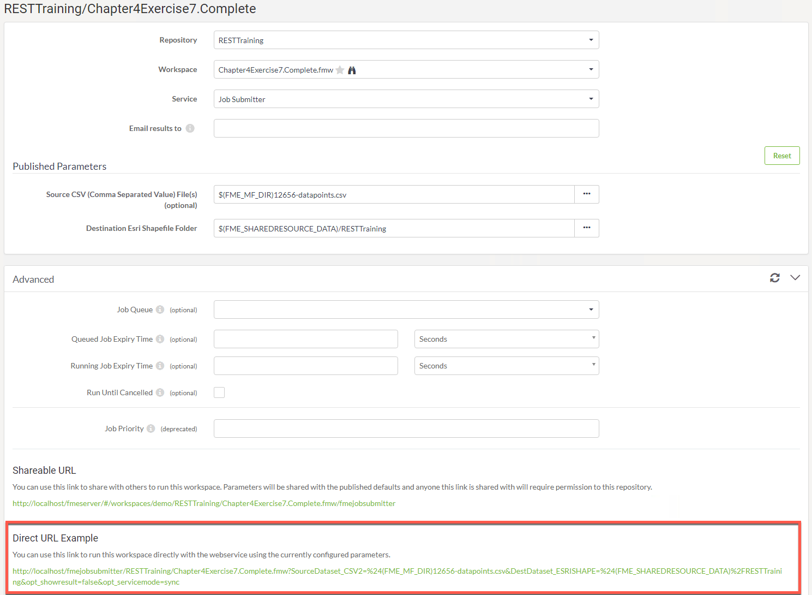
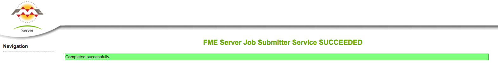
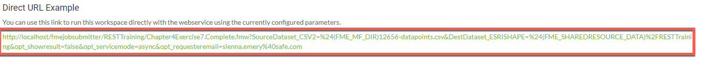
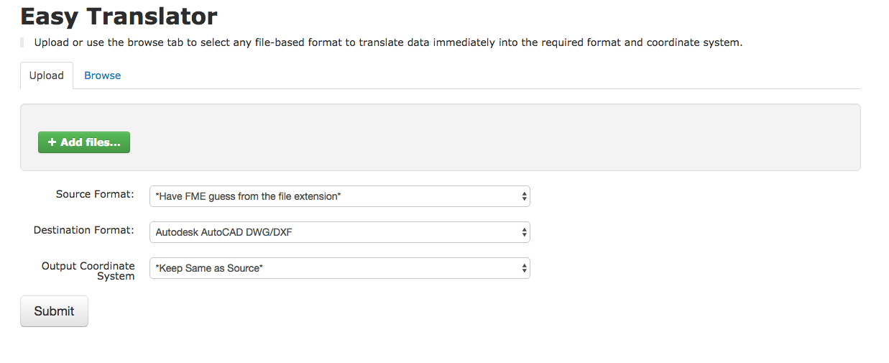

# 第5章.Web服务和REST API

直接URL看起来类似于REST API请求URL; 但是，它存在于REST API之外。查找直接URL登录到服务器并找到工作空间的示例。

打开高级选项卡并向下滚动，直到找到直接URL示例：

[](https://github.com/xuhengxx/FMETraining-1/tree/b47e2c2ddcf98cce07f6af233242f0087d2d374d/FMESERVER_RESTAPI5WebServices/Images/image5.0.1.Direct.png)

Direct URL的身份验证过程与REST API不同。使用直接URL，您可以将一个令牌添加到URL的末尾，如下所示：

```text
http://<yourServerHost>/fmejobsubmitter/<yourRepository>/<yourWorkspace>?<yourWorkpaceParameters>/token=<tokenValue>
```

或者，直接URL将默认为guest用户帐户上设置的权限。如果您的guest帐户无权在输入直接URL后运行工作空间，则可能会要求您登录。如果guest帐户具有权限，您可以在不登录的情况下运行直接URL。

单击该链接后，您的作业将运行，您将收到以下通知。

[](https://github.com/xuhengxx/FMETraining-1/tree/b47e2c2ddcf98cce07f6af233242f0087d2d374d/FMESERVER_RESTAPI5WebServices/Images/image5.0.2.JobSuccess.png)

与REST API一样，Direct URL可以同步和异步地运行作业。作业将自动同步运行。要异步运行作业，请在“将结果发送到”的部分中输入电子邮件。通过这样做，直接URL将自动更新为异步运行。作业完成后，将发送一封电子邮件。

[](https://github.com/xuhengxx/FMETraining-1/tree/b47e2c2ddcf98cce07f6af233242f0087d2d374d/FMESERVER_RESTAPI5WebServices/Images/image5.0.3.directurlwithemail.png)

就像在REST API中一样，您可以在Direct URL中更改参数。

下表复制自以下关于数据下载服务的手册。有关完整文档，请参阅[数据下载服务](https://docs.safe.com/fme/html/FME_Server_Documentation/Content/ReferenceManual/service_datadownload.htm?Highlight=direct%20url)文档。

**直接URL请求** **参数**

<table>
  <thead>
    <tr>
      <th style="text-align:left">名称</th>
      <th style="text-align:left">值</th>
      <th style="text-align:left">描述</th>
    </tr>
  </thead>
  <tbody>
    <tr>
      <td style="text-align:left">opt_responseformat</td>
      <td style="text-align:left">
        <p>xml或json</p>
        <p>默认值：xml</p>
      </td>
      <td style="text-align:left">响应的语言。文本必须为小写</td>
    </tr>
    <tr>
      <td style="text-align:left">opt_geturl</td>
      <td style="text-align:left">数据集的URL</td>
      <td style="text-align:left">用于转换的源数据集的URL</td>
    </tr>
    <tr>
      <td style="text-align:left">opt_showresult</td>
      <td style="text-align:left">对或错</td>
      <td style="text-align:left">XML / JSON响应是否包含FME转换结果。如果此参数不存在，则默认值为对。</td>
    </tr>
    <tr>
      <td style="text-align:left">opt_servicemode</td>
      <td style="text-align:left">同步或异步或计划</td>
      <td style="text-align:left">
        <p>在服务的同步和异步模式之间切换。异步提交作业（异步）时，会立即返回提交成功或失败的响应。设置为同步（同步）时，在作业完成之前不会返回响应。</p>
        <p>或者，安排数据下载请求在指定的开始时间运行（仅限一次）。如果指定了计划，请参阅下面的其他参数。</p>
      </td>
    </tr>
    <tr>
      <td style="text-align:left">opt_requesteremail</td>
      <td style="text-align:left">逗号分隔的电子邮件地址</td>
      <td style="text-align:left">发送通知电子邮件的地址。</td>
    </tr>
  </tbody>
</table>直接URL和REST API可以在应用程序中组合在一起，以利用两者的最佳组件。一个例子是[Easy Translator](http://demos.fmeserver.com/easytranslator/index.html)演示。

[](https://github.com/xuhengxx/FMETraining-1/tree/b47e2c2ddcf98cce07f6af233242f0087d2d374d/FMESERVER_RESTAPI5WebServices/Images/image5.0.4.EasyTranslator.png)

使用REST API上传文件; 但是，作业是使用直接URL运行的。

这是来自FME REST API JavaScript库的dataUpload函数的一部分代码。请注意它不是完整的函数，但应该提供一些上下文来说明调用在JavaScript函数中的样子。

```text
dataUpload : function(repository, workspace, files, jsid, callback) {
          var url = buildURL('{{svr}}/fmedataupload/' + repository + '/' + workspace);
          var token = getConfig('token');
          url = url + '?token=' + token;
          ajax(url, callback, 'POST', params);
```

使用我们在REST API中看到的调用构建URL，然后将令牌添加到URL的末尾。使用POST方法提交URL。

幸运的是，这个调用以及FME Server REST API中的几乎所有调用都存在于REST API JavaScript库中，因此用户不必编写函数。用户只需调用已创建的函数即可成功创建应用程序。

JavaScript函数中使用的直接URL如下所示：

```text
var submitUrl = BuildForm.host + '/fmedatadownload/' + BuildForm.repository + '/' +  BuildForm.workspaceName + '?SourceDataset_GENERIC=' + files;
          submitUrl = submitUrl + '&SourceFormat=' + sourceFormat;
          submitUrl = submitUrl + '&DestinationFormat=' + destFormat;
          submitUrl = submitUrl + '&COORDSYS_Dest=' + outputCoordSys + '&opt_responseformat=json';
```

在这里，直接URL被构建，然后用户将单击DirectURL来激活它。

