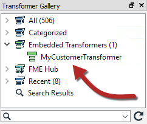
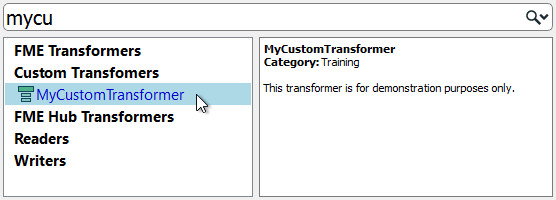

# 使用自定义转换器

一旦创建了自定义转换器，它就连接到工作空间 - 除了不同的颜色外 - 看起来就像普通的FME转换器一样。

然而，与普通转换器的相似之处不仅仅在于外观。与在工作空间中使用转换器的多个实例的方式相同，自定义转换器也可以使用任意次数。这使得自定义不仅可以整理工作空间，还可以作为重用内容的一种方式。

要放置自定义转换器的额外副本 - 再次像常规转换器一样 - 您可以使用转换器库(Transformer Gallery)（在标有“Embedded Transformers”的部分下查看）：

...或者你可以使用快速添加：

与FME转换器一样，每个新放置的自定义转换器实例都将根据需要重命名（或编号），以避免名称冲突。

|  技巧 |
| :--- |
|  转换器名称，类别和描述都出现在“快速添加”工具中 - 以及出现在帮助窗口中 - 因此设置这些参数是绝对有价值的。 |

## 编辑重复使用的自定义变换器

自定义转换器的多个实例都使用相同的核心定义; 即Main选项卡上可能有多个副本，但自定义转换器定义只有一个选项卡。

这种方法的一个主要好处是只需编辑自定义变换器定义即可更新或编辑每个实例。

例如，如果为此自定义转换器中的Aggregator更改了参数：

...然后参数会自动更改已放置的所有转换压器实例。

这使得编辑转换器序列变得更加容易，因为编辑只需要进行一次，无论该序列被使用了多少次。

